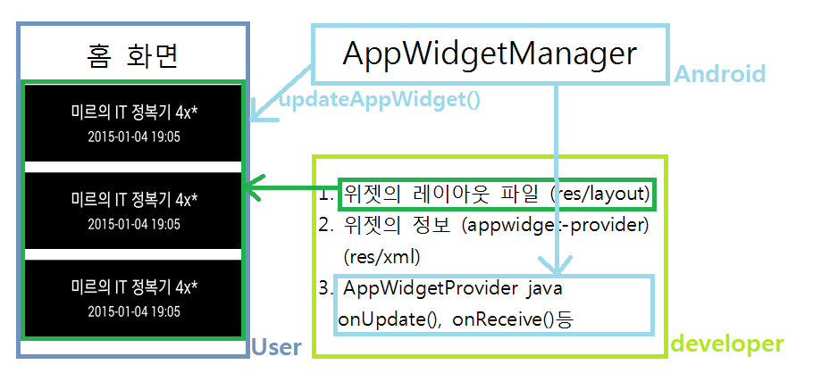
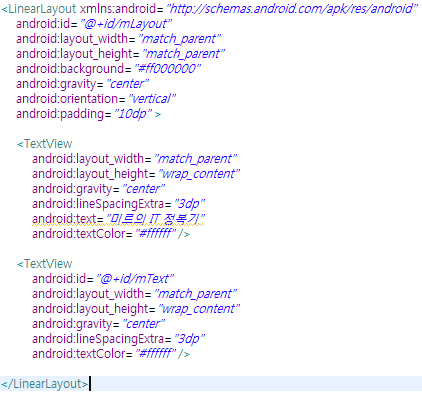
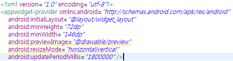
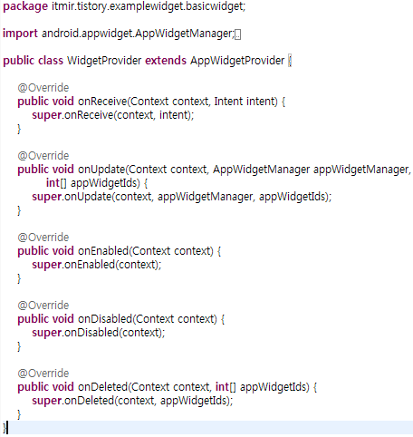
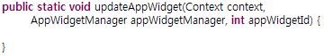
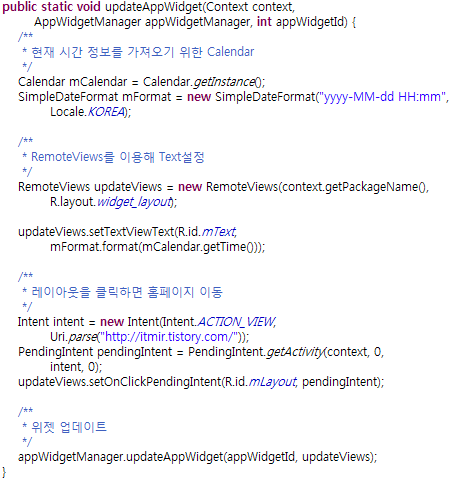
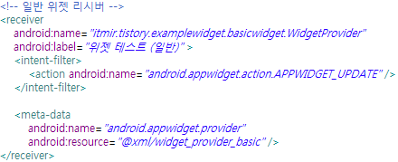
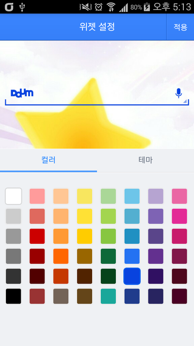
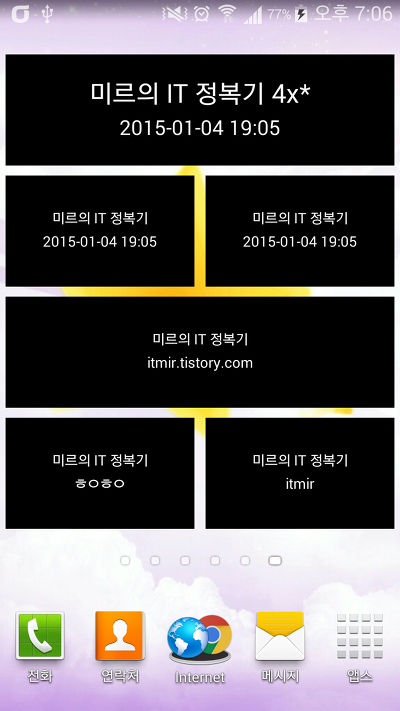

안녕하세요

이번 글에서는 위젯을 한번 만들어 볼까 합니다

안드로이드의 위젯은 TextView, EditText와 같은 위젯도 있고, 홈화면에 띄우는 위젯도 있습니다

여기서의 위젯은 홈화면에 띄우는 위젯을 뜻합니다

왜 TextView, EditText가 위젯이냐고 하나면.. import를 보시면 android.widget.EditText.... 아시겠죠??

### 프로젝트 생성 및 레이아웃 관련

프로젝트의 이름은 ExampleWidget으로 정했습니다

프로젝트를 처음 생성하면 MainActivity가 있을탠데요

위젯을 다루는 프로젝트이므로 메인 액티비티는 건들지 않습니다

위젯에 필요한 레이아웃과 액티비티만 만들 예정입니다

### 위젯의 몇가지 종류

위젯에도 종류가 있냐고 질문하시는 분들이 계실것 같습니다

사실대로 말하면 이것은 제가 임의로 분류한것인데요

그럼 어떻게 분류했냐면..

1. 기본 위젯 (위젯을 선택했을때 바로 로딩됨)
2. 크기 변경 위젯
3. 설정이 가능한 위젯

이렇게 3가지로 나눠봤습니다

이 강좌에서는 1번과 2번을 함께 설명할 예정입니다

지금부터 살펴보겠습니다

### 위젯의 작동 구조

위젯의 구조는 아래와 같습니다



조금 복잡해 보일수 있을지 모르겠습니다만..

우리가 만들어야 하는 부분은 developer부분입니다

위젯은 지금까지 만들어온 앱과는 다르게 홈화면에서 기생(?)하면서 동작하는 구조입니다

조금 이해하시기 어려워도 잘 따라와주세요

### 위젯의 레이아웃을 만들자

홈화면에 띄울 위젯도 마찬가지로 xml로 레이아웃을 정의할수 있습니다

이 강좌에서는 심플하게 30분마다 시간을 띄우는 위젯을 만들어 볼까 합니다



```
<LinearLayout xmlns:android="http://schemas.android.com/apk/res/android"
    android:id="@+id/mLayout"
    android:layout_width="match_parent"
    android:layout_height="match_parent"
    android:background="#ff000000"
    android:gravity="center"
    android:orientation="vertical"
    android:padding="10dp" >

    <TextView
        android:layout_width="match_parent"
        android:layout_height="wrap_content"
        android:gravity="center"
        android:lineSpacingExtra="3dp"
        android:text="미르의 IT 정복기"
        android:textColor="#ffffff" />

    <TextView
        android:id="@+id/mText"
        android:layout_width="match_parent"
        android:layout_height="wrap_content"
        android:gravity="center"
        android:lineSpacingExtra="3dp"
        android:textColor="#ffffff" />

</LinearLayout>
```

이렇게 코드를 작성했습니다

LinearLayout의 높이와 너비를 모두 match\_parent로 한 이유는 크기를 자유롭게 변경하는 위젯(2번)으로 구성하기 위함입니다

여기서 위젯에 모든뷰가 들어갈수 있는것은 아닌데요

다음과 같은 뷰를 추가해서 사용할수 있습니다

|  |  |
| --- | --- |
| 유형 | 뷰 이름 |
| 뷰 그룹 | FrameLayout, LinearLayout, RelativeLayout |
| 뷰 | AnalogClock, Button, Chronometer, ImageButton, ImageView, ProgressBar, TextView |

참고 : Do it 안드로이드 앱 프로그래밍

왜 이것들만 되냐면.. 위젯으로 표현되는 뷰들이 다른 프로세스에 들어가 있고,

이때문에 다른 프로세스의 뷰에 접근하기 위해서 RemoteViews가 사용되기 때문입니다

RemoteViews는 아래에서 사용됩니다

### 앱 위젯 제공자 정보를 만들자

이 레이아웃을 이용해서 앱 위젯 제공자 정보(appwidget-provider)를 만들어야 합니다

res/xml폴더를 만들어주세요

파일 이름은 widget\_provider\_basic.xml으로 하겠습니다



```xml
<?xml version="1.0" encoding="utf-8"?>
<appwidget-provider xmlns:android="http://schemas.android.com/apk/res/android"
    android:initialLayout="@layout/widget_layout"
    android:minHeight="72dp"
    android:minWidth="146dp"
    android:previewImage="@drawable/preview"
    android:resizeMode="horizontal|vertical"
    android:updatePeriodMillis="1800000" />
```

몇가지 처음보는게 나오네요.. 아니 모두 처음보는거 일수도..?

하나씩 살펴봅시다

- android:initialLayout="@layout/widget\_layout" : 위젯의 처음 레이아웃입니다, 처음이라고 한 이유는 나중에 java에서 RemoteViews를 이용해 변경할수 있기 때문입니다
- android:minHeight="72dp" : 최소 높이 입니다
- android:minWidth="146dp" : 최소 너비 입니다
- android:previewImage="@drawable/preview" : 위젯을 선택할때 미리보기 이미지입니다
- android:resizeMode="horizontal|vertical" : 위젯의 크기를 변경할수 있도록 설정해줍니다
- android:updatePeriodMillis="1800000" : 업데이트 간격으로, 1800000는 30분입니다. 30분 아래의 간격으로 설정할수 없으며, 0으로 설정하면 업데이트를 하지 않는다고 합니다

한번 읽어보셨는대 아직도 풀리지 않는게 있습니다

왜 높이가 72인가..

resizeMode는 무엇이고,, updatePeriodMillis는 30분이 최소인가??

먼저 위젯은 가로 4칸, 세로 4칸의 면적을 차지할수 있습니다

한칸을 74dp로 잡는데요 위젯의 가장자리가 표시되는 2dp를 빼주어야 합니다

∴ (원하는 칸 x 74) - 2 dp

ex) 3칸 : (3 x 74) - 2 = 220dp, 2칸 : (2 x 74) - 2 = 146dp

resizeMode는 API 12부터 생긴 옵션입니다

horizontal 또는 vertical를 선택할수 있고, 가로세로 모두 가능하게 하려면 |를 넣어주시면 됩니다

updatePeriodMillis는 업데이트 간격입니다

30분이 최소 간격이며, 이 아래로 설정해도 30분 간격이 됩니다

구글에서 배터리 절약으로 30분으로 설정한것으로 생각됩니다

더 빠른 업데이트를 위해서는 알람을 이용하는 방법이 있습니다

### 앱 위젯 제공자 클래스를 만들자

AppWidgetProvider를 상속하는 java파일을 하나 만들어주세요

이름은 WidgetProvider으로 하겠습니다



```java
public class WidgetProvider extends AppWidgetProvider {

    /**
     * 브로드캐스트를 수신할때, Override된 콜백 메소드가 호출되기 직전에 호출됨
     */
    @Override
    public void onReceive(Context context, Intent intent) {
        super.onReceive(context, intent);
    }

    /**
     * 위젯을 갱신할때 호출됨
     * 
     * 주의 : Configure Activity를 정의했을때는 위젯 등록시 처음 한번은 호출이 되지 않습니다
     */
    @Override
    public void onUpdate(Context context, AppWidgetManager appWidgetManager,
            int[] appWidgetIds) {
        super.onUpdate(context, appWidgetManager, appWidgetIds);
    }

    /**
     * 위젯이 처음 생성될때 호출됨
     * 
     * 동일한 위젯이 생성되도 최초 생성때만 호출됨
     */
    @Override
    public void onEnabled(Context context) {
        super.onEnabled(context);
    }

    /**
     * 위젯의 마지막 인스턴스가 제거될때 호출됨
     * 
     * onEnabled()에서 정의한 리소스 정리할때
     */
    @Override
    public void onDisabled(Context context) {
        super.onDisabled(context);
    }

    /**
     * 위젯이 사용자에 의해 제거될때 호출됨
     */
    @Override
    public void onDeleted(Context context, int[] appWidgetIds) {
        super.onDeleted(context, appWidgetIds);
    }
}
```

이 소스에서 Override되는 메소드는 아래와 같습니다

- public void onReceive(Context context, Intent intent)
- public void onUpdate(Context context, AppWidgetManager appWidgetManager, int[] appWidgetIds)
- public void onEnabled(Context context)
- public void onDisabled(Context context)
- public void onDeleted(Context context, int[] appWidgetIds)

onReceive()는 브로드캐스트리시버에서 배웠기에 넘어가겠습니다

onUpdate()는 위젯 갱신 주기에 따라 위젯을 갱신할때 호출됩니다

onEnabled()는 위젯이 처음 생성될때 호출되며, 동일한 위젯의 경우 처음 호출됩니다

onDisabled()는 위젯의 마지막 인스턴스가 제거될때 호출됩니다

onDeleted()는 위젯이 사용자에 의해 제거될때 호출됩니다

여기서 지금 사용할 메소드는 onUpdate()입니다

위젯은 위젯 id로 구분되는데요

모든 위젯을 동시에 갱신하기 위해 추가된 모든 위젯 id를 가져오는 코드를 onUpdate()안에 넣어줍시다

그다음 가져온 id를 for문으로 돌려서 모든 위젯을 갱신합시다

```java
appWidgetIds = appWidgetManager.getAppWidgetIds(new ComponentName(context, getClass()));
for (int i = 0; i < appWidgetIds.length; i++) {
    updateAppWidget(context, appWidgetManager, appWidgetIds[i]);
}
```

아직 updateAppWidget()메소드를 따로 안만들어서 빨간줄이 있을겁니다

메소드를 하나 만들어 봅시다



for안에서 위젯을 업데이트 해도 편하지만 좀더 코드의 가독성을 높히기 위해 메소드로 따로 분리한것입니다

위젯을 어떻게 업데이트 해야 하나면..

지금 시간을 가져와서 TextView에 적용해야 합니다

위젯을 클릭하면 제 블로그로 이동하는 기능도 넣어봅시다



```java
public static void updateAppWidget(Context context,
        AppWidgetManager appWidgetManager, int appWidgetId) {
    /**
     * 현재 시간 정보를 가져오기 위한 Calendar
     */
    Calendar mCalendar = Calendar.getInstance();
    SimpleDateFormat mFormat = new SimpleDateFormat("yyyy-MM-dd HH:mm",
            Locale.KOREA);

    /**
     * RemoteViews를 이용해 Text설정
     */
    RemoteViews updateViews = new RemoteViews(context.getPackageName(),
            R.layout.widget_layout);

    updateViews.setTextViewText(R.id.mText,
            mFormat.format(mCalendar.getTime()));

    /**
     * 레이아웃을 클릭하면 홈페이지 이동
     */
    Intent intent = new Intent(Intent.ACTION_VIEW,
            Uri.parse("http://itmir.tistory.com/"));
    PendingIntent pendingIntent = PendingIntent.getActivity(context, 0,
            intent, 0);
    updateViews.setOnClickPendingIntent(R.id.mLayout, pendingIntent);

    /**
     * 위젯 업데이트
     */
    appWidgetManager.updateAppWidget(appWidgetId, updateViews);
}
```

주석까지 함께 달았습니다

몇번 읽어보시면 어떤 원리인지 아실꺼라 생각됩니다

RemoteViews를 이용해서 TextView의 글자를 설정하고 있는 부분이 중요한 부분이라고 할수 있습니다

아주 자세한 설명은 패스하도록 하겠습니다

### AndroidManifest.xml

이제 마지막으로 지금까지 만든것을 정리해서 AndroidManifest,xml에 등록해야 합니다



```xml
<receiver
    android:name="itmir.tistory.examplewidget.basicwidget.WidgetProvider"
    android:label="위젯 테스트 (일반)" >
    <intent-filter>
        <action android:name="android.appwidget.action.APPWIDGET_UPDATE" />
    </intent-filter>

    <meta-data
        android:name="android.appwidget.provider"
        android:resource="@xml/widget_provider_basic" />
</receiver>
```

리시버의 이름은 아까만든 WidgetProvider입니다

android:label은 사용자가 위젯을 추가할때 나타나는 이름입니다

meta-data의 android:resource에는 아까 res/xml에 정의한 파일 이름을 넣어주시면 됩니다

### 설정이 가능한 위젯에 대해 조금만 알아보자

위젯을 추가하면 화면이 나타나서 위젯 설정을 할수 있는 모습 혹시 보셨나요?

다음위젯같은거 추가하시면 아래와 같은 설정 모습을 확인할 수 있습니다



이렇게 설정할수 있는 위젯에 대해 알아볼까 하는데요

글이 너무 길어져서 조금만 살펴보겠습니다 자세한건 첨부하는 예제소스를 살펴봐주세요

위젯을 설정하는 창은 액티비티입니다

액티비티를 따로 하나 만들어주세요

그다음에 res/xml에 정의한 appwidget-provider의 android:configure에 만드신 액티비티의 전체 이름(패키지명까지 포함해서)을 적어주세요

AndroidManifest.xml에 정의된 Activity에는 아래 인탠트 필터를 넣어주세요

> <intent-filter>
>
>     <action android:name="android.appwidget.action.APPWIDGET\_CONFIGURE" />
>
> </intent-filter>

이제 중요한게 남았는데요

configure widget같은경우에는 위젯 host가 액티비티를 호출합니다

onCreate()에서 위젯 id를 전달받는데요

끝날때 이 id를 리턴해줘야 합니다

> Bundle mExtras = getIntent().getExtras();
>
> if (mExtras != null) {
>
>     mAppWidgetId = mExtras.getInt(AppWidgetManager.EXTRA\_APPWIDGET\_ID,
>
>     AppWidgetManager.INVALID\_APPWIDGET\_ID);
>
> }

onCreate()안에서 위젯 id를 가져오는 소스입니다

그다음에 끝날때(적용 버튼을 누르면) 이 id를 다시 전달해야 합니다

> Intent resultValue = new Intent();
>
> resultValue.putExtra(AppWidgetManager.EXTRA\_APPWIDGET\_ID, mAppWidgetId);
>
> setResult(RESULT\_OK, resultValue);
>
> finish();

이부분만 주의해주시면 됩니다~

### 실행 결과 확인하기

실행 결과를 확인해보겠습니다

참고로 맨 마지막에 급하게 살펴본 설정가능 위젯은 그냥 메모위젯으로 만들어봤습니다



이 글에서 다루지 못한 부분이 한가지 있다면 위젯 크기에 따라 레이아웃을 다르게 설정한부분 입니다

맨위에 있는 위젯과 두번째줄의 위젯은 크기가 다릅니다

그리고 Text도 다릅니다 (4x\*가 있지요)

이것은 onAppWidgetOptionsChanged()메소드를 추가해서 위젯 크기를 알아낸다음 코드 작성하시면 됩니다

위젯마다 다른 메모를 저장하기 위해 위젯 id와 Preference를 사용했습니다

### 다운로드

> [ExampleWidget.zip](https://github.com/itmir913/archive/releases/download/itmir-attachments/ExampleWidget.zip)

혹시 문제 있으시다면 덧글 남겨주세요~

### 참조

<http://blog.naver.com/dlsdnd345/130184349716>

---

## 첨부파일

- [ExampleWidget.zip](https://github.com/itmir913/archive/releases/download/itmir-attachments/ExampleWidget.zip) `1.7 MB`
