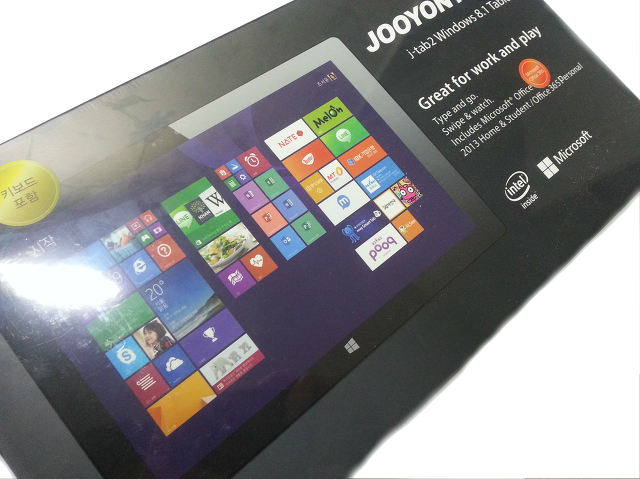
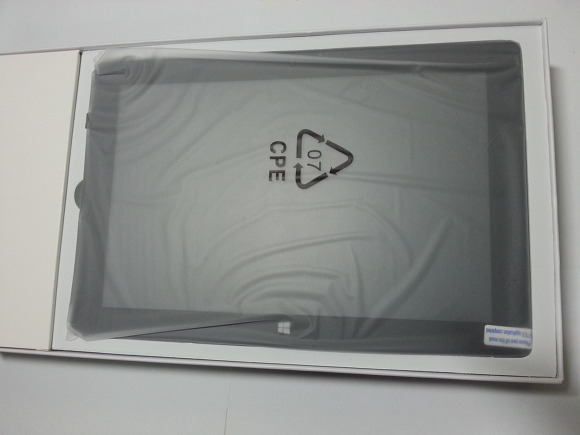
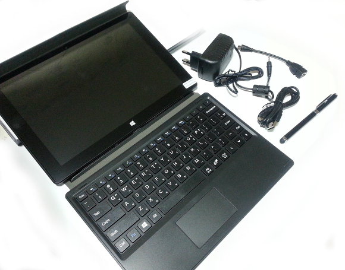
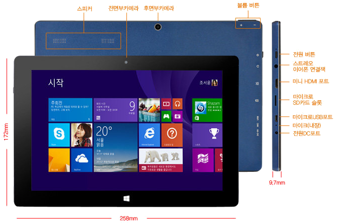
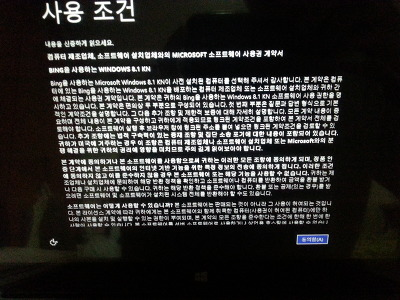
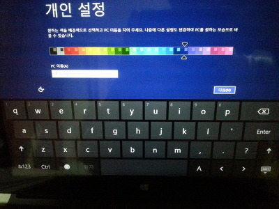
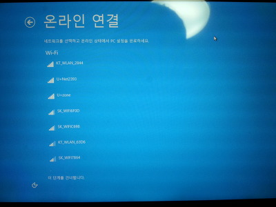
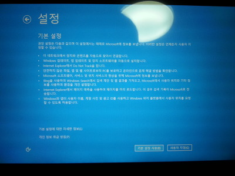
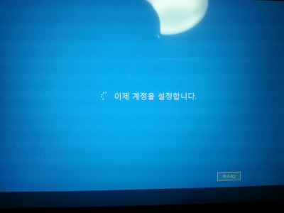
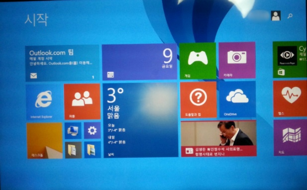

안녕하세요

어제 말씀드린대로 오늘부터 시간나는대로 J-Tab2 리뷰를 작성해볼까 합니다 ㅎㅎ

태블릿하면 안드로이드 태블릿이랑 아이패드, 그리고 윈도우 태블릿이 있는데요

저는 개인적으로 윈도우 태블릿을 선호합니다

그래서 안드로이드랑 아이패드는 제외하고 골랐습니다

다른제품들과는 다르게 j tab2의 리뷰는 별로 없더라고요

그래서 제가 정말 자세하게 뜯어볼 생각입니다 ㅎㅎ

### 박스 및 구성품

태블릿이 담겨있는 박스는 아래와 같습니다

회사인 주현테크가 있고, 왼쪽에는 태블릿 화면이 있습니다

박스를 열면 비닐에 포장되어있는 j tab2를 볼수 있습니다

상자안에 들어있는 구성품을 모두 꺼낸다음 사진을 찍어봤습니다

(편집이 조금 이상하게 된거 같은데 이해 부탁드립니다..)

저는 32GB 키보드 포함 모델을 구입했기 때문에 키보드까지 들어있습니다

구성품은 충전기, OTG USB, 마이크로 usb(스마트폰용..?), 터치펜, 그리고 사진엔 없지만 사용설명서 까지 있습니다

왜 OTG가 구성품에 있냐면요

아래 그림을 봐주세요

오른쪽 아래에서 3번째에 마이크로 USB포트가 있습니다

이 포트는 스마트폰 usb와 같은 종류인데요

usb를 연결하기 위해서는 otg가 필요합니다

전에 포스팅한 usb 허브를 사용하면 좋을거 같네요 ㅎㅎ

[[Computer/PC] - USB Hub를 나눔받았습니다!](http://itmir.tistory.com/545)

### 초기 부팅 및 설정

전원버튼을 눌러 처음 부팅을 하면 이제 사용자 설정이 진행됩니다

 

 

 

설정이 완료되면 메트로 UI화면이 나타납니다 ㅎㅎ

이제 태블릿을 가지고 신나게 노는 일만 남았습니다 ㅎㅎㅎㅎㅎㅎ

자세한 사양등등은 다음 글에서 살펴볼까 합니다~

감사합니다
