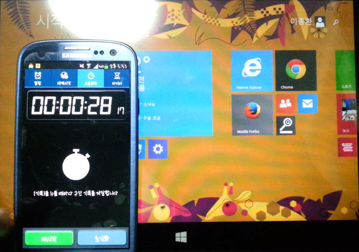
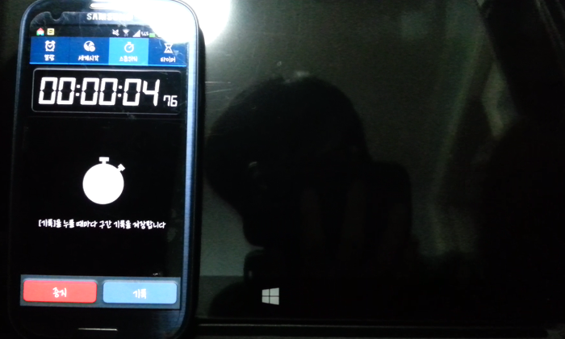

안녕하세요

저번글에서는 제이탭2 개봉기에 대해 다뤄봤습니다 ㅎ

이번 포스팅에서는 부팅시간을 측정해보도록 하겠습니다

아래는 J Tab 리뷰 목록입니다

[[Computer/PC] - [J-Tab2] 주연테크 J-Tab2 (제이탭) 개봉기](http://itmir.tistory.com/553)

참고로 Windows8의 하이브리드 절전 기능을 해제후 (powercfg -h off) 측정했습니다

### 부팅 시간 측정

부팅 시간을 측정한 동영상 입니다

데이터 부담이 크신 분들을 위해 스샷도 준비했습니다

[임베드 콘텐츠: https://play-tv.kakao.com/embed/player/cliplink/ved5cEPsPEssgHbgs74r27E?service=daum\_tistory](https://play-tv.kakao.com/embed/player/cliplink/ved5cEPsPEssgHbgs74r27E?service=daum_tistory)

부팅시간은 약 30초정도 소요됩니다

### 종료 시간 측정

종료 시간을 측정한 동영상 입니다

[임베드 콘텐츠: https://play-tv.kakao.com/embed/player/cliplink/v99afE8ZiwjVVNoiEBjCv7V?service=daum\_tistory](https://play-tv.kakao.com/embed/player/cliplink/v99afE8ZiwjVVNoiEBjCv7V?service=daum_tistory)

종료 시간은 약 5초 소요됩니다

이렇게 부팅시간이랑 종료시간을 측정해보았습니다

윈도우8의 하이브리드 절전 모드를 해제하고 나니 부팅시간이 길어진것 같습니다

절전 모드 설정후 다시 글 업데이트 할 예정입니다

(언제인지는 모르겠지만..)
