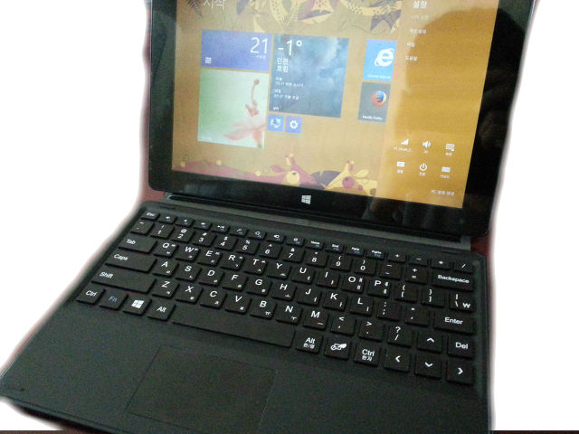
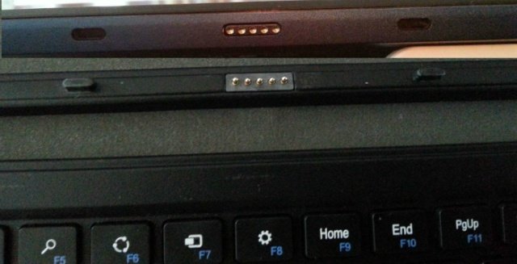
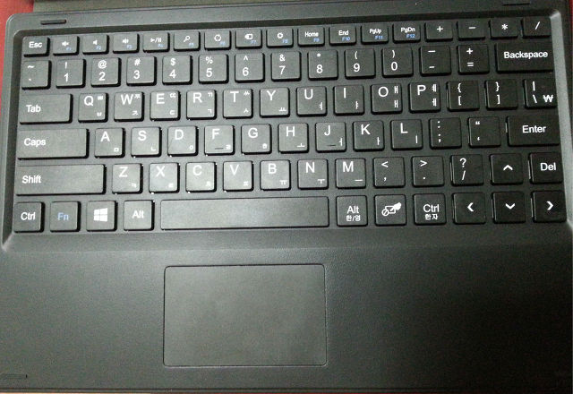
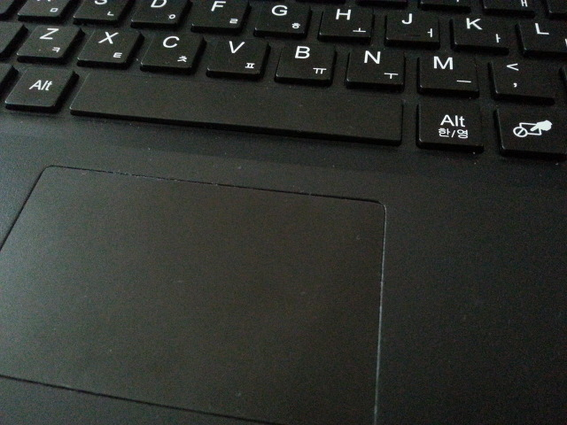
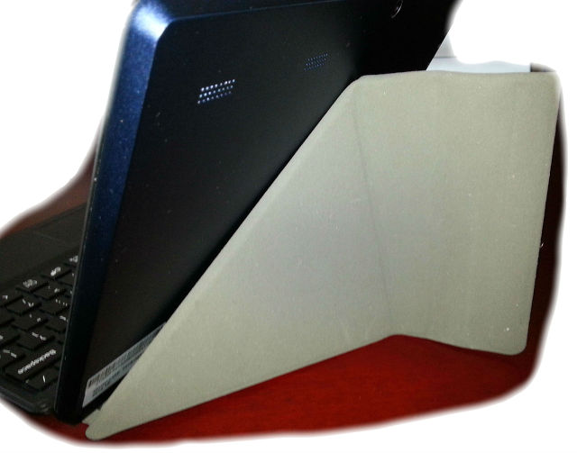

안녕하세요.  
이번 시간에는 J-Tab2의 도킹 키보드에 대해 살펴보겠습니다.

아래는 J Tab 리뷰 목록입니다.

[[Computer/PC] - [J-Tab2] 주연테크 J-Tab2 (제이탭) 부팅 시간 측정](/archive/itmir/2015/554)

[[Computer/PC] - [J-Tab2] 주연테크 J-Tab2 (제이탭) 개봉기](/archive/itmir/2015/553)

### 도킹 키보드 모습

j-tab2는 도킹키보드를 연결해서 사용할 수 있습니다.

도킹 키보드는 블루투스 연결이 아닌 연결해서 사용하는 방식입니다.

키보드 사진은 아래와 같습니다.

도킹 키보드에는 터치패드가 함께 달려있습니다.

그런데 제 손이 작은편(이라 생각해요)인데도 타자를 누르면 터치패드에 영향을 줍니다.

여기서 터치패드의 몇 가지 사용법 알려드릴께요.

터치 : 클릭

두손가락 터치 : 마우스 오른쪽 클릭

두손가락 스크롤(위로, 아래로) : 마우스 스크롤

세손가락 스크롤(위로, 아래로) : 윈도우키

그리고 도킹 키보드는 접어서 지지대로 사용할 수 있습니다.

제 개인적인 평가는... ★★★★☆ 입니다.

키보드겸 케이스이기 때문에 가지고 다닐 수 있어서 편합니다.

그렇지만 F1~F12키가 Fn키를 눌러야지만 되므로... 불편합니다.

오른쪽에 쉬프트키가 없다는 점도 불편하네요.

간단한 문서 작성은 편하게 쓸 수 있지만..

조금 무거운 작업은 힘드네요.

혹시 궁금하신 점 있으시면 덧글 남겨주세요~