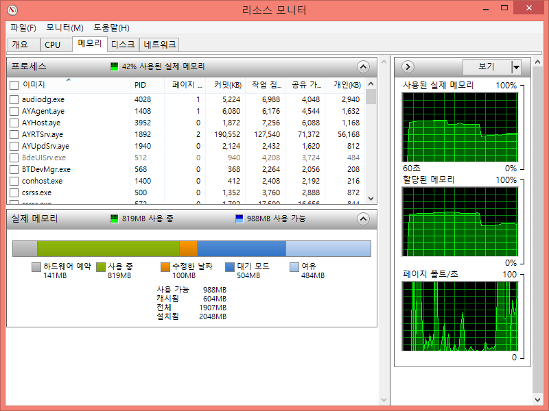
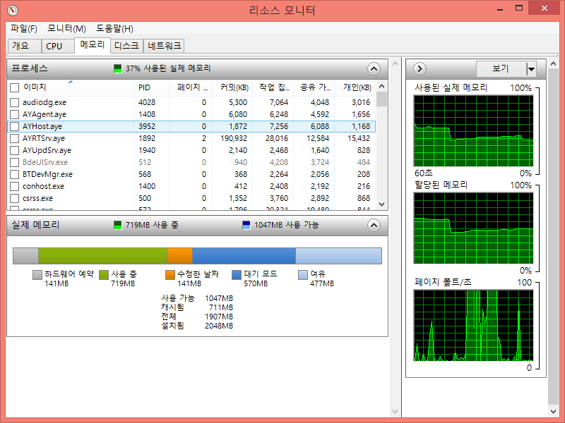
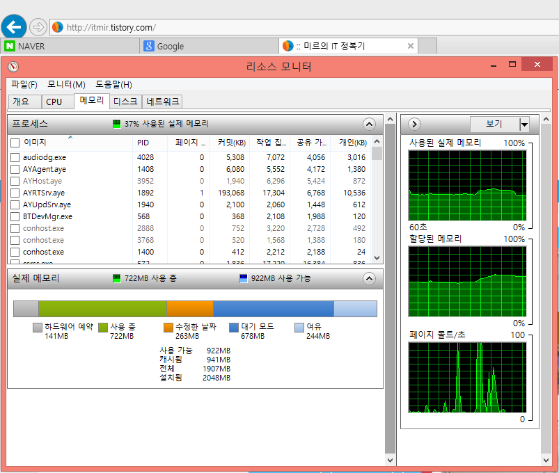
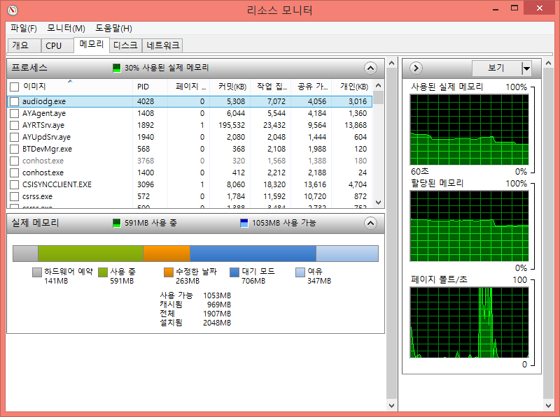
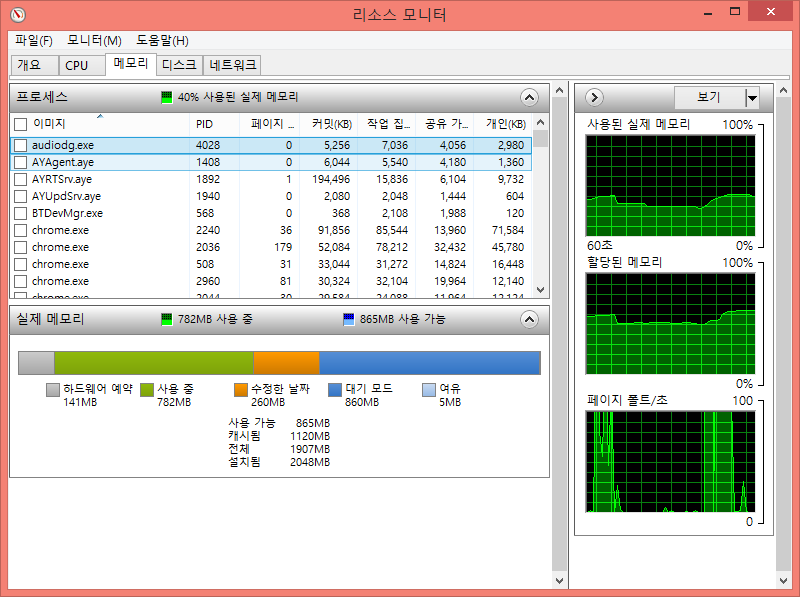
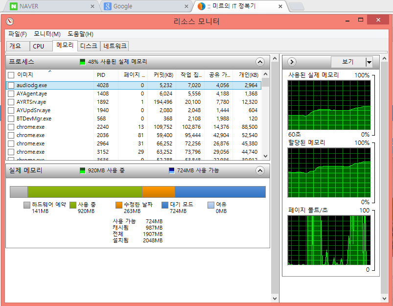
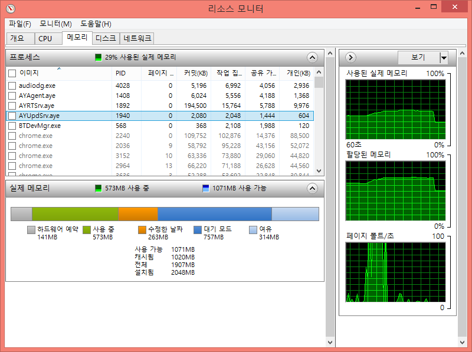

과거에 IE대신에 크롬이 속도가 더 빠르다고 해서 크롬을 자주 애용했습니다.

그런대 요즘 들어서는 크롬이 더 느린 기분이 들고, 심지어 메모리 부족 경고까지 뜨더군요. 쿨럭

왜 크롬만 켜서 탭 몇개 열면 메모리 부족 경고가 뜨는지..

그래서 직접 측정해봤습니다.

### 부팅 후 평상시 메모리 상태

일단 비교용으로 평상시 메모리 상태 스샷입니다.

사용중 메모리는 819MB, 여유 용량은 484MB입니다.

여유메모리는 300~500대에서 머물더라고요.

### IE의 메모리 상태

크롬을 살펴보기전에 인터넷 익스플로러를 확인해보겠습니다.

먼저 IE를 실행하고 조금 뒤 상태입니다.

그다음 네이버, 구글, 제 티스토리 블로그.

이렇게 3개의 탭을 열어놓은 메모리 상태입니다.

마지막으로 IE를 닫고나서 메모리 상태입니다.

### 크롬의 메모리 상태

그럼 마지막 크롬을 살펴보겠습니다.

IE와 마찬가지로 크롬을 열고나서 메모리 상태입니다.

메모리를 시원하게 먹고있습니다.

아래는 IE와 마찬가지로 3개 탭 열어놓고 찍은 스샷입니다.

... 여유 메모리 0MB네요. ㅋㅋㅋㅋㅋㅋㅋㅋ

창을 닫으면 돌아옵니다.

정말 메모리 엄청 잡아먹네요. ㄷㄷ

크롬이 전부터 쓰던 브라우저이고 편해서 잘 쓰고 있었는데...

메모리 부족이 너무 걸리네요..

다른 브라우저 알아봐야겠습니다.

IE는 블로그가 잘 안맞고,

크롬은 메모리먹고,

파폭은 플래시가... ㅠㅠ

....
