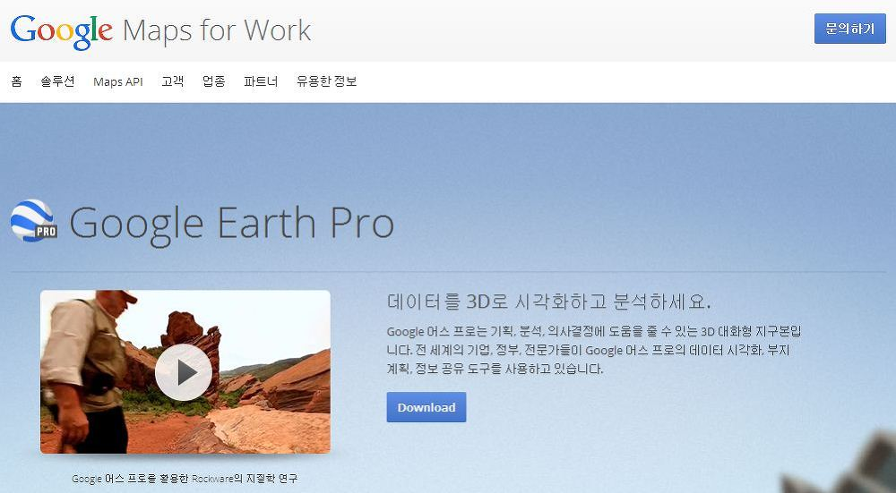
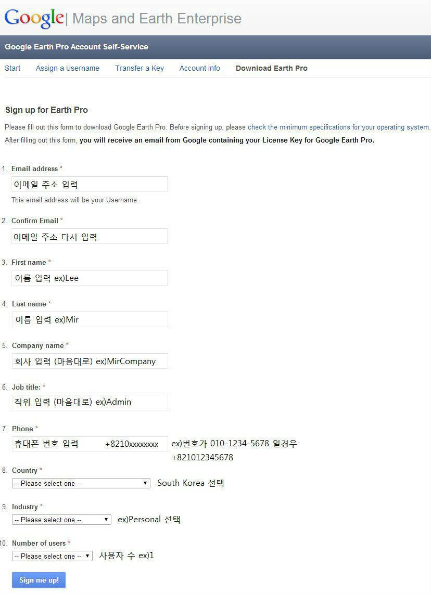
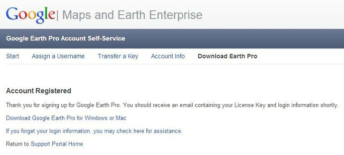
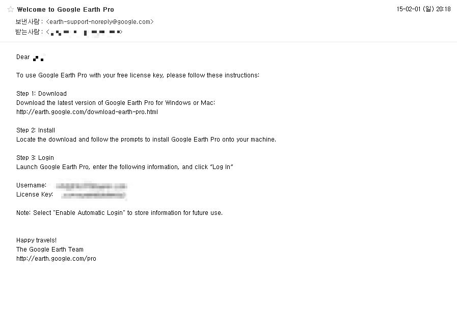
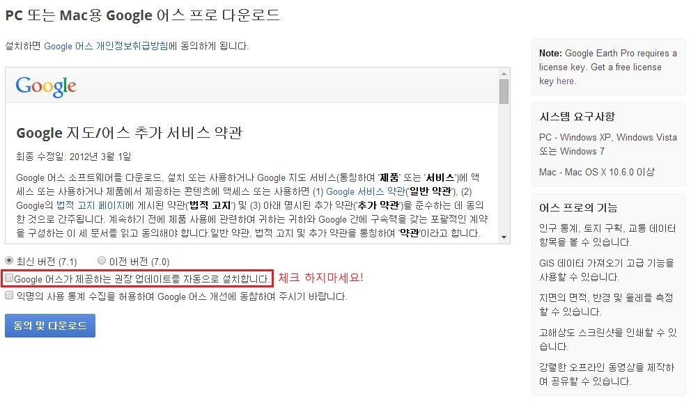
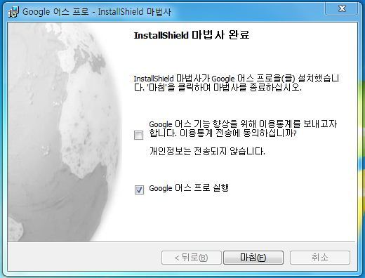
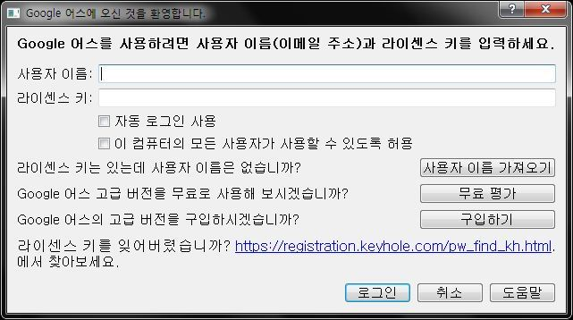
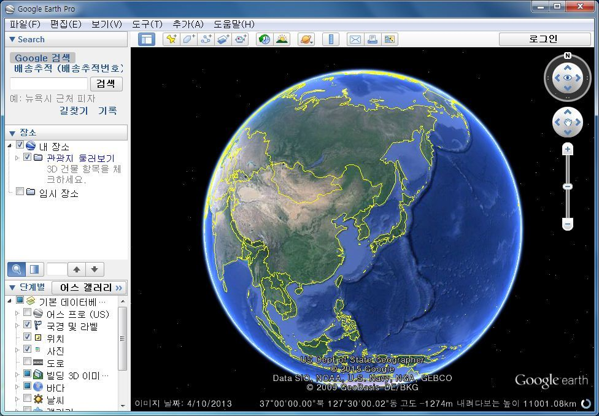
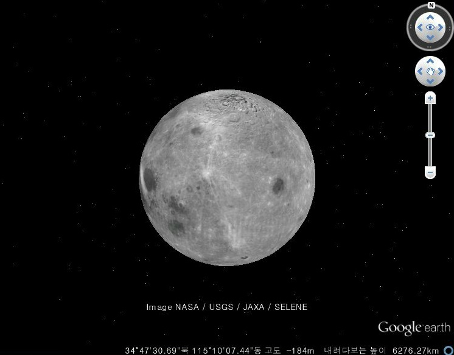

안녕하세요!

이번에 구글에서 구글 어스 프로그램을 무료로 배포하고 있습니다.

원래 구글 어스 프로는 1년에 399달러로 오늘 2015-02-01기준 약 43만7,224.20 원의 돈을 지불해야 살수 있는 프로그램인데요.

구글 어스가 나온지 10년만에 구글에서 이 라이센스 키를 무료로 배포중에 있습니다.

블로터에 관련 뉴스도 있으니 시간되시는분께서는 한번 접속해서 기사 읽어보세요~

[‘구글어스’ 전문가판도 공짜](http://www.bloter.net/archives/219472)

그럼 지금부터 어떻게 하면 구글 어스 프로버전을 받을수 있는지 살펴보겠습니다.

### 구글 어스 프로버전 사용방법

먼저 구글 어스 홈페이지에 접속해주세요.

<https://www.google.com/work/mapsearth/products/earthpro.html>

Download 버튼을 누르면 아래 스샷과 같은 페이지가 나타납니다.

양식 모두 체우신다음 Sign me Up! 버튼을 눌러주세요.

모두 입력하신다음 등록하시면 계정이 등록됩니다.

저는 네이버 메일로 성공했습니다.

저보다 먼저 성공하신 분들께서 지메일으로 되신분도 계시던대 저는 메일이 안오더라고요.

네이버 - 구글 - 한메일 등등.... 으로 시도해보세요.

이제 입력하신 메일로 들어가보시면 메일 한통이 있을탠대요.

확인해보시면 라이센스 키가 있습니다.

저기 메일 내용을 따라해야 합니다.

Step 1의 링크로 들어가주세요.

"Google 어스가 제공하는 권장 업데이트를 자동으로 설치합니다." 를 체크 하지 마시고 동의 및 다운로드 해주세요.

시간이 많이 걸렸습니다.

파일 받아 설치해주세요.

실행하시면 아래와 같은 스샷이 나타나는대요.

아까 가입한 메일 계정과 메일로 온 라이센스 키를 입력하시면 됩니다.

성공!!

구글 어스 프로 활성화를 마쳤습니다.

아래처럼 달도 확인할수 있네요.

### 마치며

구글 어스 프로가 비싼 가격임에도 불구하고 무료로 배포하고 있는 "구글"에게 감사드리며..

이만 글 마치겠습니다.

감사합니다.
