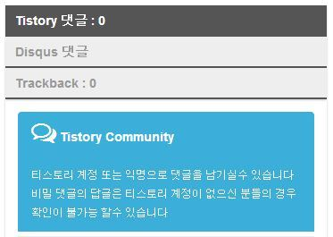
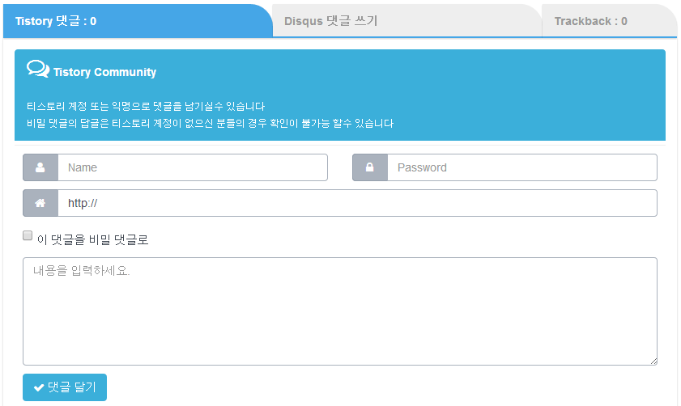
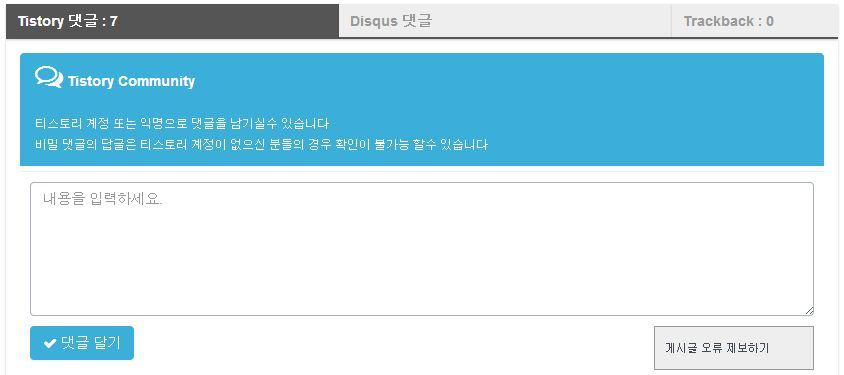

안녕하세요.

전에 뭐하라님의 도움으로 댓글 탭을 만든적이 있습니다~

[[Tistory] - 티스토리 덧글,디스커스를 탭으로 변경하였습니다~](http://itmir.tistory.com/533)

그 뒤 생각없이(?) 블로그 하다 오랜만에 다시 뭐하라님 블로그에 방문했더니 탭 모양이 업그레이드(?)되었더라고요. ㅎㅎ

전 버전보다 지금 모양이 더 심플하고 어울려서 다시 뭐하라님의 도움을 받아 새로 적용했습니다~~

전에 쓰던 css설정과 새로 바꾼 css설정 모두 백업용으로 올려두겠습니다!

### 기존 모양

CSS 설정 보기

.tabs {

  float: left;

  width: 100%;

}

.tabs>.labels>label {

  background-color: #eee;

  border-radius: 0 2em 0 0;

  color: #999;

  cursor: pointer;

  float: left;

  height: 3em;

  line-height: 3em;

  overflow: hidden;

  padding: 0 1em;

  position: relative;

  width: 40%;

  margin: 1em 0 0 0;

  border-bottom: .2em solid #45a6e7;

  -webkit-box-shadow: 0 1px 2px rgba(0,0,0,.2);

  -moz-box-shadow: 0 1px 2px rgba(0,0,0,.2);

  box-shadow: 0 1px 2px rgba(0,0,0,.2);

}

.tabs>.labels>label:nth-of-type(3) {

  width: 20%;

}

.tabs>.labels>label:hover {

  background-color: #ccc;

  color: #333;

}

input#tab1:checked ~ .labels>label[for="tab1"],

input#tab2:checked ~ .labels>label[for="tab2"],

input#tab3:checked ~ .labels>label[for="tab3"] {

  background-color: #45a6e7!important;

  color: #fff!important;

  display: block!important;

}

.tabs>.labels>label a {

  color: inherit;

}

.tab\_container {

  clear: both;

  overflow: auto;

  width: 100%;

  padding: 1em;

  -webkit-box-shadow: 0 1px 2px rgba(0,0,0,.2);

  -moz-box-shadow: 0 1px 2px rgba(0,0,0,.2);

  box-shadow: 0 1px 2px rgba(0,0,0,.2);

}

.tabs>input[type="radio"], .tabs .tab\_content {

  display: none;

}

input#tab1:checked ~ .tab\_container>#tab1C,

input#tab2:checked ~ .tab\_container>#tab2C,

input#tab3:checked ~ .tab\_container>#tab3C {

  display:block;

}

@media screen and (max-width:480px) {

  .tabs>.labels>label {

    width: 100%;

    margin: 0;

    border-radius: 0;

  }

  .tabs>.labels>label:nth-of-type(3) {

    width: 100%;

  }

  .tabs>.labels>label:first-of-type {

    margin: 1em 0 0 0;

  };

}

### 새로운 모양

CSS 설정 보기

.tabs {

  float: left;

  width: 100%;

}

.tabs>.labels>label {

  background-color: #eee;

  color: #999;

  cursor: pointer;

  float: left;

  height: 2.5em;

  line-height: 2.5em;

  overflow: hidden;

  padding: 0 .8em;

  position: relative;

  width: 40%;

  margin: 1em 0 0 0;

  border-bottom: .2em solid #555;

  -webkit-box-shadow: 0 1px 2px rgba(0,0,0,.2);

  -moz-box-shadow: 0 1px 2px rgba(0,0,0,.2);

  box-shadow: 0 1px 2px rgba(0,0,0,.2);

}

.tabs>.labels>label:nth-of-type(3) {

  width: 20%;

}

.tabs>.labels>label:hover {

  background-color: #ccc;

  color: #333;

}

input#tab1:checked ~ .labels>label[for="tab1"],input#tab2:checked ~ .labels>label[for="tab2"],input#tab3:checked ~ .labels>label[for="tab3"] {

  background-color: #555;

  color: #fff;

}

.tabs>.labels>label a {

  color: inherit;

}

.tab\_container {

  clear: both;

  overflow: auto;

  width: 100%;

  padding: 1em;

  -webkit-box-shadow: 0 1px 2px rgba(0,0,0,.2);

  -moz-box-shadow: 0 1px 2px rgba(0,0,0,.2);

  box-shadow: 0 1px 2px rgba(0,0,0,.2);

}

.tabs>input[type="radio"],.tabs .tab\_content {

  display: none;

}

.notAvailable {

  border: #f00 solid 1px;

  background: #fdd;

  padding: 1em;

}

input[name="tabs"]:checked ~ .tab\_container>.notAvailable {

  display: none;

}

input#tab1:checked ~ .tab\_container>#tab1C,input#tab2:checked ~ .tab\_container>#tab2C,input#tab3:checked ~ .tab\_container>#tab3C {

  display: block;

}

@media screen and (max-width:480px) {

  .tabs>.labels>label {

    width: 100%;

    margin: 0;

  }

  .tabs>.labels>label:nth-of-type(3) {

    width: 100%;

  }

  .tabs>.labels>label:first-of-type {

    margin: 1em 0 0 0;

  };

}

항상 좋은 정보 알려주시는 뭐하라님께 감사드립니다!
