목요일날 주문한 샤오미 보조배터리 10400이 어제 토요일에 도착했습니다 ㅎㅎ

설날이라 엄청 늦을것 같았는데 다행이 2일걸려서 도착했네요 ㅎㅎ

### 보조배터리 개봉기

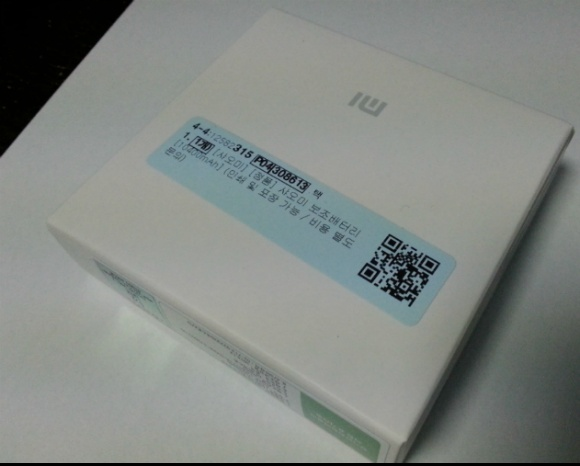

박스는 이렇게 생겼는데요

저기안에 배터리랑 USB가 꽉차있습니다

여유공간이 별로 없는 구성입니다

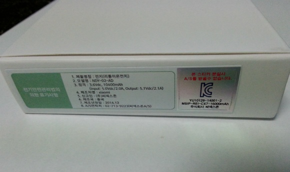

옆면에 있는 저 K 마크 스티커를 배터리에 붙히라고 하더라고요

그렇지만 저는 패스

그냥 박스채로 보관할 생각입니다

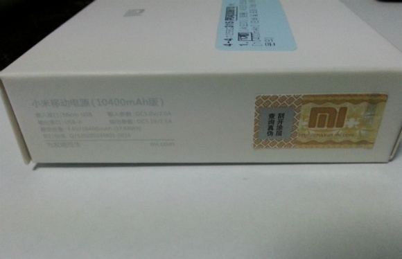

위 사진의 오른쪽 부분이 이 제품이 정품인가? 짝퉁인가?를 구분할수 있는 시리얼 번호가 담겨있는 ....

아무튼 저 은색부분을 문상 핀번호 알아낼때처럼 동전같은걸로 긁어주세요

강하게 긁으면 숫자까지 손상됩니다..;

정품인증은 좀더 아래에서 설명드리겠습니다

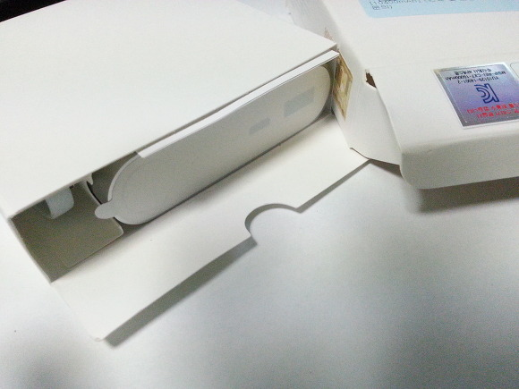

박스안에는 정말 꽉 담겨있습니다

보조배터리 본체와 usb가 끝

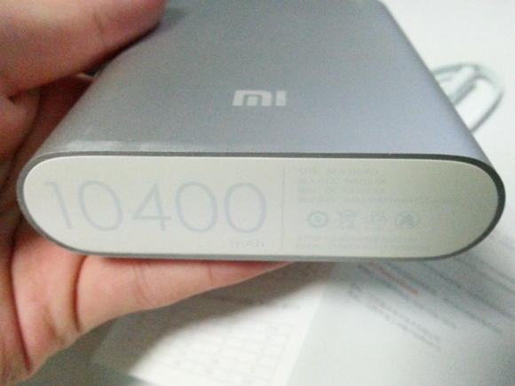

배터리 용량인 10400이 표시되어 있네요

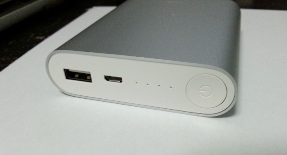

USB단자(다른기기 충전용), 마이크로 5핀(배터리 충전용), LED 4개, 전원버튼이 있습니다

사실 전원버튼은 사용할 필요가 없습니다

그냥 다른기기랑 연결하면 충전시작, 해제하고 5초간 사용이 없으면 전원중단됩니다

중국어로된 설명서를 보면 저기 LED 깜빡임 횟수와 남은 배터리 용량이 표로 정리되어 있는데요

한국인인 우리는 이해가 안됩니다..

그래서 제가 표로 준비했습니다

|  |  |  |  |  |
| --- | --- | --- | --- | --- |
| 방전될때 | LED 1 | LED 2 | LED 3 | LED 4 |
| 방전됨 | X | X | X | X |
| 0%~25% | 깜빡임 | X | X | X |
| 25%~50% | 깜빡임 | 깜빡임 | X | X |
| 50%~75% | 깜빡임 | 깜빡임 | 깜빡임 | X |
| 75%~100% | 깜빡임 | 깜빡임 | 깜빡임 | 깜빡임 |

|  |  |  |  |  |
| --- | --- | --- | --- | --- |
| 충전할때 | LED 1 | LED 2 | LED 3 | LED 4 |
| 0%~25% | 깜빡임 | X | X | X |
| 25%~50% | 켜짐 | 깜빡임 | X | X |
| 50%~75% | 켜짐 | 켜짐 | 깜빡임 | X |
| 75%~96% | 켜짐 | 켜짐 | 켜짐 | 깜빡임 |
| 100% | 켜짐 | 켜짐 | 켜짐 | 켜짐 |
| 비정상 | 깜빡임 | 깜빡임 | 깜빡임 | 깜빡임 |

참고하시길 바랍니다~

마지막 스샷은 사용화면입니다

직접 연결해서 사용중이고.. 저 불빛은 깜빡거립니다

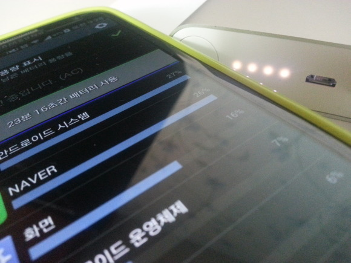

### 정품인증하기

정품인증은 아래 사이트에 접속해서 할수 있습니다

<http://order.mi.com/service/dyscode>

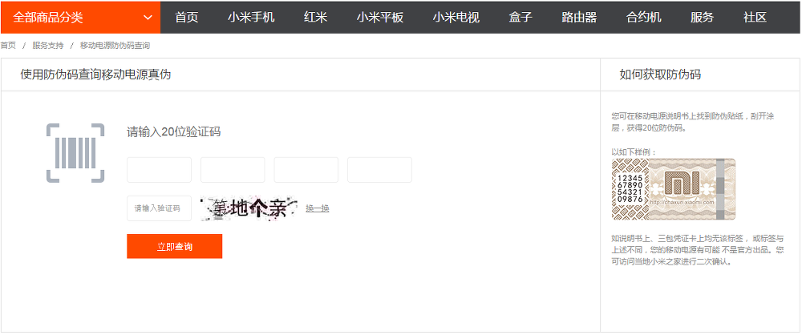

박스에 있던 시리얼 번호를 입력하고

또... 한자를 입력해야 하는대요

원래는 숫자입력방식이었는데 한자로 바꿨다고 합니다...

한가지 팁을 드리자면..

네이버 한자사전에서 마우스로 한자를 검색할수 있습니다

<http://hanja.naver.com/>

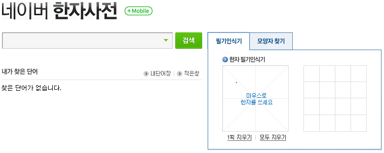

아래 스샷처럼 모두 입력해주시고 확인버튼을 눌러주세요

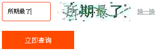

정품이 맞다면 아래 스샷처럼 1次(차)라고 나타납니다

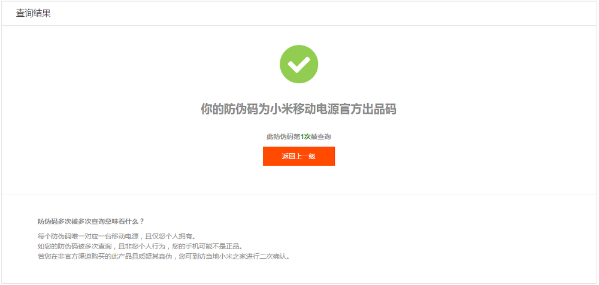

저도 다행히 정품이네요 ㅎㅎ

이상으로 보조배터리 개봉기 및 정품인증에 대해 마치겠습니다

ps.. 보조배터리 산 이유가 태블릿 충전하려고 샀는데..

2.5파이 usb가 없네요 ㅠㅠ

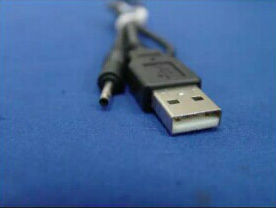
  
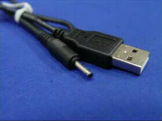

이렇게 생겼다는대.. 좀더 찾아봐야 겠어요
