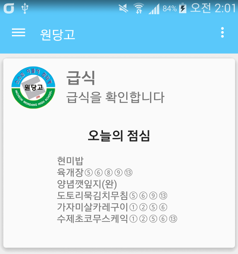
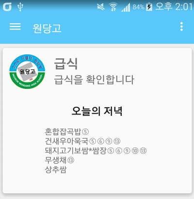
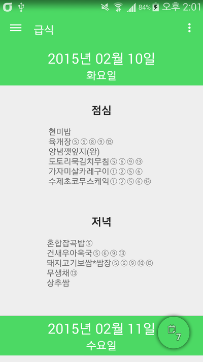
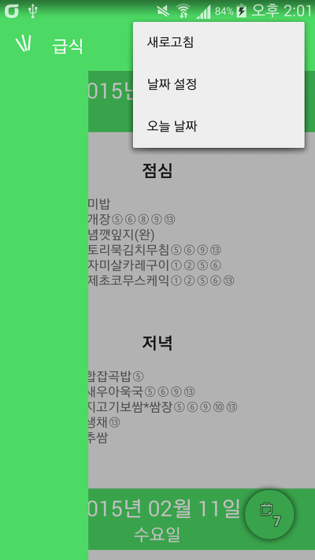
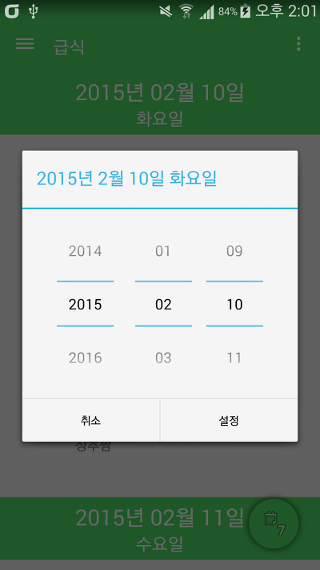

안녕하세요

요즘 3일동안 엄청 바빴는데요 ㅋㅋ

SC은행가서 통장도 만들고 제이탭 망가진줄알고 인천 서구에서 계양까지 버스 3시간 타고 등등...

뻘짓을 많이 했습니다

그래도 틈틈히 학교앱 작업하고 있는데요

설날을 맞이해서 작업 현황 보고겸 포스팅합니다~~

  

전체적으로 머터리얼 디자인을 적용하려고 노력했습니다

이클립스에서 ToolBar쓰려고 했는데 뭔짓을 해도 제 컴에선 안되길래 안드로이드 스튜디오로 옮겨탔습니다 ㅎㅎ

나중에 안드로이드 스튜디오 관련한 포스팅을 쓸 예정입니다

이번에 학교앱 프로젝트를 안드로이드 스튜디오에서 새로 만든다음 하나씩 머터리얼 디자인을 적용하는김에

급식을 저장하는 방식을 갈아엎었습니다

필요없는 아침을 제거하고 한주 단위만 저장이 가능했던 전버전에 비해 지금 만드는 버전은 하루 단위로 급식을 저장해서

"한번만 로딩하면 다음부터는 무제한 검색이 가능합니다 ㅎㅎㅎ"

그리고 메인화면에 바로 오늘 점심과 저녁을 알수있어요

0시부터 13시까지는 점심이 표시되고, 14시(2시)부터는 저녁이 표시됩니다

다운받은 데이터가 없으면 표시되지 않도록 설정했습니다

  

플로팅 액션 버튼을 적용해서 날짜선택을 더 편하게 해봤어요 ㅎㅎ

원래는 이 리스트뷰도 가로 스크롤이 아닌 세로 (↔) 스크롤으로 하고 싶었는대 ㅠㅠ

많은 문제가 있어 지금은 반 포기상태입니다

한번 급식을 받아오면 앱 삭제시까지 따로 데이터 사용이 없습니다

하아... 힘드네요

이거 생각보다 힘든 작업이네요

앱 새로 만들때보다 더 힘든것 같은...

그럼 설날 다들 무사히 도착하시길...!

ps. 알림창같은건 나중에 다 완성한다음 머터리얼 찾아보려고요

ps2. 저 저녁에 중국 베이징가요!!!
