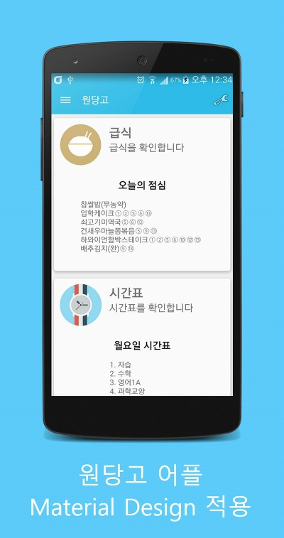
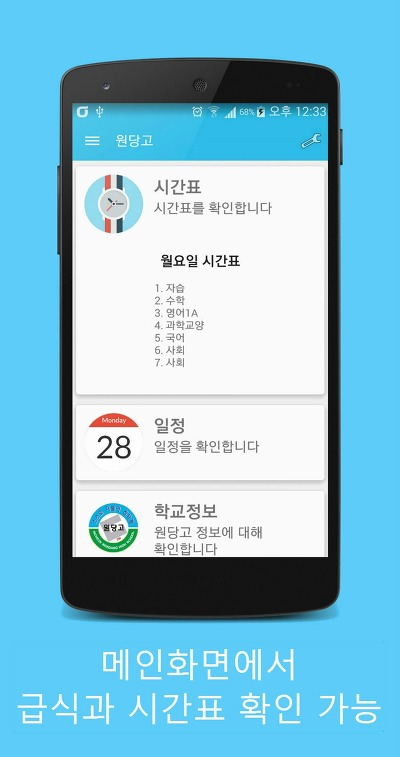
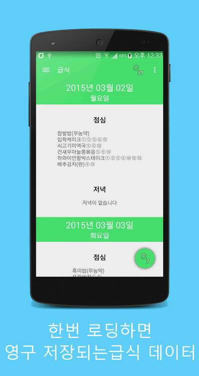
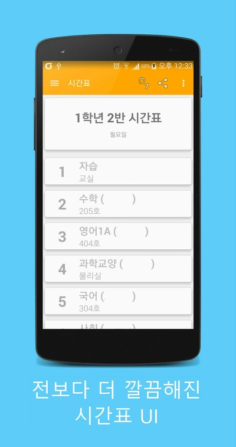
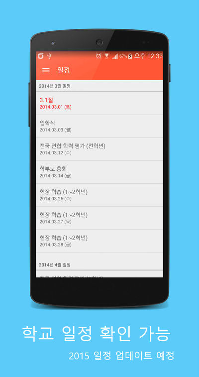
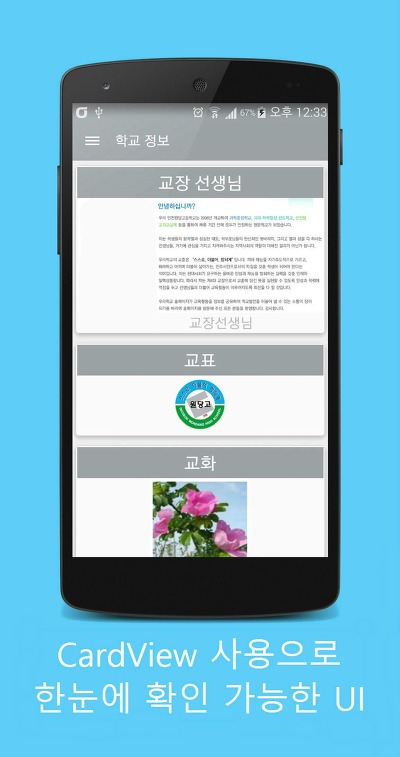
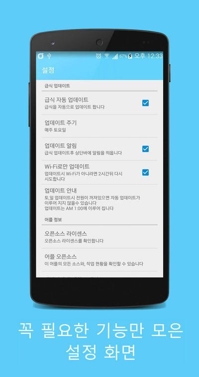
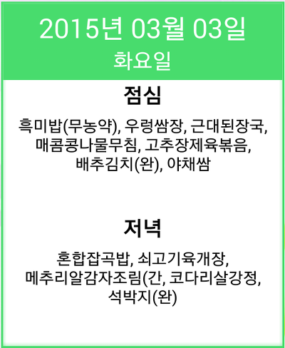

저번에 학교앱을 Material Design으로 만들고 있다는 글을 올렸습니다

[[Application] - 학교앱을 Material 디자인으로 새로 만들고 있습니다](http://itmir.tistory.com/563)

일단은 전체적인 디자인이랑 기능이 복구(?)된것 같아 마켓에도 업데이트 하고 글 남깁니다~

아래 스크린샷은 이번에 디자인 갈아엎고나서 찍은 스크린샷입니다 ㅎㅎ

확실히 저번 디자인보다 나아진것 같습니다.

나중에 한번 더 갈아엎어야지요 ㅋㅋ

저번 디자인보다 훨씬 보기 좋네요

메인화면에서 급식이랑 시간표 확인이 바로 가능하도록 구현했습니다

급식은 저장된 데이터가 있을때(한번 접속에서 다운받으면 저장됨)

0시부터 오후 1시까지는 점심 식사가 표시되고

오후 2시부터는 오늘의 저녁이 표시됩니다

  

급식 데이터는 한번 로딩하면 다시 불러올때 데이터 없이 불러오기가 가능합니다

전에는 한주간격으로만 저장됬다면 이 버전에서는 하루 간격으로 저장되도록 변경해서 가능했습니다

EX) WIFI로 2015-02-23 급식을 로딩했다면 2015-02-22(그주의 일요일)~2015-02-28(그주의 토요일)까지의 데이터가 저장되며

언제든지 데이터 없이 다시 볼수 있습니다

  

시간표 디자인은 카드뷰를 사용했어요

학교 일정은 디자인은 바뀌지 않았지만 여백부분만 바꿔 넣었습니다

  

학교 소개, 교가, 연락처를 모와서 하나의 메뉴로 모두 집어넣었습니다

설정화면도 필요없는 설정과 코드는 모두 지워버리고 딱 필요한것만 넣었습니다

3.2버전에 다시 위젯도 추가했습니다~~

기본적으로 3x3 크기이고 크기 조절 가능합니다

그리고 날짜부분을 눌러주면 급식 업데이트 됩니다 ㅎㅎ

Material 적용하는거 생각보다 조금 어렵네요..

앱을 새로 만드는것 만큼 힘들었습니다

그래도 2월안에 전체적인 흐름을 마무리 해서 좋네요 ㅎㅎ

오픈소스 : <https://github.com/itmir913/wondanghighschool>

마켓 : <https://play.google.com/store/apps/details?id=wondang.icehs.kr.whdghks913.wondanghighschool>
