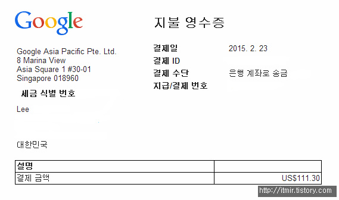
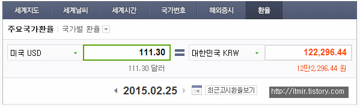

구글 애드센스를 알게된지 2년정도 흐른것 같습니다.

블로그 주소를 바꾼 다음, 애드센스를 다시 설치하고 한 반 년? 정도 된 것 같은데요 ㅎㅎ

드디어 $100가 넘어서 애드센스 수익금을 받았습니다. ㅎㅎ

그동안 애드센스와 관련해서 쓴 글도 많네요. ㅎㅎ..

[[Tistory] - [1편] 티스토리에 구글 애드센스 (Google Adsense)를 넣어보자](http://itmir.tistory.com/110)

[[Note] - 드디어 구글 애드센스 허가가 떨어졌습니다!](http://itmir.tistory.com/112)

[[Note] - 구글 애드센스 무효클릭으로 인해 계정이 비활성화 되었습니다 ㅠ](http://itmir.tistory.com/163)

[[Tistory] - [애드센스] 구글 애드센스 (Google Adsense) 신청하기](http://itmir.tistory.com/508)

[[Tistory] - 구글 애드센스 $10를 넘어 주소 확인 PIN이 발송되었습니다~](http://itmir.tistory.com/513)

[[Tistory] - 구글 애드센스(Adsense) 핀번호가 도착했습니다](http://itmir.tistory.com/535)

작년 6월달에 블로그 주소 변경하고, 7월에 핀번호 발송되서, 8~9월에 핀번호 입력하고....

9월 달 부터 5개월이 지난 지금에서야 드디어 100달러가 넘었습니다. ㅎㅎ

6월부터 8개월동안 저 아이콘을 가지고 있는 애드센스 어플...

처음에는 자주 확인하다가 요즘은 확인도 안하네요 ㅎㅎ..

애드센스를 받을때 국내 은행 계좌로 송금하려면 수수료가 있다고 하더라고요 1만원정도..

그래서 저번 주 화요일에 $300이하는 수수료가 면제되는 SC은행에 통장만들고 기다리고 있었습니다.

아래 스샷은 구글에서 주는 지불 영수증이예요.

(개인정보는 삭제 ㅎㅎ)

저기 영수증에는 월요일인 23일로 되어있는데, 저는 오늘 오후에 SC은행에서 전화를 받았고 오늘 입금되었더라고요.

며칠정도 전산처리(?)할 시간이 필요한가봅니다.

해외에서 입금이 되면 은행에서 전화가 온다고 하더라고요.

(바쁜 은행은 그냥 입금한다는 말도 있습니다.)

그래서 전화가 개학하고 오면 어떡하지 했는데.. 다행히 방학 중에 왔어요. ㅎㅎ

직원분께 구글 애드센스라고만 말씀드렸는데, 광고수익이라는걸 아시더라고요.

수수료로 SC은행에 계좌 만드시는분 많으실거 같은데.. 이러다가 SC도 수수료를 받는다고 한다면 어떻게 해야할지....;;

환율과 비교해보겠습니다.

오늘 환율과 입금된 금액인 121,483원을 비교해봤습니다.

저기에는 12만 2,296원이라고 되어있는대 입금된 금액은 12만 1,483원이라고 되어있거든요.

약간의 차이는 있지만 다른 은행들처럼 1만원 수수료가 없어서 금액 그대로 들어왔네요. ㅎㅎ
