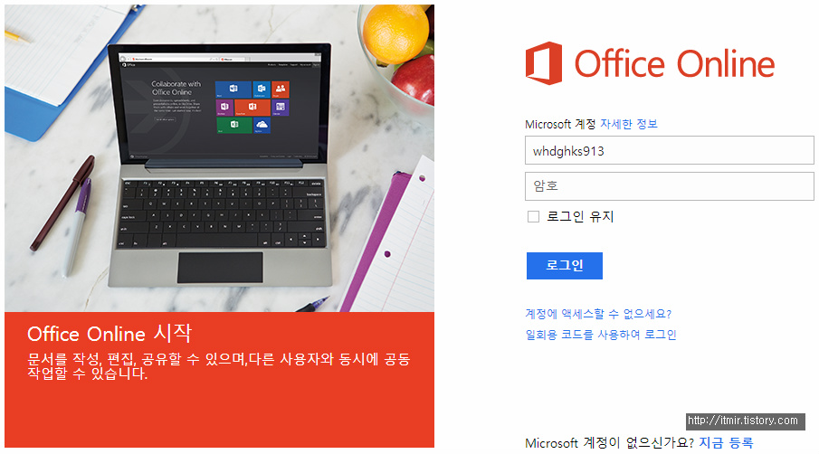
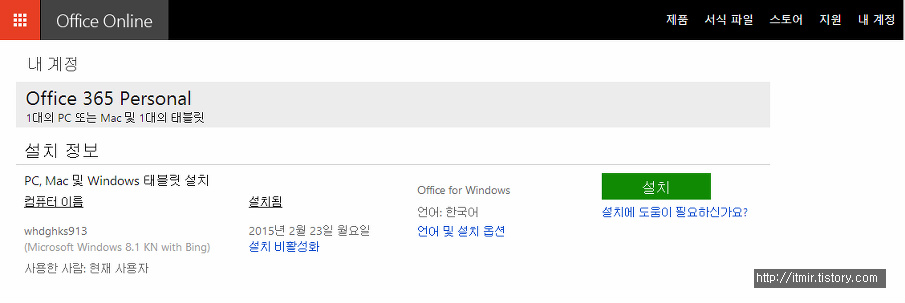
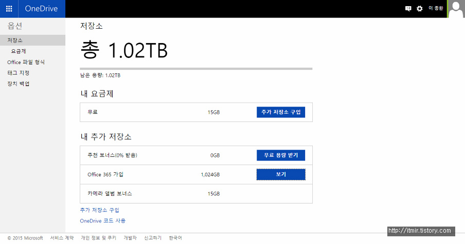

J-Tab2에 기본적으로 들어있는 오피스 프로그램이 말을 안들어서(?) 삭제해버린적이 있습니다

(그떄 왜 삭제했는지 모르겠네요 ㅠㅠ 귀찮게 왜 삭제했지?)

그러고나서 다시 어떻게 재설치 하는지 막막했는데요...

이거 맨처음에 있었던 런처(?)프로그램까지 지워져버렸더라고요

포멧해야 하는거 아닌가 생각하고 있었지만 다행히 방법을 찾아서 재설치 했습니다 ㅎㅎ

확실히 이번 오피스는 가벼운거 같아요

램이 2GB인 제 태블릿에서도 무난하게 돌아가니..

아무튼 어떻게 하면 다시 설치 프로그램을 다운받을수 있는지 알려드리겠습니다

### Office Online에 접속해주세요

<https://stores.office.com/myaccount/home.aspx>

위 사이트에 접속하셔서 로그인해주세요

이게 오피스를 처음 설치했을때 기억이 가물가물한데요...

처음에 오피스 설치할때 마이크로소프트 계정으로 로그인을 했던거 같아요

그 계정에 설치 기록이 남아있어서 그걸 이용해서 다운받을수 있는거 거든요

마이크로소프트 도움말이나 다른곳 보면 제품키를 입력하라고 나와있거든요

J-Tab2는 제품키가 없고 자체 인증방식이기때문에 제품키를 입력할수가 없어요..

그래서 계정에 로그인해서 설치 정보를 확인해야 합니다

아무튼 로그인 해줍시다

로그인하면 아래 스샷처럼 나타납니다

설치버튼 누르시면 설치프로그램이 다운로드되고, 실행하시면 정상적으로 설치 진행이 가능합니다~~

무작정 지워버리다보니까 어떻게 해야 재설치해야 하는지 막막했었는데요..

구매 내역? 설치 내역이 남아서 가능한일 같습니다

아 그리고 Office 365를 등록해서 그런지 OneDrive용량이 늘었더라고요 ㅋㅋ

어떻게 이 용량을 활용할수 있을까요..???

OneDrive동기화가 SSD용량을 안먹고 동기화가 된다면 막 쓰겠지만.. 용량을 잡아먹는지라 어떻게 해야 잘 쓸지 모르겠네요 ㅋㅋ

그렇다고 일일히 온라인 전용 파일로 설정하기도 귀찮고 말이죠..
