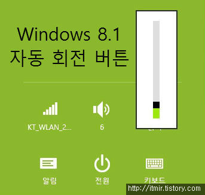
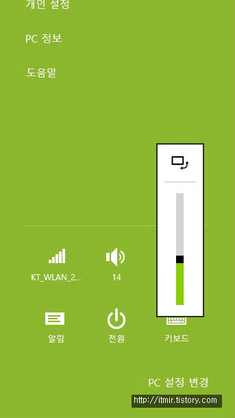
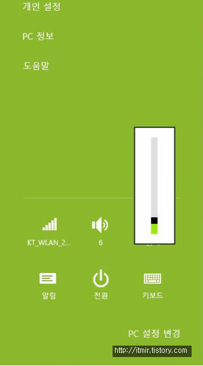
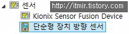

윈도우 8.1을 쓰는대... 자동회전 버튼이 없어졌습니다. ㅠㅠ

어느날 부팅을 했는데 자동회전 버튼이 없어져있더라고요...;;

이게 자동 회전버튼이 자주 쓰이는건 아닌지라 언제 없어졌는지도 모릅니다.

   

(좌) 기존 (우) 사라짐

위에 있는 2개의 스샷을 확인해보시면..

자동회전 버튼이 사라진걸 확인할 수 있습니다.

장치관리자에 들어가봤더니..

스샷은 없지만 센서 부분에 방향 센서가 안뜨는거 같더군요.

위 스샷은 정상으로 돌아왔을때 찍은 스샷입니다.

아마 윈도우에서 센서를 인식하지 못해 버튼이 사라진거 같은데..

저는 원인을 알 수 없어서.. 마침 윈도우도 꼬인거 같아서 포멧해버렸거든요. ㅋㅋ

다시 정상으로 돌아왔지만.. 왜 버튼이 사라진건지는 모르겠네요...

찝찝합니다.
