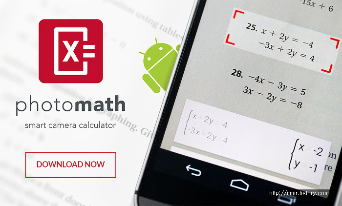
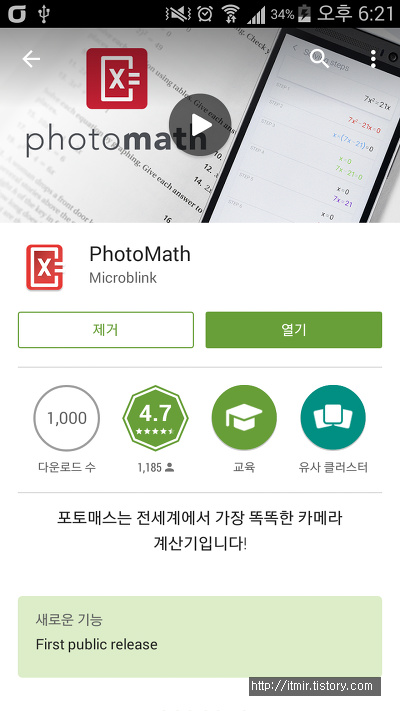
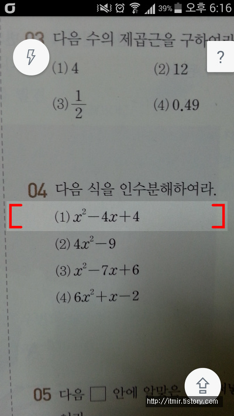
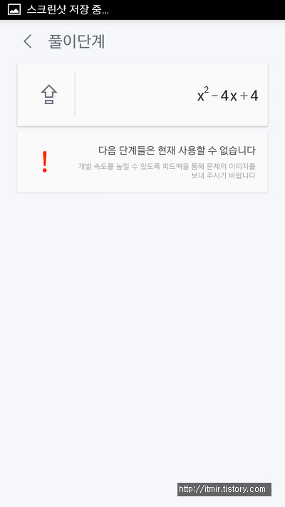
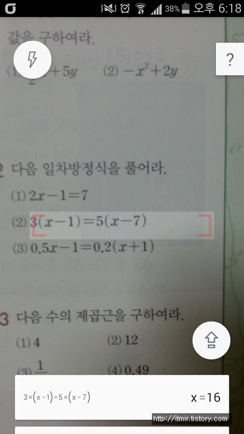
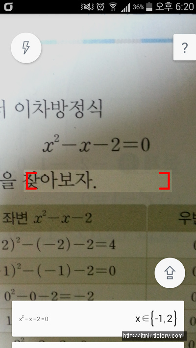
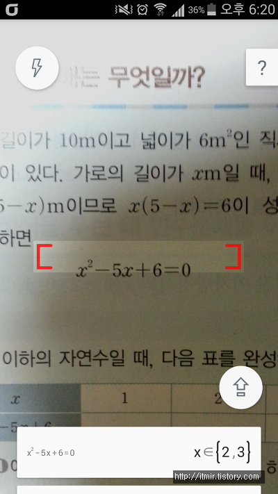
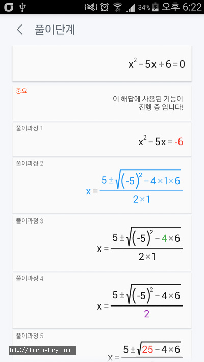

사진으로 수학문제를 풀어주는 PhotoMath어플이 안드로이드 마켓에 올라왔습니다~

기존까지는 IOS와 윈도우폰에서만 사용이 가능했었는데요

이제부터는 안드로이드에서도 사용이 가능합니다~

2015-02-26일이 마켓에 찍혀있는걸로 보아 올라온지 얼마 안된것 같네요ㅎㅎ

<https://play.google.com/store/apps/details?id=com.microblink.photomath>

Android Play Store에서 다운받으실수 있고, 용량은 약 4.1M정도이며 안드로이드 4.1부터 지원합니다

아직까지는 손글씨는 안되는대요 기존 [MyScript 계산기](https://play.google.com/store/apps/details?id=com.visionobjects.calculator)라는 어플과 병행해서 사용한다면 더 유용하지 않을까 생각되네요 ㅎㅎ

마켓에서 PhotoMath를 다운로드 하고 실행해주세요

그다음 박스안에 수식을 맞춰주시면 됩니다

  

저렇게 박스안에 수식을 넣어주시면 되는대요

빨간 박스를 움직여서 상자 크기를 조절할수도 있습니다

아직 초기버전이라 지원되지 않는 수식이 많은거 같습니다

  

중3 이차방정식 부분인데요

이부분은 정확하게 인식하는 모습을 확인할수 있습니다

  

자세한 풀이과정도 확인할수있습니다

(2차방정식은 근의공식으로 푸는것같네요)

공식 홈페이지는 <https://photomath.net/> 입니다

몇가지 단점이 있다면..

저는 이제 미적분등등 들어가는데요 극한 같은건 안되나요 ㅠㅠ

조금더 업데이트가 진행되서 사용가능한 수식이 더 많아진다면 유용하게 사용할수 있는 어플이 될것 같습니다
