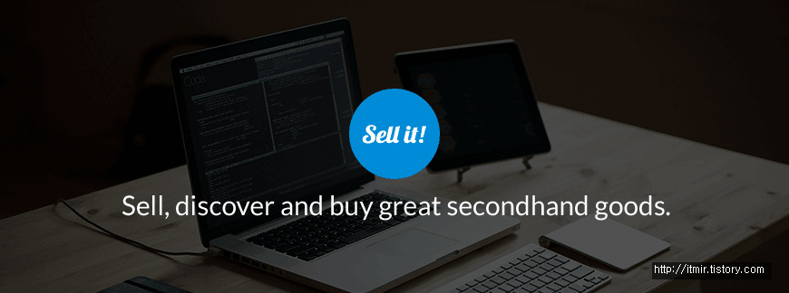
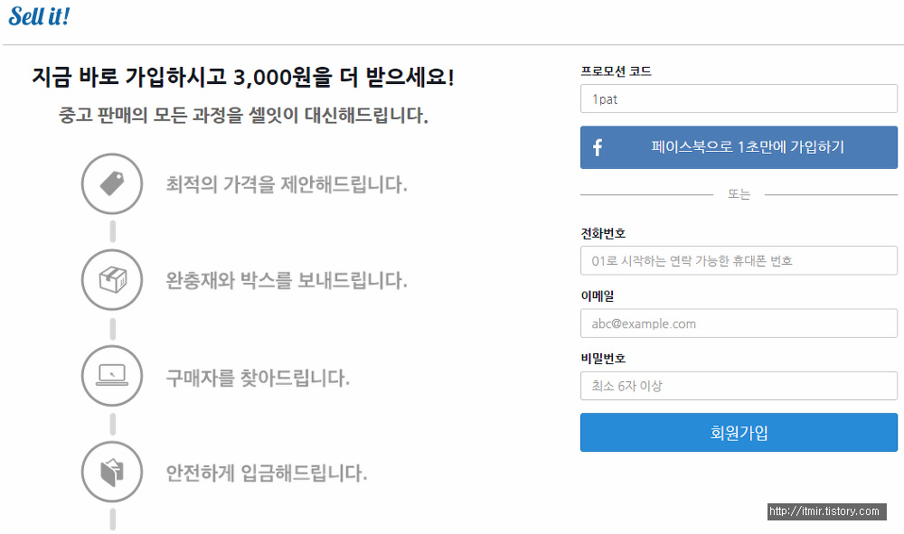

출처 : https://play.google.com/store/apps/details?id=com.withsellit.app.sellit 의 어플 이미지 캡쳐

친구가 자신이 쓰던 태블릿이랑 블루투스 키보드를 팔고 그 돈으로 아이패드를 산다고 하더라고요

그래서 어떻게 팔았냐고 물어보니까 이 어플을 알려주었습니다

이 어플의 이름은 셀잇(Sell It) 입니다

출처 : https://www.withsellit.com/about

기존 중고 거래 카페(중고등학교 나라)등은 판매자와 구매자가 1:1 매칭이었다면

이 sell it은 판매자 - 회사 - 구매자의 형식입니다

가운데에 회사가 적극적으로 개입합니다

홈페이지에서 말하기를 회사가 최적 가격을 제안하고, 판매자에게 박스를 제공하고, 등등등...

확실히 기존 중고 거래보단 사기 위험이 낮아졌습니다

...

그 친구는

아이패드를 산다고...

아이패드를....

아 정말 부럽네요ㅋㅋ

아무튼,

어플을 잠시 다운받아서 확인해봤는데, 판매자가 회사로 물건을 보내면 회사가 판매중 목록에 올리고, 구매자가 그걸 구매하면 회사에서 택배로 보내주는 형식인가봐요

저도 쓰고싶은데 돈이......

정말 다 좋은데 한가지 단점이 돈이 없네요...

공식 홈페이지는 <https://www.withsellit.com> 입니다

안드로이드 마켓 : <https://play.google.com/store/apps/details?id=com.withsellit.app.sellit>

※주의 : 절대로 돈이 조금이라도 있는 분은 접속하지 마세요

진짜 몇일동안 사고 싶어서 ㅠㅠ 지름신이 몇일째 오는건지...

아, 그리고 저번주까지 초대 10000원이벤트는 끝났지만 3,000원은 아직도 주고 있습니다

혹시 못받으신 분들은 제 초대 링크 올려놓을태니 여기로 들어가셔서 가입하시고 전화번호 인증 하시면 됩니다

<https://www.withsellit.com/invite/1pat>

이런 창이 뜨면 회원 가입 하신다음에 셀잇 앱에서 전화번호 인증 하시면 됩니다

ps. 디벨로이드에 갤럭시 노트3 사신분 있더라고요 이걸로......... 정말 부럽습니다 ㅠㅠ
