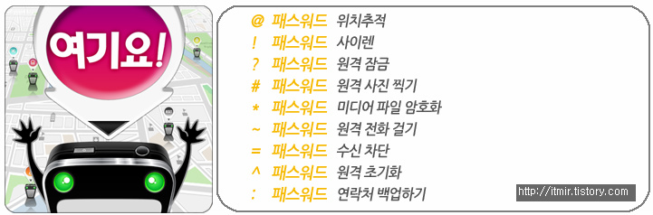
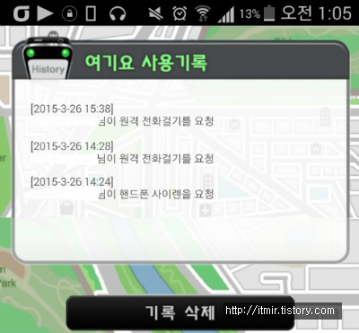

출처 : http://www.durldy.com/

오늘 학교에서 점심먹고 휴대폰을 찾아보니 ... 없어졌어요 ㅠㅠ

분명 4교시 끝날때 가지고 있었는데 점심먹고 주머니를 찾아보니 없어졌더라고요...

아무리 찾아봐도 없고... 구글 위치 추적을 쓰려고 했더니 데이터를 끈 상태이고...

다행히 전에 여기요! 어플을 깔아둬서 다행히 찾았습니다 ㅎㅎ

저는 티스토리에서 여기요 유료버전을 받아 사용중인데요

오늘 @, !, ~까지 사용해봤네요 ㅋㅋ

스샷 : http://www.durldy.com/

오늘 5교시 미적분 시간 끝나기 5분전쯤 자유시간이 생겨서 제 친구폰으로 여기요 명령어를 찾아봤는데요

좀있다가 쉬는시간에 사이렌 울려서 찾아보려고 했는데 5분전(=수업시간)에 사이렌 명령문자를 보냈습니다 ㅋㅋㅋㅋㅋㅋㅋ

어떤반 수업끝나기 5분전에 사이렌 울렸나봐요 ㅋㅋㅋㅋㅋㅋㅋ

아무튼 그렇게 되서 학생부에서 휴대폰을 찾았는데요

학생부쌤이 사이렌 울렸다고 하시더라고요 ㅋㅋㅋㅋㅋㅋㅋㅋ

아무튼 오늘 여기요!어플의 효과를 톡톡히 봤네요 ㅋㅋㅋ

앞으론 더 잘 관리좀해야겠어요

잃어버리지 않도록...

ps. GPS와 DATA는 되도록 켜둬야겠어요

GPS는 켜둔다고 배터리 나가는게 아닌 앱이 gps쓸때만 배터리를 소모하므로... 이제부턴 켜둬야겠습니다.
