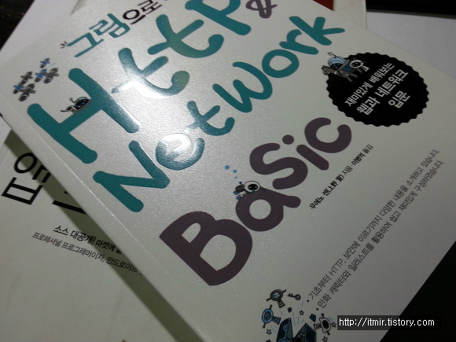
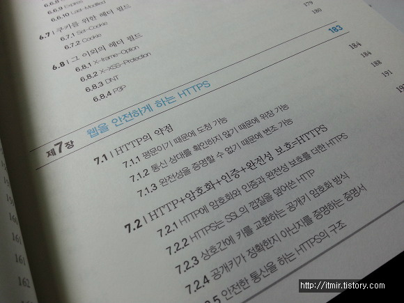
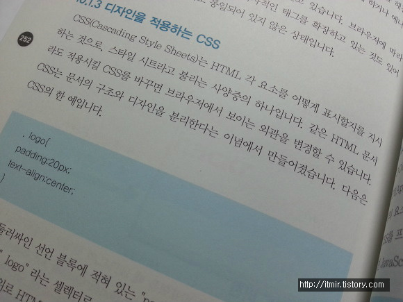
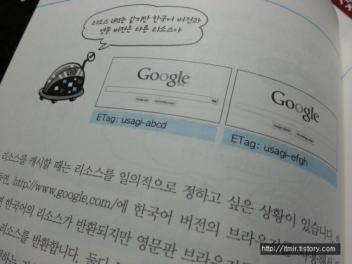
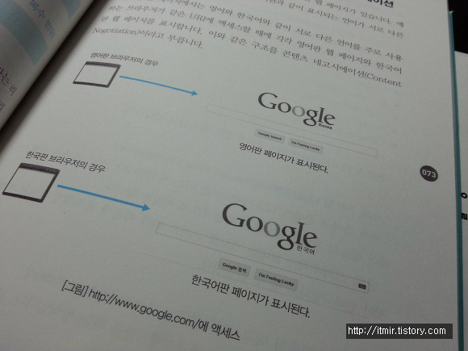
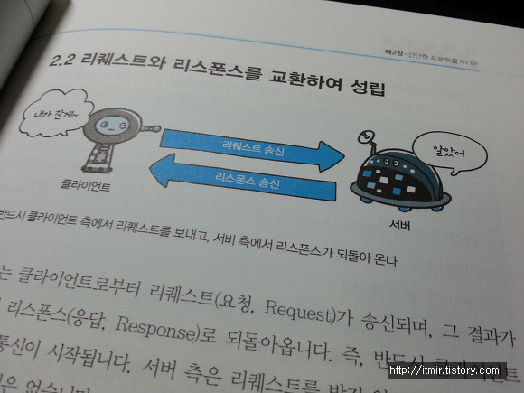

그림으로 배우는 Http & Network Basic을 읽어보았습니다.

그림이 정말 아기자기(?)하고 재미있게 설명되어 있어서, Http에 대해 전혀 모르고 있어도 이해하는데 크게 어렵지 않았습니다.

이 책은 총 11장으로 구성되어 있는데요.

제 1장(웹과 http의 기본)부터 제 11장(웹 공격 기술)로 이루어져 있습니다.

책의 내용 중에서 몇 가지 인상깊었던 부분을 알려드리겠습니다.

먼저 이것은 css에 관련된 내용인데요.

왜 이게 인상깊었냐면, 티스토리를 주로 하면서 html과 css에 대해 알아볼 기회가 많이 있었는데, 이 내용을 책에서 만나서 반가웠습니다.(?)

두번째는 이 부분입니다.

http://www.google.com에 접속해도 나라마다 표시되는 언어가 달라야 할탠데,

이 부분을 어떻게 처리할까?에 대한 의문이 해소되었습니다.

세번째는 서버의 통신부분입니다.

이부분은 사실 그림이 너무 아기자기해서(?) 골랐네요. ㅎㅎ

몇 가지 인상깊었던 부분을 살펴보았습니다.

네트워크에 대해 아주 자세한 정보는 (머리 아플정도) 나오지 않았습니다.

기본에 충실한 책이라 생각합니다.

http에 관련해서 입문용 책은 그림으로 배우는 Http & network 이 정도가 딱 적당한 것 같습니다.

웹사이트를 돌아다니다 보면, http에 대해 모르는 저도 이렇게 짜면 안되는데라고 생각하는 부분이 있습니다.

바로 "아이디가 잘못되었습니다" or "비밀번호가 잘못되었습니다" 이런 오류메시지 인데요.

이는 아이디가 있다는 정보를 해커에게 알려주기 때문에 별로 추천하지 않는 코딩 방법입니다.

이 부분처럼 웹 개발자들이 자주하는 실수들도 상세히 나와있어서 기본을 배우는데에는 정말 적당합니다.

서버나 웹 관련해서 HTTP에 대해 공부해야 하시는 분께서는 이 책 한번 구입해보셔서 읽어보시길 추천드립니다~

좋은책 서평 이벤트 열어주신 영진닷컴과 디벨로이드 카페 운영진분들께 감사드립니다!
