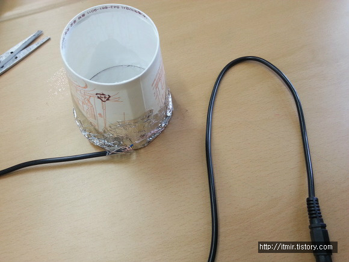
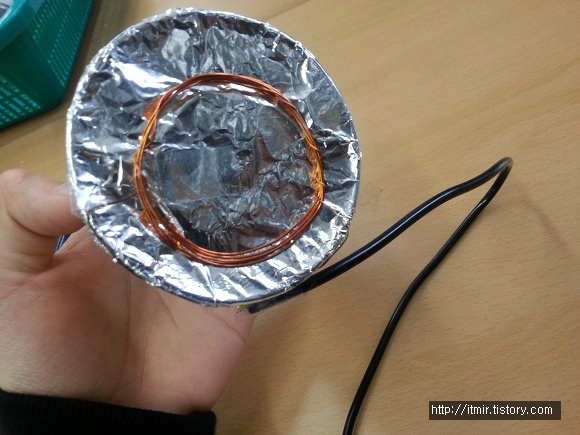
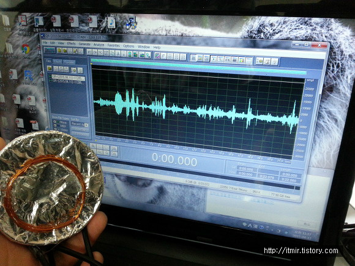
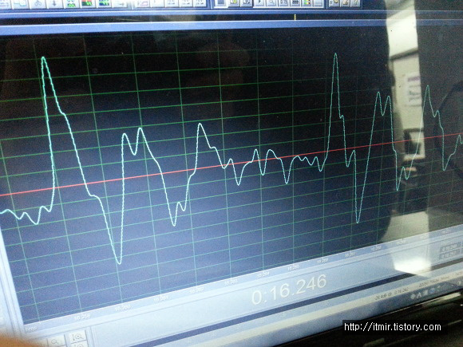

올해 학교에서 진행하는 토요실험교실에 참여해서 종이컵 스피커를 만들어보았습니다.

원래는 4월 11일, 저번주 토요일에 한건대 지금 올리네요 ㅋㅋ..

(정신이 없어서요 요즘 ㅠㅠ)

종이컵 스피커(&마우스)를 만들었는데요

처음엔 잘못 만든줄 알았는데 알고보니 소리가 너무 작아서 안들리는거 였다는.......

아래부터는 사진들입니다~

간단하게 코일이랑 이어폰잭, 그다음 종이컵이랑 호일만 있으면 되네요

가장 중요한 네오디움 자석까지..!

네오디움 자석을 코일에 가져다대면 이어폰 소리가 미세하게 들립니다.

그리고 종이컵 스피커는 그 자체로도 마이크가 되더라고요

원리는 정반대지만 적용은 같습니다.

종이컵 스피커로 실제로 소리를 녹음했습니다

진짜로 녹음도 잘 되더라고요

제 조가 1등으로 녹음까지 성공해서 2회 토요실험교실에 강사 추천 되었습니다 ㅎㅎ

이건 제 목소리 파형인데요

잘 녹음되었더라고요 ㅋㅋ

원래 종이컵 스피커가 소리도 잘 들리면 집에서 하나 만들어서 쓸려고 했는데.. 소리가 아주 미세하게 들리는 스피커라서...

그냥 시중에 있는 이어폰을 사용하려고 합니다 ㅋㅋ

그럼..

ps. 어제 무슨 일 있었나요? 갑자기 방문자 수가 2900이 됬지...
