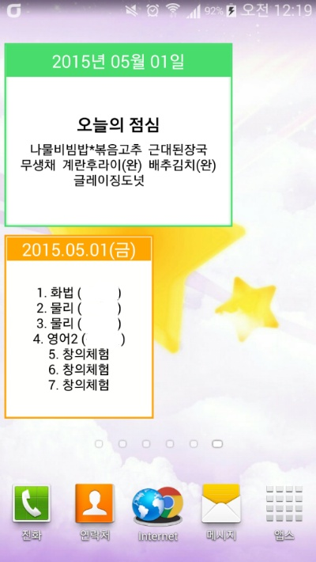
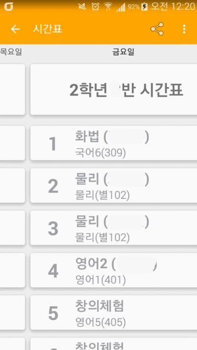

어제 시험이 끝나서 몇시간동안 뭘 할까 하다가 7시부터 12시까지 약 5시간에 걸쳐 만들었습니다.

전부터 만들려고 준비중이었던 시간표 위젯이랑 스크롤 가능한 시간표까지 구현했습니다

시간표 위젯 디자인은 어떻게 할까 하다가 그냥 급식이랑 똑같게 했네요 ...

나중에 디자인은 고쳐야겠습니다

아무튼 시간표 위젯과 스크롤해서 요일을 한번에 살필수 있는 시간표 까지... 시험 끝나고 구현해야 하는거 대부분 했네요 ㅎㅎ

   

이제 앞으로 생각중인건..

급식에 영양 성분(예를들면 비타민함량..?)이나 성적표(는.......)랑 급식위젯+시간표위젯이 남았네요

모두 쉬운게 아니라서.. 잠시동안은 그냥 놀아야겠습니다(?)

아 그리고 언제 시간내서 급식 라이브러리 사용방법을 올려보도록 하겠습니다

github에 README로 올려뒀지만 이해를 못하시는 분이 많아서..
