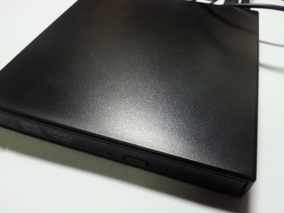
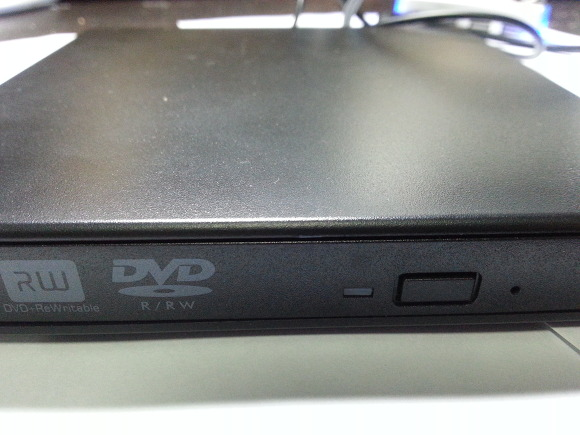
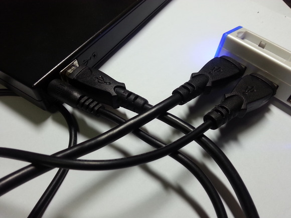
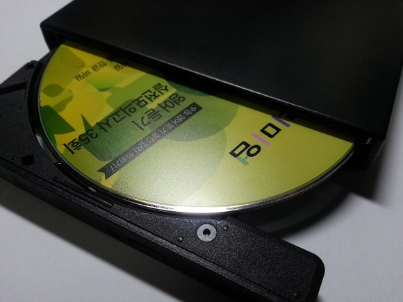
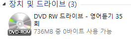

디벨로이드에서 나눔 물품을 당첨 받은 적은 이번이 두번째군요. ㅎㅎ

나는나비(mdbs2)님께서 나눔해주신 외장 ODD를 오늘 받게되었습니다!

제 태블릿과 노트북에 CD를 쓸 방법이 없어 안방에 있는 데스크톱을 사용했어야만 했다면,

이제부터는 바로 사용할 수 있습니다. ㅎㅎ

궁금해서 제 폰 OTG에 연결해봤는데요.

안되더라고요...

USB는 총 2개의 케이블이 필요합니다.

시험삼아 영어 듣기 CD를 넣어봤습니다.

Windows 8.1 제 태블릿에서 정말 잘 인식되고 사용 가능합니다~

다시 한번 좋은 나눔해주신 나는나비(mdbs2)님께 감사드립니다~
