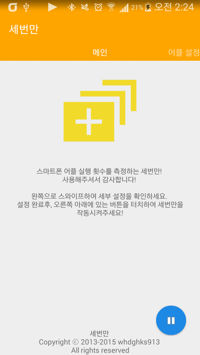
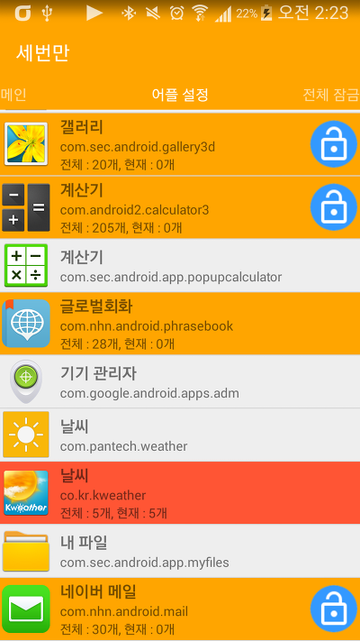
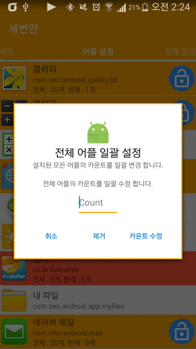
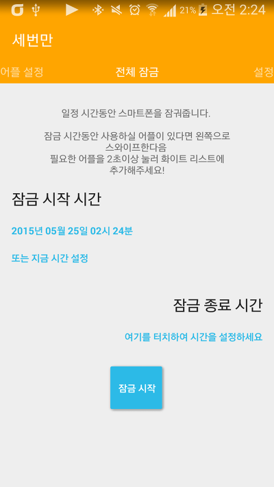
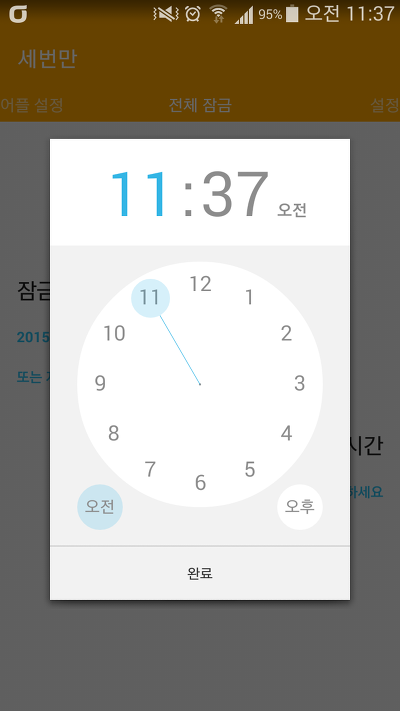
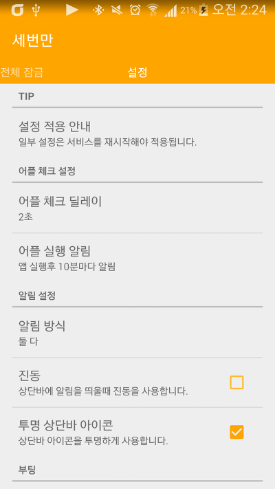
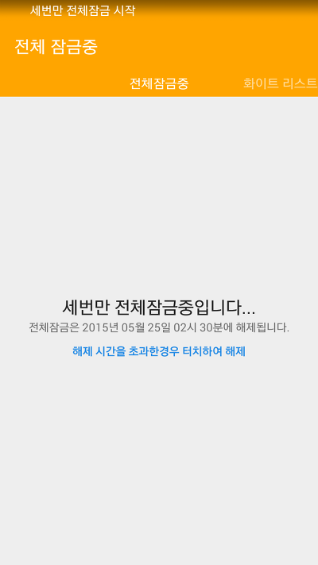
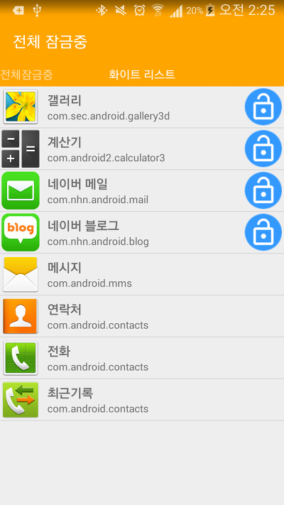

오래전(2013년)에 아이디어 가지고 만든 세번만이라는 앱입니다

제 블로그에도 몇번 포스팅한적이 있습니다!

[[Application] - 세번만 (BETA) 어플을 완성했습니다](/archive/itmir/2013/362)

[[Application] - 하루에 어플을 실행할 횟수를 정하자! - 세번만 (BETA)](/archive/itmir/2013/383)

[[Application] - [Update v2.4] Only3 (세번만) - 스마트폰 어플 중독방지](/archive/itmir/2014/443)

과거기록(?) 보시면 아시겠지만 제가 중3때 완성한 앱이라 그때 UI도 그렇고 체계적으로 앱을 만들지 못했습니다.

그래서 2015년 5월에 다시 한번 앱을 갈아엎었습니다

말이 갈아엎는거고 그냥 앱을 처음부터 만들었다고 해야할까요..?

진짜 이 작업 하면서 "처음에 만들때가 제일 중요하구나" 라는걸 깨닫게 되었습니다.

다행히도(?) 제가 학교앱을 전에 갈아엎었을때

대부분의 자료를 모든 앱에서 통용될수 있도록 짜두어서 왠만한건 변형없이 가져올수가 있어서 그래도 시간을 덜었네요 ㅎㅎ..

아무튼 결론은 처음부터 계획적으로 만들자 입니다

그때 만든 세번만의 아이디어는 "다른 중독 방지앱은 시간을 정해서 잠궈주는 앱이 대부분이었는데 제 중3 사회쌤께서 우연히 하신 말씀을 캐치!" 해서 만들었습니다 ㅋㅋ

세번만은 하룻동안 어플의 실행 횟수를 제한하는 어플입니다.

예를들면.. 내가 네이버 카페를 너무 많이 한다 라고 한다면

네이버 카페앱에 카운트를 50걸어두면 카운트가 초기화되는 0시 0분까지 네이버 카페앱은 정확히 50번만 실행할수 있게 됩니다.

  

전 버전은 투박했지만 이번에 갈아엎으면서 스크롤 탭으로 만들어봤습니다 ㅎㅎ

어플 설정 탭에서 카운트를 지정할수도 있고 화이트 리스트에 앱을 추가할수도 있습니다.

화이트 리스트는 전체 잠금중에 사용을 허용할 앱을 말합니다.

전체 카운트 일괄 변경 기능도 넣어봤는데요

당연히 카운트가 초과된 어플의 전체 카운트는 수정되지 않도록 해두었습니다.

  

이 부분은 전체 잠금 기능입니다.

일반 잠금 앱과 다른점이 하나 더 있다면 잠금을 예약할 수 있습니다.

맨 마지막은 설정화면 입니다.

  

전체 잠금 기능이 활성화 되면 위와 같은 화면이 나타납니다.

전화와 문자 어플은 기본으로 사용할수 있도록 설정 해두었습니다.

저번까지만 해도 화이트리스트 앱을 모와보는 기능은 못만들었는데 기술의 발전으로(흐흐) 가능하더라고요 ㅋㅋ

리스트를 터치하면 앱이 실행됩니다.

저번주부터 몇 주간 갈아엎고 새로 만들었는데 이제야 끝이 보이는 것 같네요..

감사합니다~

**[마켓 바로가기](https://play.google.com/store/apps/details?id=lee.whdghks913.only3)**

<https://play.google.com/store/apps/details?id=lee.whdghks913.only3>