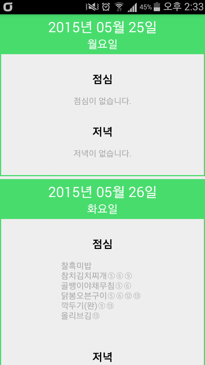
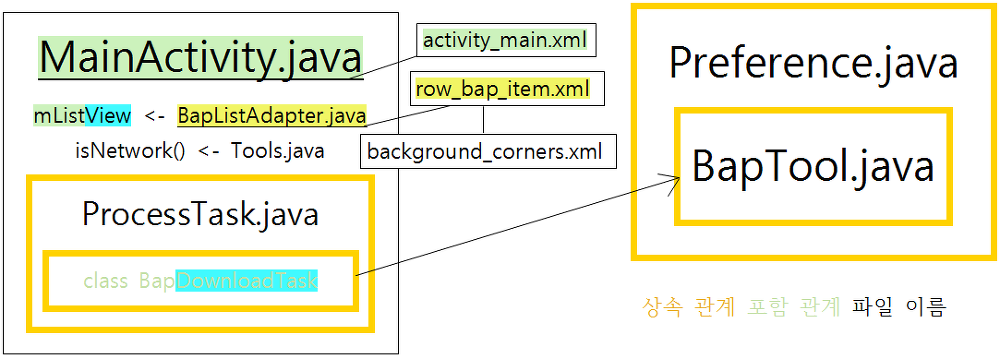

## Android Meal Library Guide

나이스에서 오픈 API로 급식 정보를 공개함에 따라, 급식 파싱 라이브러리의 지원을 공식적으로 중단합니다.

지금까지 제 라이브러리를 사용해주신 모든 분들께 감사의 말씀을 드리며, 아래 사이트로 접속하여 정부에서 공개한 API 정보를 확인하시기 바랍니다.

<https://open.neis.go.kr/portal/data/dataset/searchDatasetPage.do>

나이스의 보안프로그램 적용으로 급식 파싱 라이브러리 사용이 제한될 수 있으며, 영구적으로 사용이 불가능할 수도 있습니다.

자세한 내용은 [[Application] - 나이스 보안 프로그램과 현재 급식 파싱 불가능 관련](/archive/itmir/2016/614)을 참고하세요

MealLibrary.java의 사용은 자유입니다. MealLibrary.java만 사용한다면 오픈소스를 표기해야 하는 제약은 없습니다.

그러나 급식 위젯과 급식 자동 업데이트를 제 앱을 참고해서 기능을 만드시려면 **꼭(강제) 오픈소스 라이센스를 표기해야 합니다.**

오픈소스 라이센스는 가급적 어플 내에 표기하세요.

부탁드립니다.

**이 라이브러리는 처음에 [토스트](http://blog.naver.com/rimal)님께서 만드셨고, 이후 나이스 홈페이지에 맞게 제가 패치하고 있습니다.**

AndroidMealLibrary가 적용된 대표적인 프로젝트를 살펴보세요!

<https://github.com/itmir913/wondanghighschool>

이 글보다 더 자세하게 설명하고 있는 README를 살펴보세요!

<https://github.com/itmir913/wondanghighschool> (README 위치 : app/src/main/java/toast/library/meal)

<https://github.com/itmir913/androidmeallibrary>

학교 급식 파싱 라이브러리를 어떻게 사용하는지 궁금하신 분들을 위해 가이드라인을 작성했습니다.

잘 따라오시면 자신만의 학교앱을 만들수 있으실겁니다.

> 이 글을 읽고 복사+붙혀넣기 하실 사람께서는 뒤로가기를 눌러주세요
>
> 가장 간단한 급식 파싱만 이 글에서 다룰것이고, 이에 대해서는 샘플 프로젝트도 제공합니다.
>
> 앞으로는 제 개인 메일로 급식 파싱에 대해서 질문하지 말아주세요. 부탁드립니다.
>
> 기본적인 급식 파싱에 대해서는 샘플 프로젝트를 참고해 주시고, 급식 위젯처럼 심화된 내용은 스스로 구현 하셔야 합니다.
>
> 비슷한 질문 메일을 받게 된다면, 저는 메일을 삭제하겠습니다.

급식 파싱을 하기 전에 필수로 준비해야 할 것.

1. jericho-html.jar 추가 [(클릭)](/archive/itmir/2014/486)

2. 인터넷 권한 추가

3. MealLibrary.java 추가 [(클릭 후 app/src/main/java/toast/library/meal 폴더로 진입하세요.)](https://github.com/itmir913/wondanghighschool)

4. 자신의 학교 코드 정보

이 글에서 설명하고 있는 앱의 전체 소스는 아래에서 받을 수 있습니다.

<https://github.com/itmir913/androidmeallibrary>

프로젝트를 다운받으신다음 아래를 진행하세요.

### 1. 자신의 프로젝트에 필요한 파일을 추가해주세요

위치 : (AndroidMealLibrary / app / src / main / java / com / tistory / itmir / example / androidmeallibrary)

(AndroidMealLibrary / app / src / main / res)

ProcessTask.java

MainActivity.java

BapListAdapter.java

BapTool.java  
Preference.java

Tools.java

activity\_main.xml

row\_bap\_item.xml

string.xml

background\_corners.xml

무조건 수정해야 하는 것

수정해도 좋지만 안해도 상관 없는것

수정할 필요가 없는 것

### 2. 수정해야 하는 파일을 수정합시다.

ProcessTask.java를 열어 자신의 학교에 맞는 정보를 입력하세요.

```java
public abstract class ProcessTask extends AsyncTask<Integer, Integer, Long> {
    final Context mContext;

    /**
     * TODO 원하는 학교의 정보를 입력하세요
     */
    final String CountryCode = "yourCountryCode"; // 접속 할 교육청 도메인
    final String schulCode = "yourSchulCode"; // 학교 고유 코드
    final String schulCrseScCode = "yourSchulCrseScCode"; // 학교 종류 코드 1
    final String schulKndScCode = "yourSchulKndScCode"; // 학교 종류 코드 2

...

}
```

ProcessTask.java는 필수로 수정하셔야 합니다.

수정해도 상관 없는 파일들을 자신의 입맛에 맞게 수정해줍시다.

수정할 부분에 TODO로 주석을 달아뒀습니다.

자신의 입맛에 맛게 어플을 커스텀 할때 필요한 부분들입니다.

수정할 필요가 없는 파일들은 구조를 이해할때만 열어주시고 나머지 경우에는 건들 필요가 없습니다.

### 3. 프로젝트를 실행해봅시다.

프로젝트를 실행하면 정상적으로 급식이 로드됩니다.



### 4. 구조 이해



대충 이런 구조를 가지고 있습니다만

일부 잘못되어 있는 부분이 있어서 직접 파일을 분석해서 확인하시는게 편합니다.

그림에서 BapTool이 Preference와 상속관계라고 되어 있는데 정확하게 말하면 BapTool에서 Preference를 사용하는 겁니다.

### 5. 더 자세한 예제

자신이 그래도 실력이 있다 생각하시면 샘플 프로젝트 분석을 건너뛰시고 바로 제 학교앱 분석에 들어가셔도 됩니다.

상급자용 : <https://github.com/itmir913/wondanghighschool>

기초예제 : <https://github.com/itmir913/androidmeallibrary>

위에서 언급한 것 처럼 상급자용 분석은 질문하셔도 답변을 하지 않을 예정입니다.

먼저 기초 예제를 완전히 끝내신 다음 기본 지식이 충분할때 도전해주세요

기초 예제도 조금의 시간을 투자한다면 누구나 구현이 가능하도록 주석을 상세하게 달아두었기 때문에 간단한 질문은 사양합니다.

제 학교앱(상급자용)에는 **급식 자동 업데이트**, **급식 위젯**, **특정한 날짜의 급식 정보를 가져오는 기능**, 한번 불러온 급식 데이터 자동 저장(이 기능은 기초예제에도 포함)등의 기능이 모두 포함되어 있습니다.

기초 예제를 구현하신다음 시간이 되시면 다양한 기능도 구현해보시기 바랍니다.

직접 제 학교앱 어플을 실행해보고 싶으신 분께서는 마켓에 "원당고"라고 검색하시면 됩니다.

### 6. MealLibrary.java 변수 설명

MealLibrary에서 사용되는 변수에 대한 설명입니다.

- CountryCode : 학교 교육청 코드, nice홈페이지 도메인의 과 같습니다

경상 북도는 gbe.kr이며, 경상도는 .kr, 다른 교육청은 go.kr 도메인을 사용합니다

EX) 인천 : ice.go.kr

- schulCode : 학교 고유 코드번호 입니다

교육청에서 학교를 구분할때, 학교에 공문을 내릴때 사용하며 아래 참조에서 코드를 찾을수도 있습니다

EX) 인천의 학교 코드 검색 : http://hes.ice.go.kr/sts\_sci\_si00\_001.do (학교 검색후 E10000xxxx 부분)

- schulCrseScCode는 학교 분류입니다

"1" : 병설유치원

"2" : 초등학교

"3" : 중학교

"4" : 고등학교

분류번호랑 종류랑 안맞으면 급식을 가져올 수 없습니다.

- schulKndScCode는 학교 종류입니다

"01" : 유치원

"02" : 초등학교

"03" : 중학교

"04" : 고등학교

- schMmealScCode : 식사 값을 의미합니다

조식 : "1"

중식 : "2"

석식 : "3"

- schYmd : (일주일치 정보를 얻어오는 메소드에서) 원하는 날짜의 급식 정보를 얻기 위해 필요합니다 - 사용하지 않습니다.

String 형식 : 년.월.일

EX) "2014.03.16"

- schYm : (한달치 정보를 얻어오는 메소드에서) 원하는 달의 급식 정보를 얻기 위해 필요합니다 - 사용하지 않습니다.

String 형식 : 년.월

EX) "2014.03"

- year, month, day : schYmd와 schYm의 정보를 세분화 해서 각각 정보를 넘겨줄때 사용합니다

EX) year = "2014", month = "03", day = "16"

> 이 글에서 다룬 내용은 간단하게 자신의 학교의 급식정보를 받아와서 리스트뷰에 뿌려주는 내용입니다.
>
> 급식 위젯과 자동 업데이트는 이 글에서 다루지 않고, 따로 메일로 질문주셔도 받지 않겠습니다.
>
> 저는 심화된 내용을 스스로 도전해서 성공하는 기쁨까지 뺏고싶지는 않습니다.