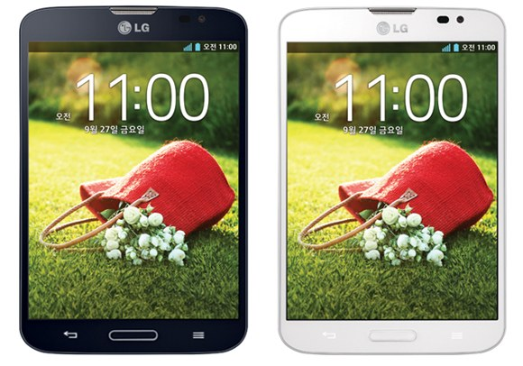
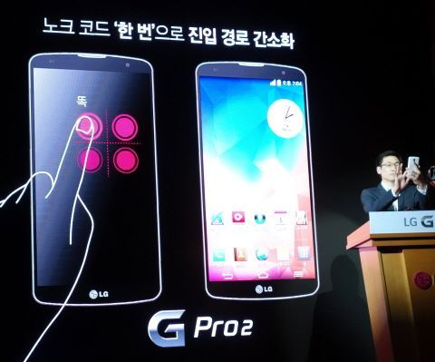

하하.. 6월달 들어서 처음 글쓰네요;

원래 이렇게까지 방치(...)하려고 한건 아닌데 어쩌다보니 이렇게 됬습니다..

원래 5월달쯤에 바꿨는데 이제와서 엄청난 뒷북이군요;

그래도.. 갤3에서 뷰3로 바꾸게 되었습니다.

게다가 몇가지 공기계도 얻고 ㅎㅎ

4:3 비율이라고 해서 조금 불편할것 같았는데요

익숙해지다보니 전에 썼던 갤3를 잡아보면 어색합니다 ㅋㅋ

이렇게 생겼는데요

디자인은 사람마다 다르게 생각하니 ..

개인적으로는 나쁘지 않습니다.

뷰3에 있는 터치펜이 처음엔 쓸만해보였는데 필기용으로 쓰기에는 무리가 있더라고요

정전식 터치펜의 한계긴 하지만 손바닥을 화면에 댄 상태에선 필기 자체가 안되니.. 그냥 간단하게 Q 메모용으로만 쓰고 있습니다.

노크코드는 유용하게 사용하고 있습니다.

그런데 이게 롤리팝이 아직 안나와서 ㅠㅠㅠ...

LG 킷캣의 특징인지 노크코드와 노크온이 동시 사용이 안되고 게스트모드도 패턴만 되더라고요.

롤리팝이 올라간 G3 Cat3 보면 노크온과 노크코드 동시 사용도 되고 게스트모드 노크코드도 되던대 킷캣은 안되더라고요

G Pro도 올라간 롤리팝인데.. 슬슬 불안해지기 시작합니다.

그리고 어쩌다보니 뷰3 단점만 쓰는거 같은데..

홈런처 렉이 조금씩 있네요;

몇초 지연되는 정도로..

그리고 전원키 10초 눌러서 재부팅 기능도 없고

호불호가 정말 다른 폰일텐데 일단 업데이트를 무한정 기다려 봅니다.
