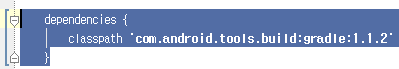

오류 정보

Could not normalize path for file 'D:\android-sdk\platforms\android-14\android.jar;D:\android-sdk\tools\support\annotations.jar'.

Could not normalize path for file 'Q:\trunk\ActionBarSherlock\build\intermediates\mockable-Sony:Sony Add-on SDK 3.0:19.jar'.

Could not normalize path for file 'F:\Android_Studio\onebusaway-android\onebusaway-android\build\intermediates\mockable-Google Inc.:Google APIs:21.jar

파일 이름, 디렉터리 이름 또는 볼륨 레이블 구문이 잘못되었습니다

해결 방법

{project path}\build.gradle 파일을 연다음

dependencies {

    classpath 'com.android.tools.build:gradle:1.1.0'

}

을

dependencies {

    classpath 'com.android.tools.build:gradle:1.1.2'

}

으로 변경후 Rebuild

또는 새로운 gradle 버전을 찾아 입력.

(새로운 버전의 gradle을 다운로드 하기 위해 인터넷 연결 필요)

출처 / 팁

구 버전의 gradle의 문제이다.

gradle을 최신버전으로 업데이트 하면 해결된다.

https://code.google.com/p/android/issues/detail?id=148912

http://stackoverflow.com/questions/20532781/could-not-normalize-path-for-file-when-running-gradle-check
