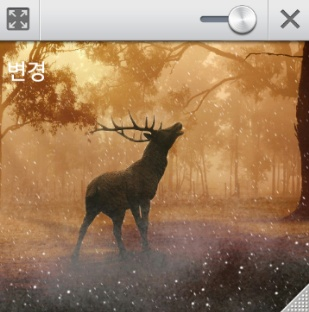
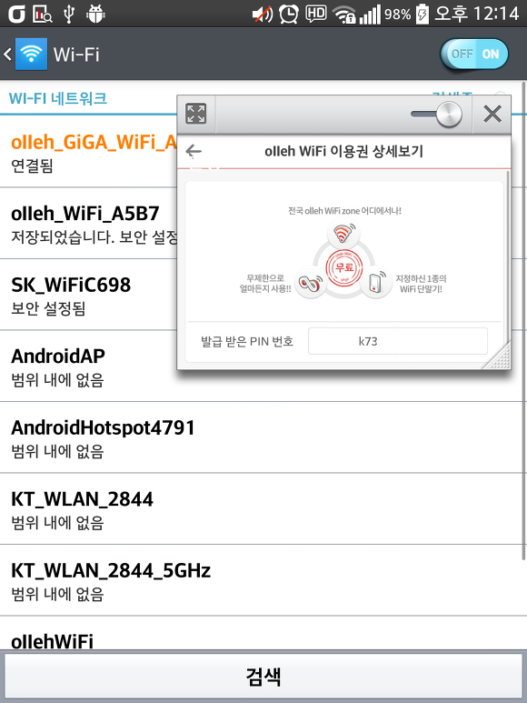
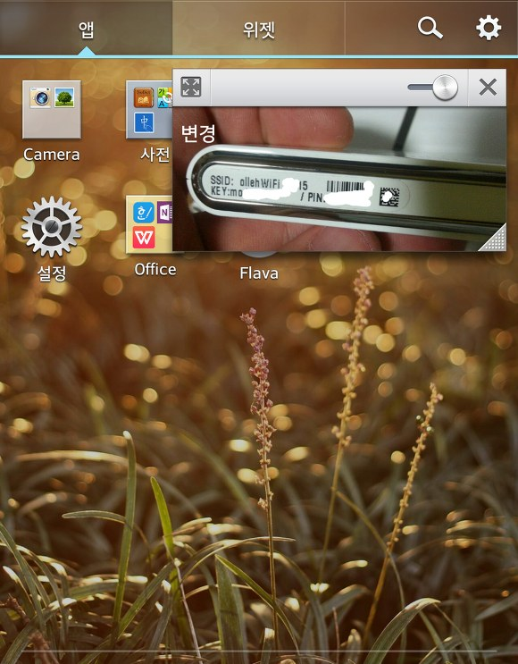
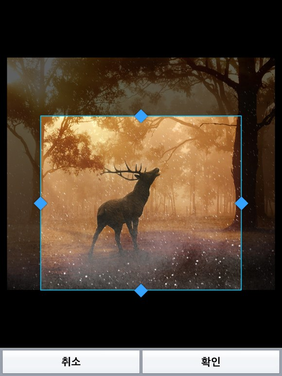

안녕하세요

시험기간에 공부할거 엄청 많은데 ㅋㅋ... 이런거나 하고 있네요;

시험기간엔 뭐든지 공부말곤 다 잘됩니다 ㅋㅋ

아무튼 Q슬라이드 SDK를 이용해서 이번에 갤러리 앱을 만들어 봤습니다

갤러리라고 하기엔 단어 선택이 적절하지 않으니 사진 뷰어 정도가 적당할 것 같습니다.

무슨 어플인지 말로 설명하긴 힘들것 같아서 스크린샷으로 모든 설명을 생략하겠습니다.

상단바의 Q슬라이드 앱부분에 이번에 만든 Q슬라이드 갤러리 앱이 들어있습니다.

아이콘은 그냥 ADT에서 만들어서 복붙해서 일단 지금은 완성도가 극히 떨어집니다.

앱 디자인도 그냥 발로 만들어서 심각하니 앱 디자인은 생략하겠습니다...

Q슬라이드 갤러리앱은 갤러리에 있는 사진을 Q슬라이드로 띄워주는 앱입니다.

이렇게 사진을 선택하면 Q슬라이드에 사진이 나타나게 됩니다.

이거 어디에 쓸수 있냐면..

(깨알 홈 기가 와이파이 자랑)

이런식으로 갤러리 사진을 화면에 띄울수 있습니다.

원래 예시를 많이 가져오려고 했는데 생각이 안나네요..

사진은 내장 갤러리 앱을 사용해서 자르기가 가능합니다.

회전부분은 좀더 알아봐야겠어요

일단은 이렇게 기본적인 기능은 모두 완성했는데 앱 디자인이 너무 망해서 좀더 손봐야겠어요

그래서 일단은 마켓에도 올리지 않았는데..

디자인 고친다고 해도 쓰실 분이 있을지 모르겠네요 ㅋㅋ..

몇개 다듬어서 마켓에 올렸습니다~

<https://play.google.com/store/apps/details?id=com.tistory.itmir.qslidegallery>

오픈소스 : <https://github.com/itmir913/qslidegallery>
