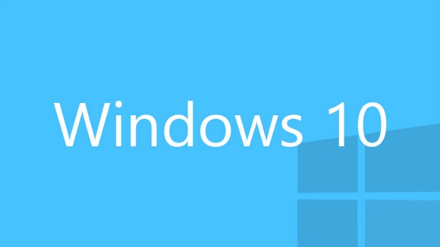
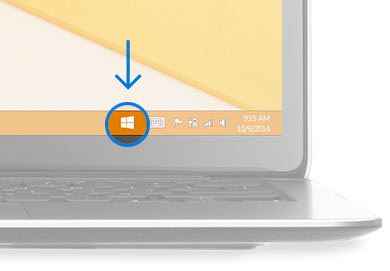
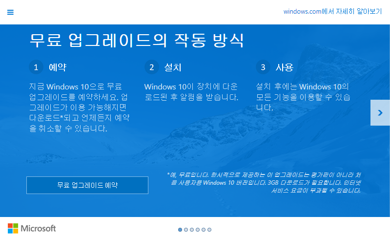
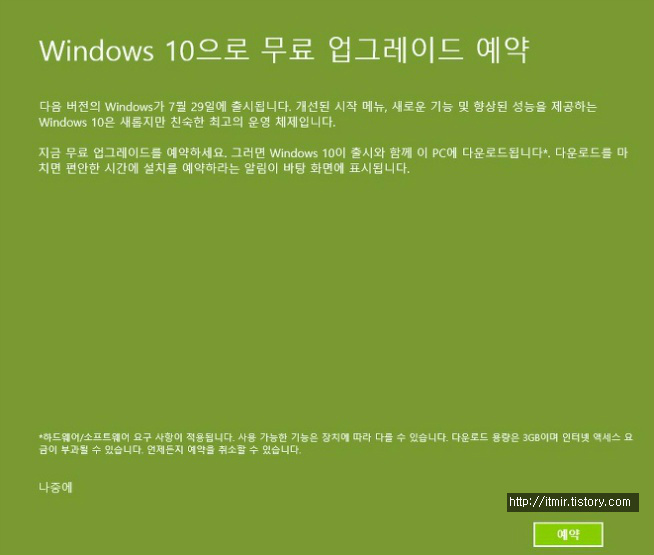
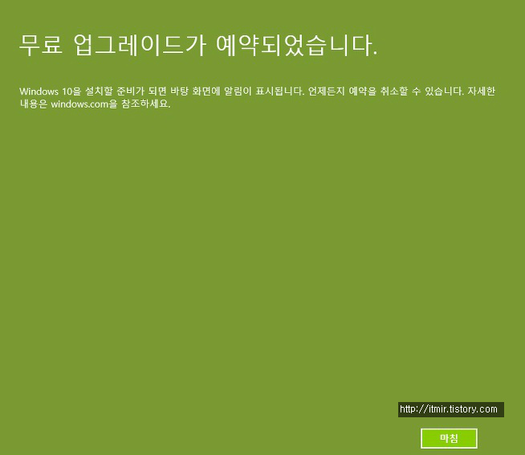

http://www.gamespot.com/articles/games-bought-on-gog-will-work-with-windows-10-on-d/1100-6428730/

벌써 Windows 10 정식 출시일인 7월 29일이 2주하고 조금 더 남았습니다.

원래 그냥 제 태블릿은 Windows 8.1 그대로 쓸려고 하다가 방학도 다가오고 그래서 업데이트 예약을 해보려고 시도했습니다.

SSD용량이 작아서 평소에 Windows Update를 끄고 살았는데 이거 때문인지 몰라도 작업 표시줄에 윈도우 아이콘이 안뜨더라고요

http://www.microsoft.com/ko-kr/windows/windows-10-upgrade

원래는 위 스샷처럼 자동업데이트를 활성화하면 저렇게 떠야 합니다.

그다음 윈도우 아이콘을 클릭하면 무료 업그레이드 설치창이 뜹니다.

그래서 어젯밤에 필수 업데이트 모두 설치하고 그다음 오늘 일어나서 10 예약을 위해 필수적인 업데이트들도 설치를 했는데 아무리 기다려도 안뜨더라고요

귀찮게 10 업데이트하지말고 그냥 써야겠다 라고 생각을 했지만 이미 Windows Update가 설치되서 사용가능한 용량이 4기가 조금 넘게 남았습니다.

원래는 더 있었고 포멧하고 나서는 10기가 정도 여유가 있었는데 왜 이렇게 용량이 가득 차는지..

SSD용량도 적어졌고 그래서 오랜만에 시원하게 초기화를 했습니다.

그다음 사용자 설정때 Wi-Fi 연결한다음 Windows Update를 자동 설치(권장)으로 설정했습니다.

그러니까 Windows 10 예약 화면이 뜨네요 ㅋㅋ..

결국 얼떨결에 업데이트 예약은 했지만 또 초기화를 했네요 ㅠㅠ
