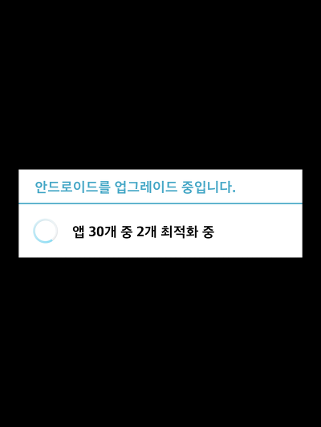
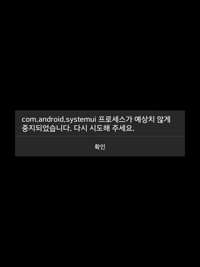
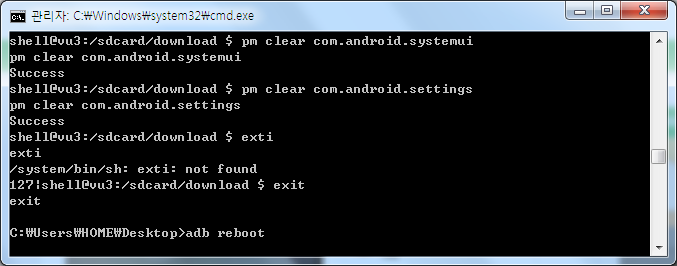
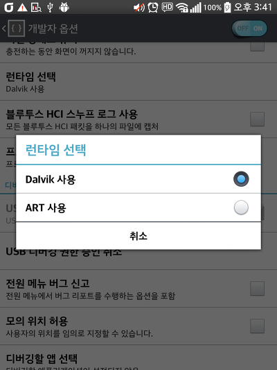

오랜만에 달빅모드에서 ART로 건너갔다가 무한 업그레이드 당첨되고 무한 강종보고 왔네요 ㅋㅋ

특히 요즘은 무한 강종을 볼 기회가 없어서 나름 신선했습니다(?)

다행히 adb는 잡혀서 중요한 파일을 그냥 초기화 시켜버리는 일은 막았네요;

데이터 초기화를 안하고 살려보려고 서비스 센터에 갔더니 ART에 대해 잘 모르시는 기사분을 만나서 하하....

  

adb가 잡히길래 신기해서(?) 스크린샷을 찍어봤습니다.

저 업그레이드가 끝나면 무한 SystemUI 강제 종료 뜨다가 다시 재부팅 되고...

원래는 초기화 하려고 했는데.. 혹시 Vu3는 리커버리가 없나요?

전원키 + 볼륨 위 + 볼륨 아래 버튼을 누르니 외부 버튼 조작 모드라고 나오더라고요

adb reboot recovery 명령어도 해봤는데 리키버리로 추정되는 화면은 안뜨고..

인터넷에 있던 초기화 방법도 순정 전화 다이얼에서 히든 모드 들어가서 초기화하거나 설정에서 초기화하는 방법은 나와있는데

리커버리에 대한 정보는 쉽게 안나오더라고요

하.. 뷰3 정보가 없어서 힘들었습니다

(넥5살걸 아직도 후회되네요)

그래도 오늘의 운이 나쁘지는 않았는지 adb로 해결했습니다.

해결한게 이것 때문인지 확신은 안들지만

이거말곤 따로 한게 없어서요

adb shell pm으로 com.android.settings의 데이터를 날려버리니 다행히 부팅이 되더라고요

(아.. 물론 설정 초기화는 덤으로...)

런타임은 다시 Dalvik으로 되어있고

2학기 중간고사 끝나고나 겨울 방학쯤에 다시 초기화하고 ART로 바꿔야겠습니다.
