작년 7월 여름방학중 어느 목요일에 키타스가 열려서 갔다온지가 벌써 1년하고 1개월이 지났습니다.

그때는 7시 30분쯤에 도착했는데 벌써 250분 정도가 있어서 키타스백은 못받고 돌아왔습니다.

(목요일날 같이 갔던 친구들은 토요일날 다시 도전했는데 5시쯤 도착했는데 180명 정도로 아슬아슬했다고 하더라고요.)

작년 키타스 글 : [[Note] - KITAS (키타스) 2014 D-Day](/archive/itmir/2014/514)

그래서 올해는 전 날에 출발했습니다.

이번에 키타스가 열리는 기간이 개학 중이고 목, 금요일은 평일이라 사람이 그렇게 많지는 않았다고 했지만,

오늘은 토요일이므로 일찍 출발했습니다.

원래 어제 금요일 21일 11시에 출발해서 막차 끊기기 전에 도착하는게 목표였지만..

생각보다 버스가 일찍 끊길 것 같아 10시 30분에 출발해서 토요일 0시 되기 전에 도착했네요. ㅋㅋ

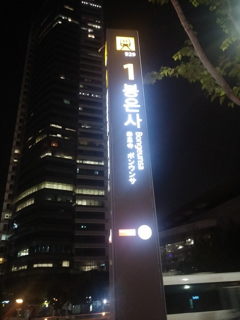

역까지는 친구 엄마께서 태워주셨고, 그 다음부터는 지하철을 타고 왔습니다.

급행 열차를 타서 일반 열차보다 더 빨리 도착했습니다.

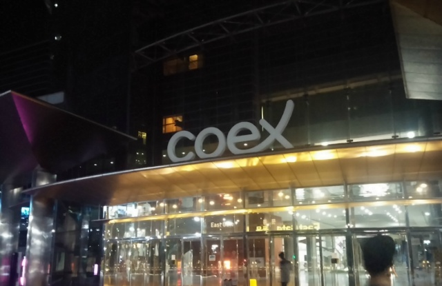

아직 토요일도 아니고 12시 전이기 때문에 사람들이 많이 없을거라 예상했었습니다.

올라가서 보니 생각보다 더 많은 분들이 이미 기다리시고 있더라고요.

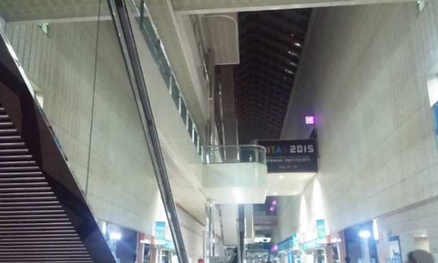

저기 보이는 현수막 옆의 복도부터 쭉 줄이 이어집니다.

12시에 도착했는데도 절반인 100등에 들어갔네요.

다들 도대체 몇 시에 오신건지..

이 부분에서 한가지 아쉬운 점이 있다면..

누가 먼저 왔는지라던가, 아니면 새치기에 대한 대비가 미흡하다라고 생각합니다.

번호표라도 있었으면 논란의 여지가 적을텐데 말이죠...

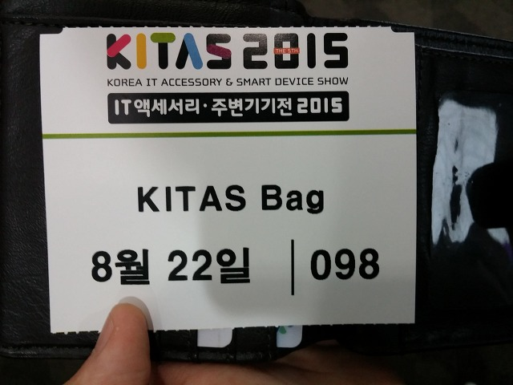

현금으로 2만원을 내고 받은 티켓(?)입니다.

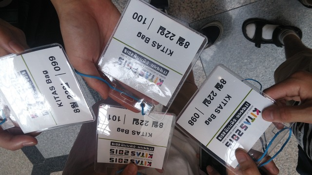

098, 099, 100, 101번이 되었습니다.

일단 티켓을 받은다음에 2시까지 시간 떼우다가 2시부터 키타스백 추첨 장소에 갔습니다.

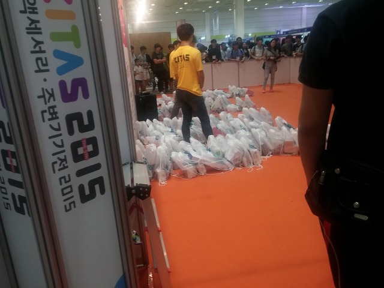

저기 보면 흰색 키타스백에 상품이 담겨있는데요.

100% 해드셋이나 키보드인 봉투가 보였는데 가져올 수 없었습니다. ㅠㅠ

케이스 뒷면에 키타스백 번호를 붙인후, 뒤집어놓고 케이스를 하나 선택하는 방식입니다.

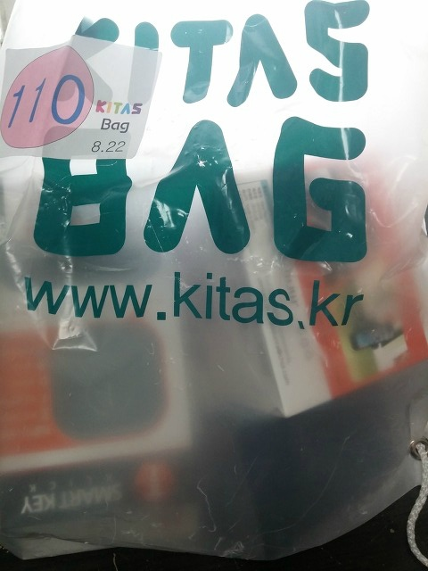

제가 뽑은 케이스는 아이패드 미니 3 케이스인데 왜 이걸 뽑았을까 후회되네요.

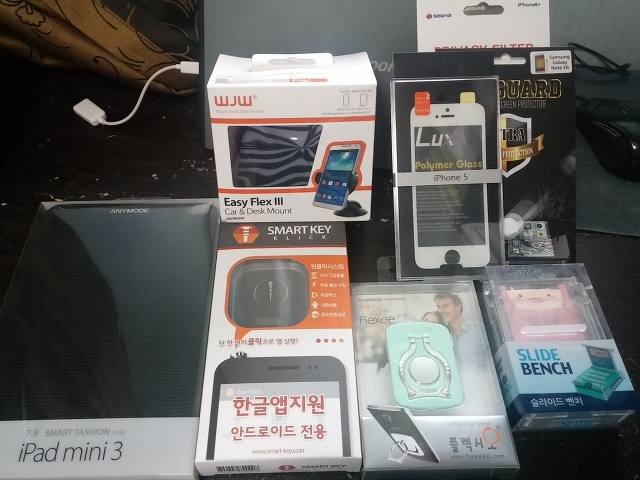

위 사진이 키타스백에 들어있던 내용물들입니다.

가장 왼쪽의 케이스는 제가 골랐던 케이스입니다.

다른 애들은 블루투스 이어폰이나 홍채인식 USB같은게 있는 가방을 뽑았는데, 저는 이상한 걸 뽑아서.. 하...

토요일 0시부터 14시간동안 앉아있으면서 기다린 보람이 없네요. ㅠㅠ

아래 사진들은 키타스백의 내용물들입니다.

내용물 보기

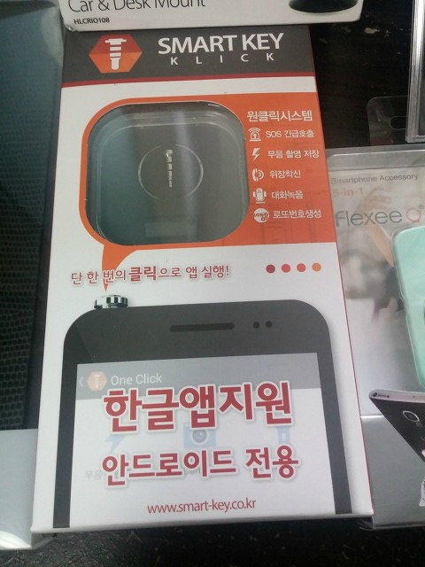

스마트키

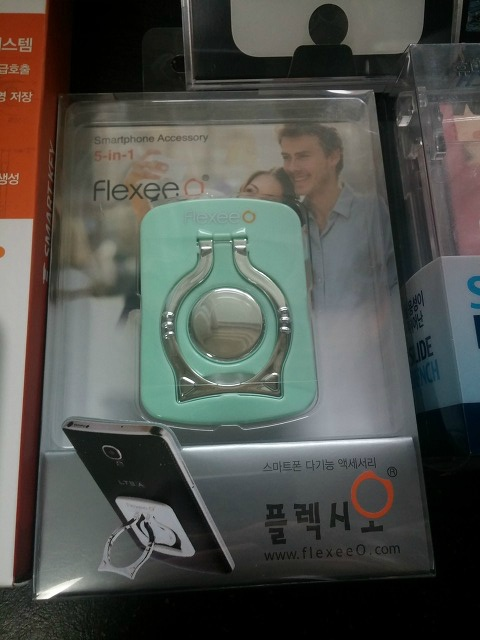

클렉시오 스마트링

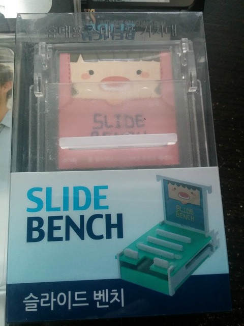

슬라이드 벤치 거치대

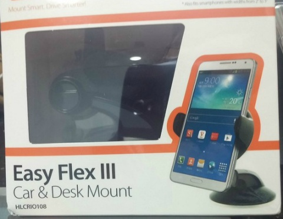

Easy Flex 3

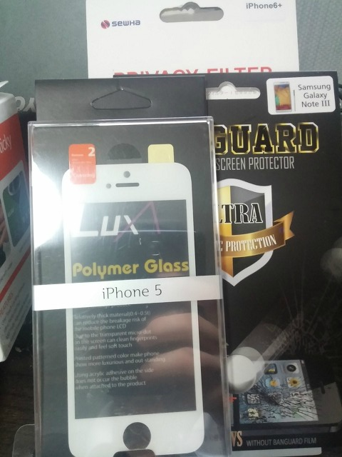

필요없는 필름들.

이번에 2015 키타스백 후기 보면서 재고떨이용 의심과 왜 이딴게 들어있는건지 의심이 되는 것들(케이스)이 많이 있다고 하던데,

저는 필름이 걸렸네요 ㅠㅠ

그리고 나머지도 별로 쓸모가 없는 것이 전부인지라..

잘못 뽑았습니다.

필름은 주변사람 몇 개 주고 나머지는 어떻게 해야할 지 생각 좀 해봐야겠습니다..

결론은 12시에 도착해서 14시간을 기다릴 정도로 키타스백의 구성품이 다양하거나, 풍부하거나, 독특하지 않았다는 겁니다.

그리고 눈에 확 띄는 상품이나 아이디어 제품도 없었습니다.

전부 돌아봐도 작년에 봤거나, 디자인이 처음보는 것뿐 기능은 이미 나와있는 거랑 비슷비슷한 게 많더라고요.

이번 키타스는 제게 득보다 실이 더 많네요.