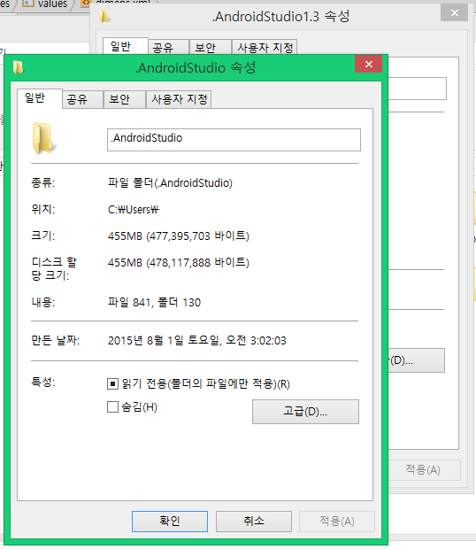
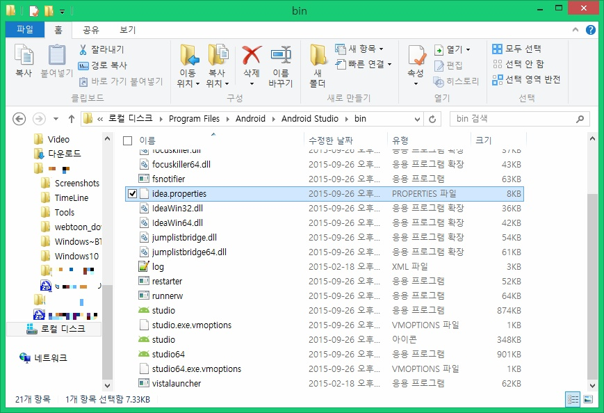
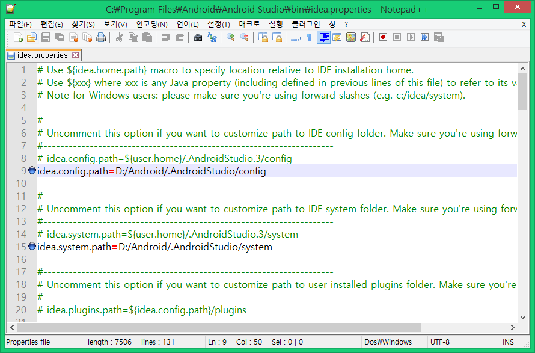
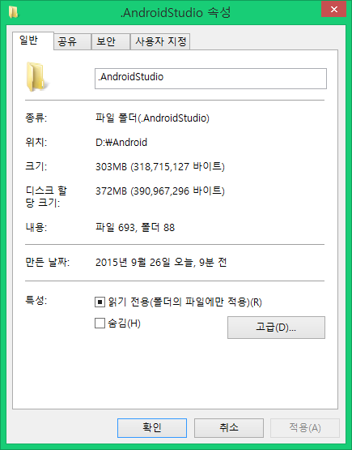
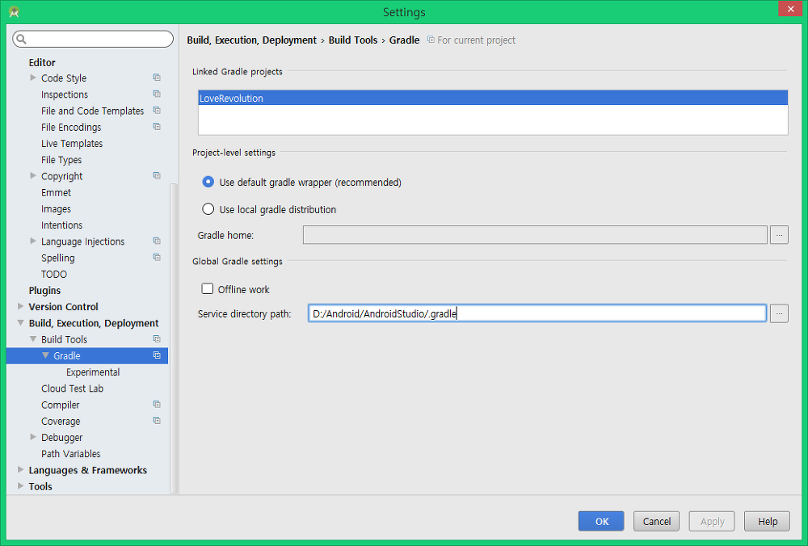

.안드로이드스튜디오 폴더 경로 바꾸기

How to change the location of .androidstudio

안녕하세요.

추석 다음날 수요일이 시험인데 공부는 안되고.. 해서 안드로이드 스튜디오랑 SDK업데이트 했습니다.

벌서 새 SDK가 SDK Manager에 떴더라고요 ㅋㅋ

아무튼 이번에 들고온 팁은 저처럼 SSD사용자분들에게 도움이 될만한 팁입니다.

C:/Users/(계정 이름) 폴더에 들어가보면 .AndroidStudio라는 폴더가 보일겁니다.

이게 config이랑 기타등등이 들어있는 폴더인데요

이거 꽤 용량 많이 잡아먹더라고요

그래서 이 폴더의 위치를 옮길수 있는 방법을 찾아봤습니다.

안드로이드 스튜디오를 업데이트 했더니 .AndroidStudio 폴더가 총 2개가 생겨서...

아에 옮겨버리고 저 폴더 지워버리자 해서 찾아봤습니다.

일단 C:\Program Files\Android\Android Studio\bin 이 폴더에 진입해주세요

그다음 idea.properties 파일을 열어주세요

표시되어 있는 두줄 부분을 수정해주시면 됩니다.

그뒤 안드로이드 스튜디오를 키면 스튜디오 업데이트 할때의 화면이 나오는데요

그냥 영어 읽어보시면 설정 가져오기 같은거니 확인하신후 선택하시면 됩니다.

스튜디오 킨다음 Gradle Finish까지 기다리시면 됩니다.

이부분 스샷을 못찍어서...

그럼 이렇게 .AndroidStudio 폴더가 이동됩니다.

참고로 .gradle 폴더 위치 바꾸는 방법은 아래와 같습니다.

Gradle 위치는 Android Studio 설정에서 바꿀 수 있습니다.

참고 : http://www.laurivan.com/android-studio-change-the-location-of-androidstudiobeta/
