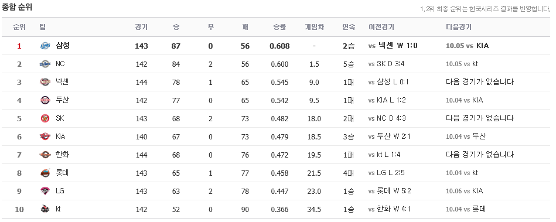
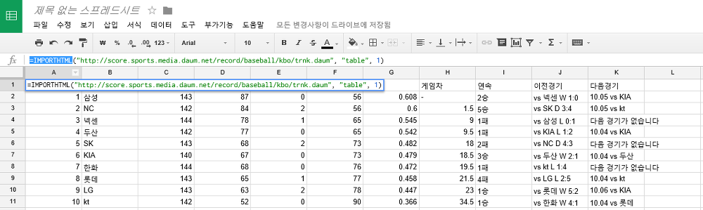
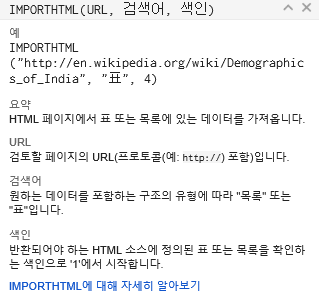
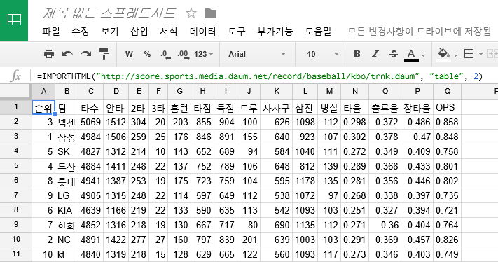

안녕하세요 정말 오랜만의 글인 것 같군요.

이번에 구글 스프레드시트를 이용해서 웹페이지 정보를 가져오는 방법을 알아내서 알려드리고자 합니다.

일단 구글 스프레드 시트에 접속해야 합니다.

<https://docs.google.com/spreadsheets>

사용할 수 있는 함수는 아래와 같이 있습니다.

- importdata
- importfeed
- importhtml
- importrange
- importxml

엑셀의 함수처럼 "=" 을 앞에 붙히시고 사용하시면 되는데요.

예제로 다음 프로 야구 순위를 가져와보겠습니다.

사이트는 http://score.sports.media.daum.net/record/baseball/kbo/trnk.daum 입니다.

이렇게 table형식으로 되어있습니다.

이제 스트레드시트에 =IMPORTHTML("http://score.sports.media.daum.net/record/baseball/kbo/trnk.daum", "table", 1) 이렇게 입력해보겠습니다.

이렇게 table의 정보가 가져와집니다.

importhtml에 마우스를 가져가보면 도움말이 나오는데요.

어떻게 사용하는지 정보가 나와있습니다.

URL은 가져올 웹사이트 주소이고 큰따음표 ""로 묶어줘야 합니다.

'검색어'에 들어갈 수 있는건 "list"와 "table" 두개뿐입니다.

시트의 특성상 표와 리스트만 가져올 수 있도록 만든 것 같습니다.

마지막으로 색인에는 html에서 가져올 태그의 위치로 생각하시면 되는데요.

숫자만 입력하시면 됩니다.

마지막 색인의 숫자를 2로 바꿔보겠습니다.

색인을 1로 했을때와는 다른 정보가 나타난걸 확인할 수 있습니다.

데이터 파싱할때 더 편하게 파싱할 수 있겠습니다.

참고

http://fronteer.kr/bbs/view/92

http://overthedatum.co.kr/archives/148

http://blog.nemesys.co.kr/tt/entry/%EA%B5%AC%EA%B8%80-%EB%93%9C%EB%9D%BC%EC%9D%B4%EB%B8%8C-%EC%8A%A4%ED%94%84%EB%A0%88%EB%93%9C%EC%8B%9C%ED%8A%B8-importhtml-importxml

https://support.google.com/docs/answer/3093339?hl=ko
