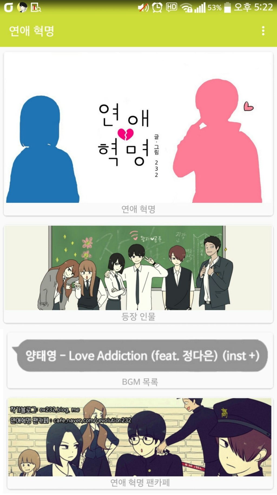
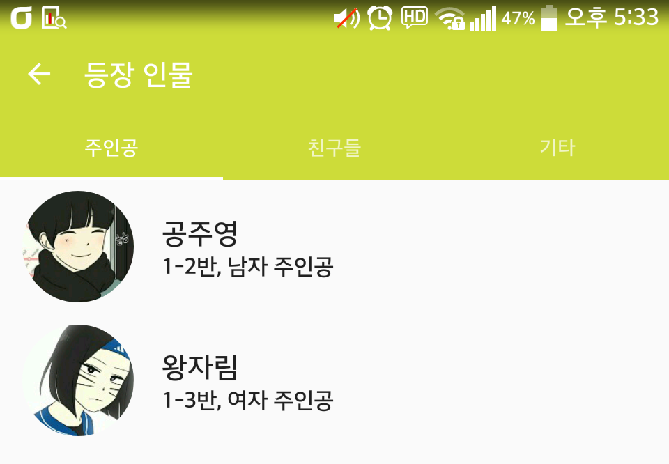
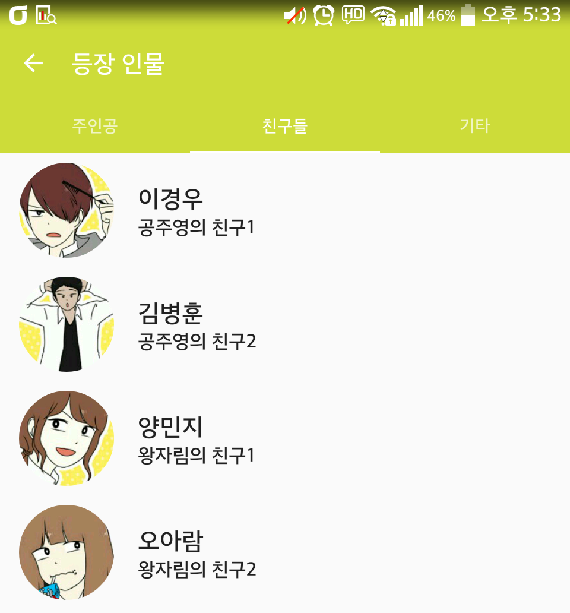
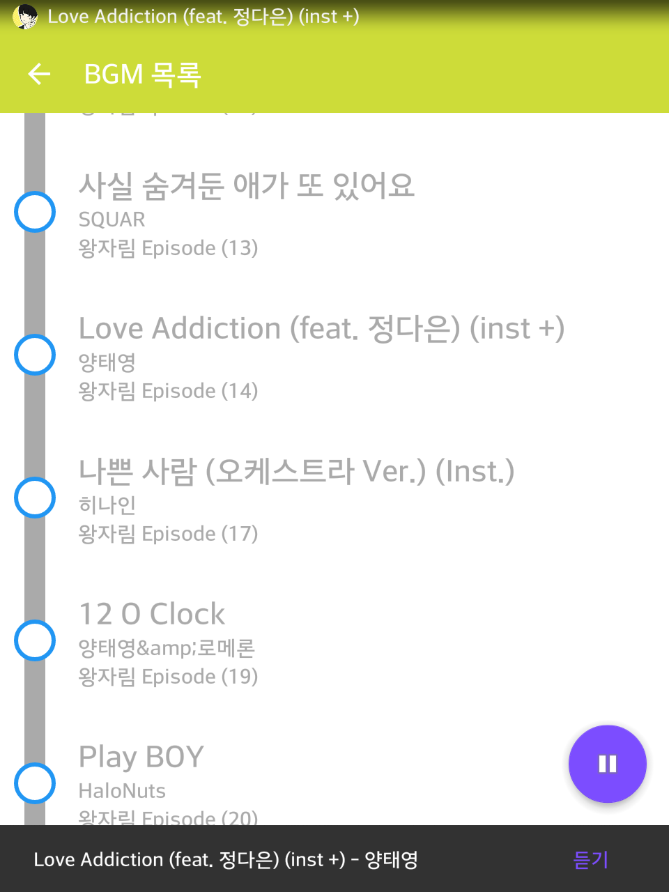
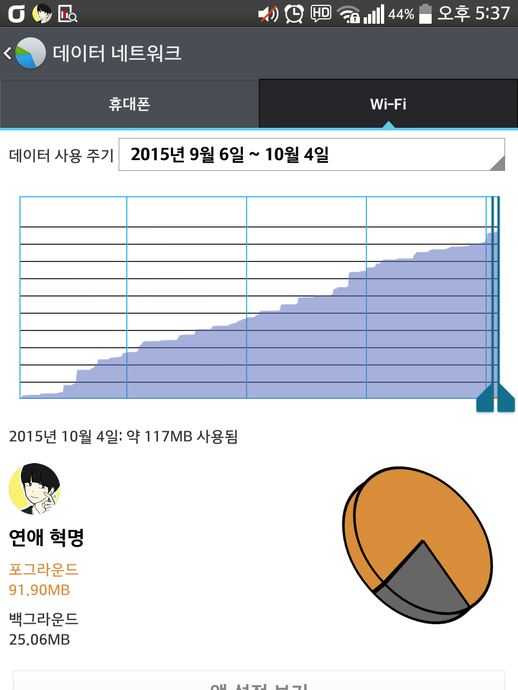

안녕하세요  
  
내일 마지막 시험이라 공부해야되는데 주말동안 앱만 건들고 있네요..;  
  
  
시험 2주전에 연애혁명을 봐서 쿨럭.. 만들자 라고 생각하다가 결국 만들고 있습니다  
  
  
일단 기본적인 디자인만 완성하고 추후에 마무리할때 내용을 알차게 채울 예정입니다  
목표는 12월 연애혁명 연재가 다시 시작될때까지!  
  

  
  
일단 지금 메인화면입니다  
  
내용을 이제 채워야죠 ㅋㅋ...  
  

  
  

  
  
등장인물 정보입니다  
일단 틀만 만들기 위해 캐릭터는 가장 필수적인 몇 명만 넣었습니다  
  
세부 캐릭터 정보도 추가해야죠 이제...  
  
  
그다음 어제 토요일 하루종일 매달려서 BGM 목록기능을 완성했습니다  
  

  
  
지금까지 연애 혁명 BGM 전체 목록을 가져와서 보여줍니다  
그리고 각 BGM은 스트리밍으로 들을 수 있습니다  
  
물론 BGM이 들어간 화에 접속할 수 있는 바로가기 링크도 제공합니다  
  
  
  
이 BGM목록은 제가 일일히 수작업으로 땄습니다 ㅋㅋ  
어디 사이트에 있는거 파싱한거 아닙니다  
  
수정과 추가가 쉽도록 목록은 인터넷에서 파싱합니다  
나중에 이경우 애피소드가 나오고 BGM이 첨부되면 인터넷에서 업데이트 수작업으로 해주면 바로 반영됩니다  
  
그런데 한가지 단점이 있다면..  
  

  
  
스트리밍이 데이터 엄청 잡아먹네요..  
무제한이 아니라서 데이터에서는 못쓰겠습니다  
  
이건 나중에 대책을 마련하던가 해야겠어요  
  
  
  
  
ps. BGM 목록을 인터넷에서 가져오는 방법은 나중에 학교앱에서 시간표를 인터넷에서 파싱할 수 있도록 수정할 때 사용할 방법과 같은 방법입니다  
일단 연애혁명앱 중간까진 마무리한다음 학교앱 시간표를 인터넷에서 수정해서 바로 반영 가능하도록 업데이트할 생각입니다
