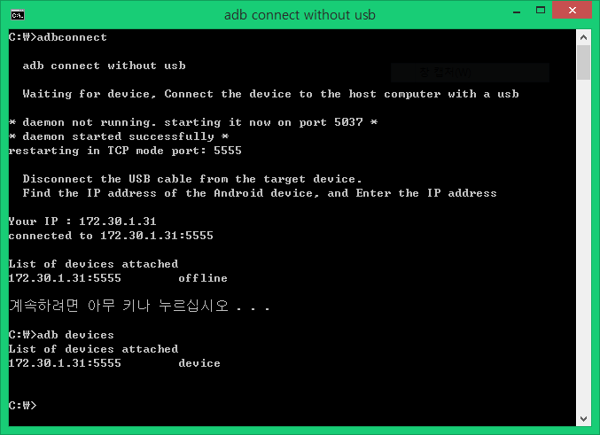

안드로이드 스튜디오를 사용하신다면,

[[Android/App] - Android Studio 무선 ADB 사용하기 (Android WiFi ADB)](/archive/itmir/2020/673) 글을 참고해주세요!

안녕하세요.

앱을 만들거나 스마트폰의 상태를 확인할때 ADB(Android Debug Bridge)라는 고마운 툴을 사용합니다.

이 놈은 정말 없어서는 안되는 꼭 필요한 툴인데요

저를 포함한 대부분의 분들께서 adb를 쓰기 위해 usb를 연결해서 사용하실겁니다.

그런데 adb에는 무선으로 디버깅 할 수 있는 기능이 있습니다.

바로 adb connect 기능을 이용하는 겁니다.

wifi adb를 어떻게 하는지 알아보도록 하겠습니다.

1. 먼저 컴퓨터와 스마트폰이 같은 네트워트상에 존재해야 합니다.

같은 Wifi 또는 공유기에 연결해주세요.

2. 먼저 스마트폰을 컴퓨터에 USB로 연결해주세요.

3. cmd창을 하나 열으신다음 아래 명령어를 입력해주세요.

물론 adb가 들어있는 폴더에서 cmd를 작업해주시거나 환경변수를 설정하셔야 합니다.

5555는 연결할 포트입니다.

adb tcpip 5555

성공시 나타나는 내용 : restarting in TCP mode port: 5555

4. 이제 USB를 연결해제하세요.

그다음 스마트폰의 IP주소를 알아내야 합니다.

알아내는 방법은 다양하므로 몇가지만 알려드린후 넘어가겠습니다.

설정 앱 - 휴대폰 정보 - 상태(또는 네트워크) - IP 주소

설정 앱 - WIFI - WIFI 고급 설정(또는 WIFI 설정) - IP 주소

adb connect <Your IP>:5555

성공시 나타나는 내용 : connected to <IP>:5555

5. 축하드립니다.

adb devices

이 명령어를 통해 연결 상태를 확인할 수 있습니다.

이 작업이 귀찮으신분들을 위해 간단한 배치파일을 만들었습니다.

[adbconnect.bat](./file/adbconnect.bat)

Chrome등 일부 웹 브라우저에서는 다운로드 오류가 발생할 수 있습니다.

adbconnect.bat 파일은 악성코드가 아닙니다.

다운로드 받기 껄끄러우신 분들께서는 아래 초록 박스를 복사하셔서 메모장에 붙혀넣기 하신 뒤, 파일 이름을 adbconnect.bat라고 저장하시면 됩니다.

@echo off

title adb connect without usb

set port=5555

echo.

echo   adb connect without usb by Mir(whdghks913)

echo.

echo   Connect your Android device and adb host computer to a common Wi-Fi network accessible to both.

echo   Waiting for device, Connect the device to the host computer with a usb

echo.

adb kill-server

adb wait-for-device

adb tcpip %port%

echo.

echo   Disconnect the USB cable from the target device.

echo   Find the IP address of the Android device, and Enter the IP address

echo.

set /P ip=  Your IP :

adb connect %ip%:%port%

timeout /t 1

echo.

adb devices

pause

간단한 배치파일이므로 사용하시는데 큰 어려움 없으실거라 생각합니다.

다만 bat 파일중 timeout /t 1 이라는 명령어가 있는데 이게 윈도우 7 이상에서 사용 가능하다고 하네요.

xp에서는 timeout 부분을 제거하시면 될겁니다.

개인적으로 adb가 있는 폴더에 넣으신다음, 그 폴더를 환경 변수에 추가해버리면 바로 사용이 가능해서 매우 편하더라고요.

저번 포스팅으로부터 벌써 한달이 지났군요;

방문해주신분들께 모두 감사드립니다~

참고 : <http://developer.android.com/tools/help/adb.html#wireless>

<http://theaessay.tistory.com/m/post/entry/안드로이드-앱-개발-할-때-무선-WIFI로-디버깅-하는-방법>

---

## 첨부파일

- [adbconnect.bat](./files/adbconnect.bat)