안녕하세요.

매년 우분투가 최신 버전이 릴리즈 되면서 기존 블로그에 작성했던 12.04 버전이 구버전이 되었습니다.

그래서 최신 버전인 우분투 15.10 설치를 포스팅 해보도록 하겠습니다.

## VMWare에 우분투 설치하기

저는 우분투를 가상머신 프로그램인 VMWare Player에 설치하도록 하겠습니다.

VMPlayer는 공식 홈페이지에서 쉽게 다운로드 할 수 있으므로 설치 방법은 생략 하도록 하겠습니다.

<http://www.vmware.com/kr>

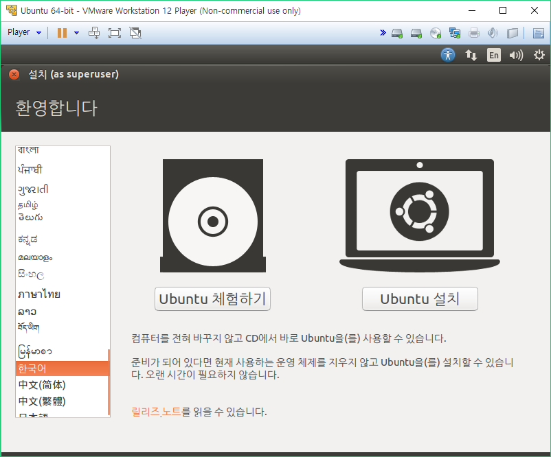

우분투 ISO 파일으로 부팅을 처음 하면 위와 같은 화면이 나타납니다.

처음은 영어로 되어 있으므로 아래에 있는 한국어로 바꿔주시고 Ubuntu 설치 버튼을 눌러주세요.

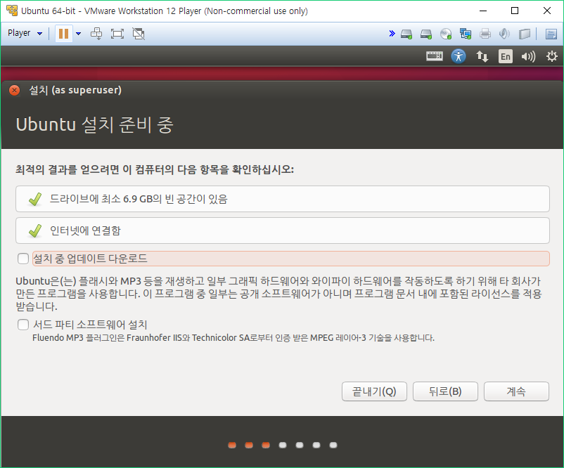

여기에서 일반적인 블로그 글에서는 설치 중 업데이트 다운로드를 체크하라고 하지만,

우분투 서버가 폭주하는 시간대의 경우 오히려 업데이트 설치를 누르면 너무 오랜 시간동안 기다려야 합니다.

그래서 저는 체크를 하지 않고 설치를 먼저 완료하신다음 나중에 업데이트를 하시는 것을 추천드립니다.

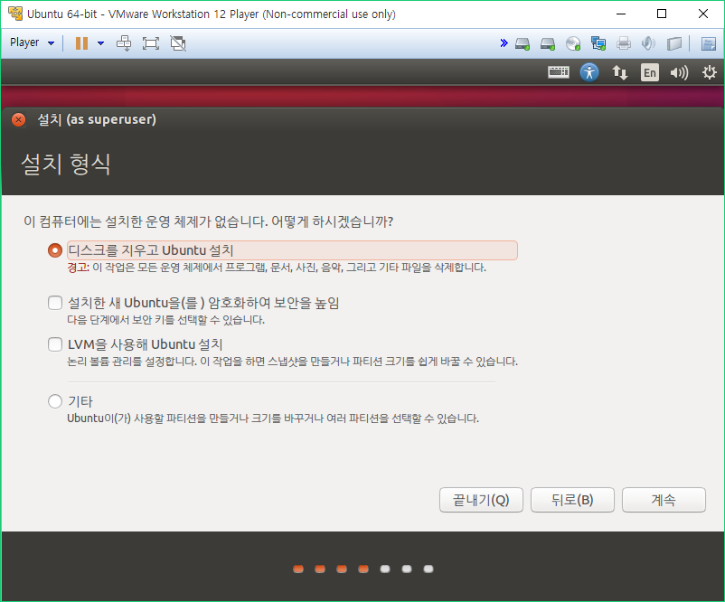

이 부분에서 우분투를 설치할 디스트의 파티션을 설정할 수 있습니다.

일반적인 사용자의 경우 파티션을 설정하지 않고 그냥 설치해 주시면 됩니다.

저는 기타를 선택하여 파티션을 설정하겠습니다.

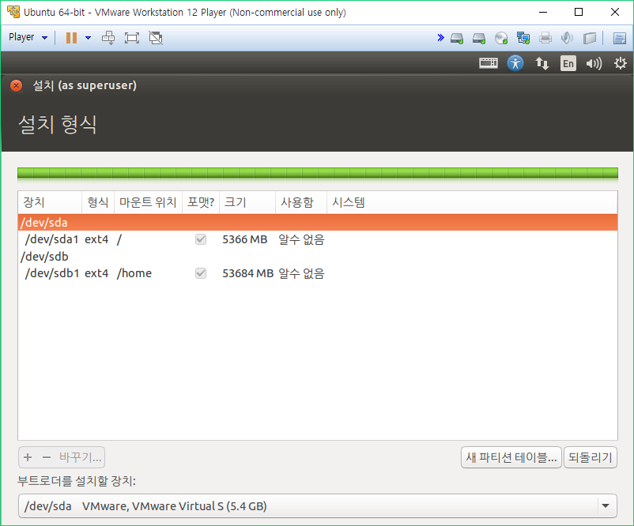

위 사진과 같이 파티션을 설정하였습니다.

+ 나중에 /dev/sda1(Mount : /)의 크기를 20GB로 변경하였습니다.

5GB로는 자바 설치하니 다 차더라고요. ㄷㄷ

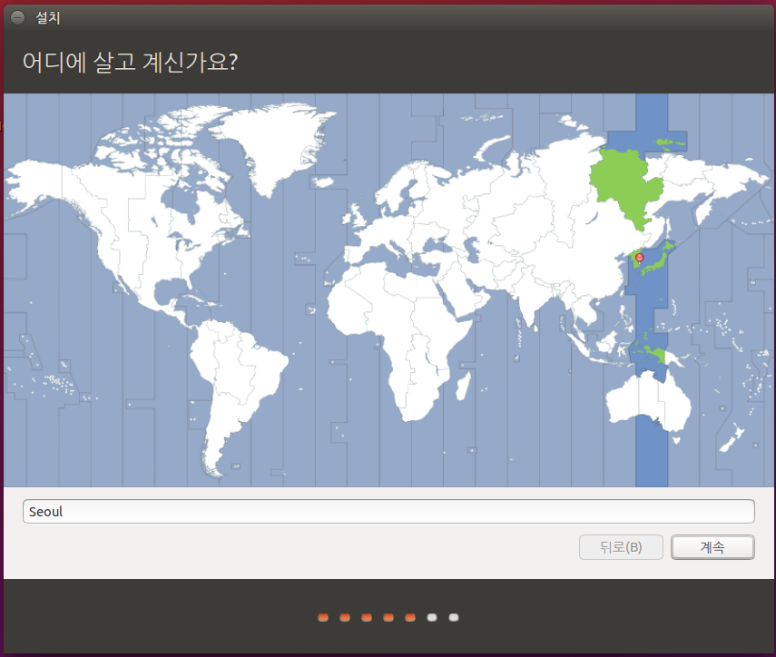

파티션 설정까지 끝났으면 background에서 설치가 진행되고, foreground에서는 사용자 설정이 진행됩니다.

먼저 지금 위치와 시간대 설정 화면입니다.

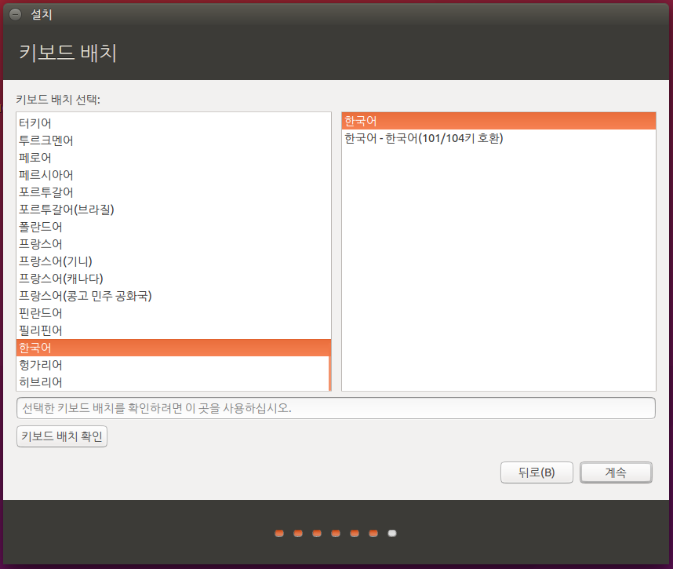

두번째로는 언어와 키보드 설정입니다.

처음 키보드는 일반적인 키보드 배치이고 두번째 키보드는 노트북용 키보드 배치입니다.

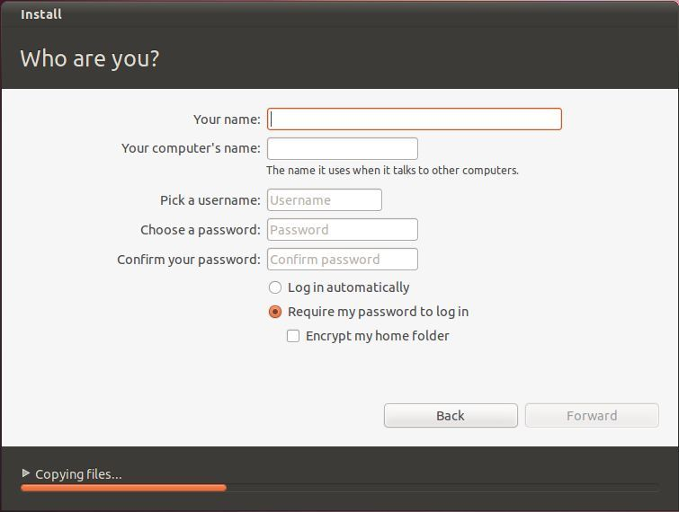

계정 설정부분을 캡쳐 못하고 그냥 넘어가서 사진 얻어왔습니다.

(출처 : <http://www.techotopia.com/index.php/Installing_Ubuntu_11.04_on_a_Windows_System_(Dual_booting)>)

여기서 입력한 암호가 sudo를 쓸때 사용되는 암호이므로 꼭 기억하세요!

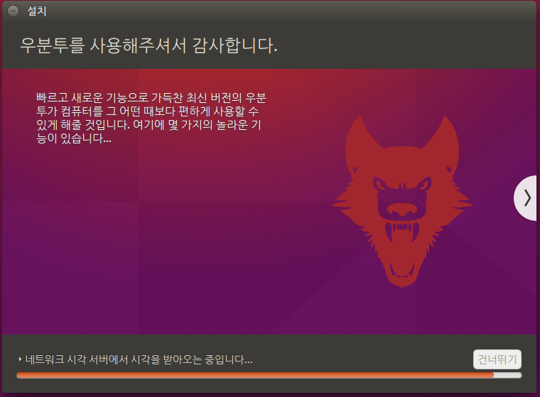

이제 기다려줍시다..

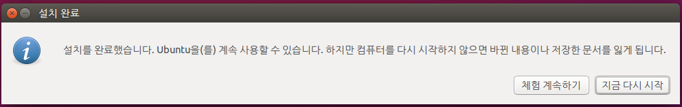

저는 우분투 체험하기로 들어갔다 설치를 했기 때문에 "바뀐 내용이나 저장한 문서를 읽게 됩니다." 라고 뜨지만

대부분 그냥 재부팅 하시겠습니까? 라고만 뜰겁니다.

재부팅 해줍시다.

## 우분투 해상도를 위해 VMWare Tools 설치하기.

재부팅하고 나서 우분투를 보면 해상도가 매우 낮을겁니다.

이를 해결하기 위해 VMWare Tools를 설치합시다.

Manage - Install VMWare Tools를 눌러주세요.

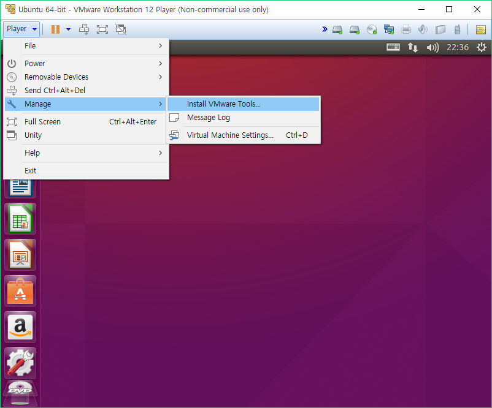

그럼 CD가 하나 뜨게 됩니다.

CD안에 있는 tar.gz파일을 바탕화면에 복사해서 압축 풀어주세요

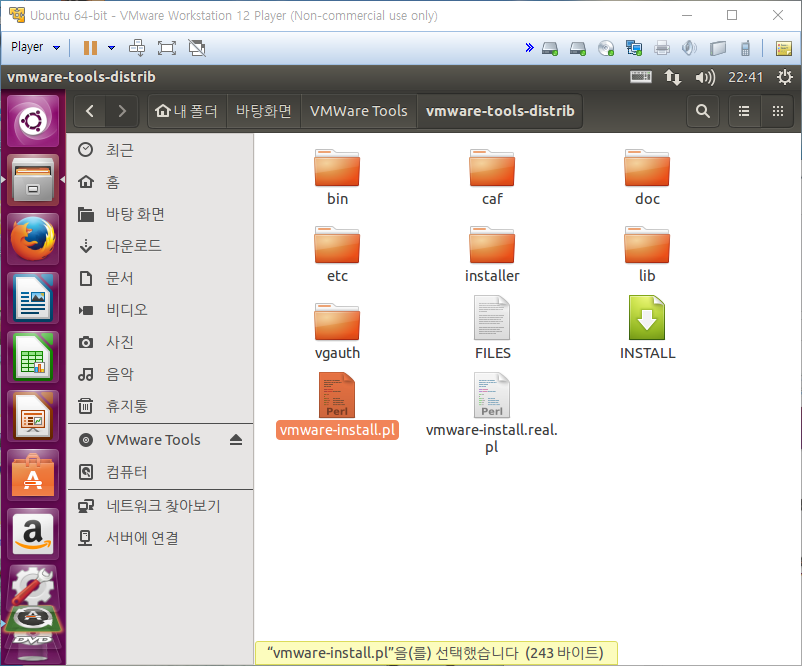

tar.gz 압축 파일을 풀고 나면 위와 같은 파일들이 나타납니다.

이제 터미널을 열어주세요

터미널을 여는 단축키는 Ctrl + Alt + T 입니다.

터미널을 연다음 cd 명령어를 사용해서 아까 압축푼 폴더로 이동해주세요

그다음 chmod 명령어로 실행 권한을 준다음에 vmware-install.pl 파일을 실행해주면 됩니다.

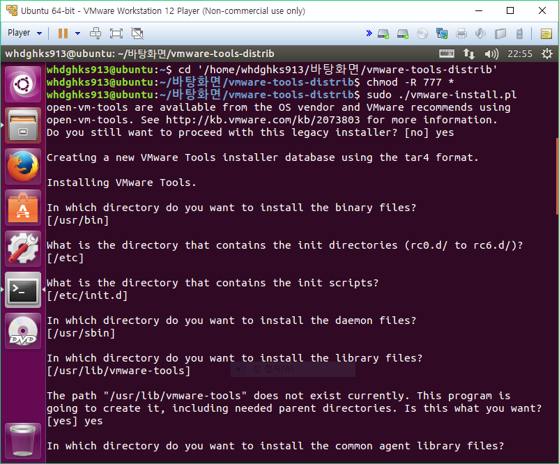

처음에 Yes 입력해주신다음 중간마다 뜨는 질문에 엔터 또는 yes 입력해주시면 됩니다.

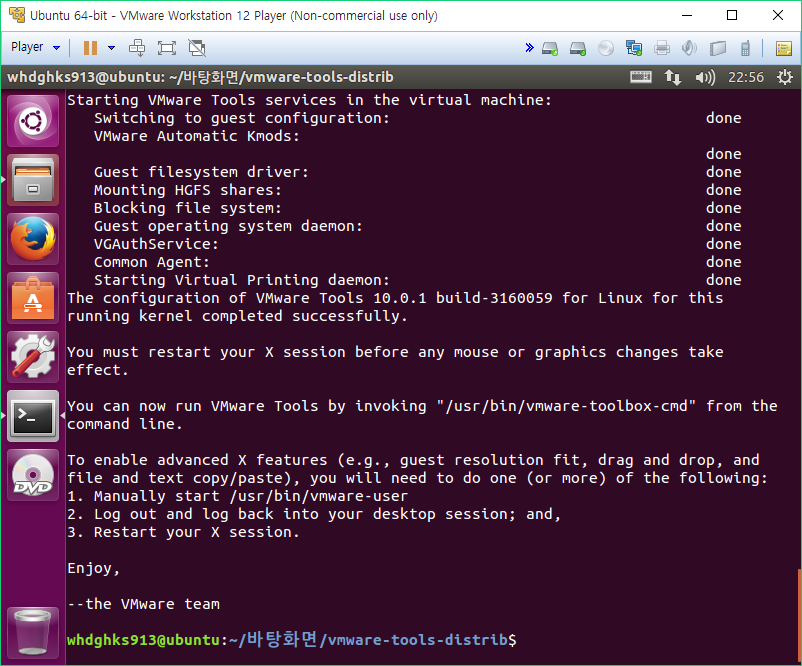

위 스샷처럼 나타난다면 설치가 모두 완료되었습니다.

다시 가상머신을 재부팅해 우분투를 실행해보면 해상도가 정상적으로 뜨고 VMWare 크기를 변경하면 자동으로 해상도도 변경됩니다.

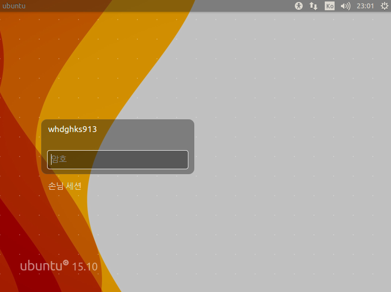

확실히 15.10이 새로운 느낌입니다.
