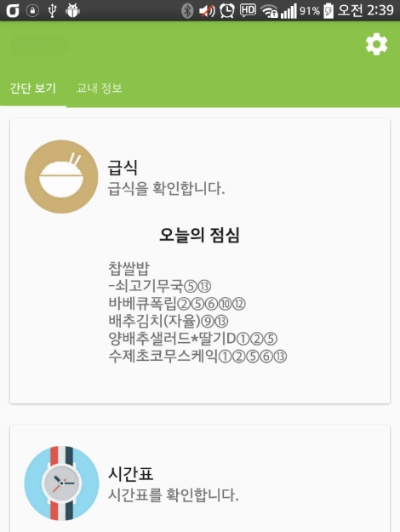
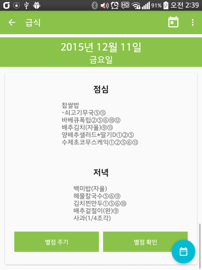
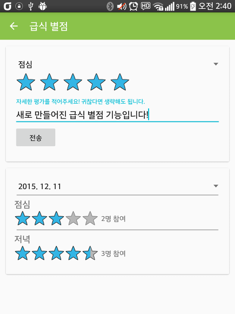
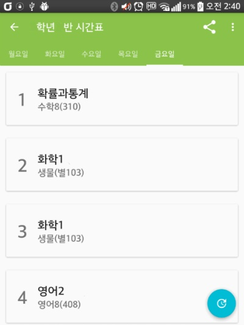
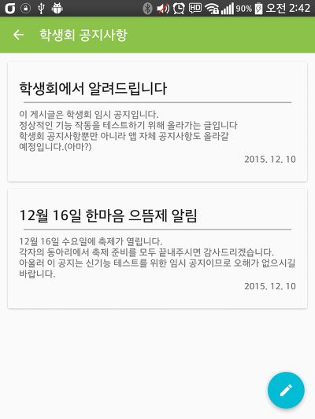
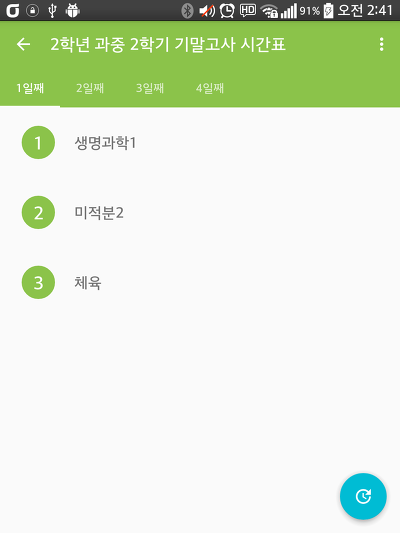
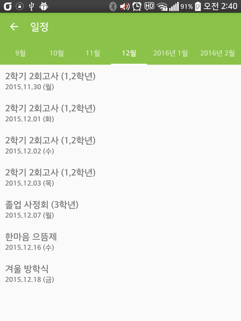
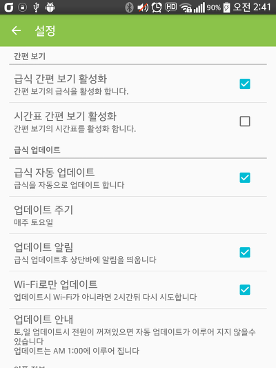
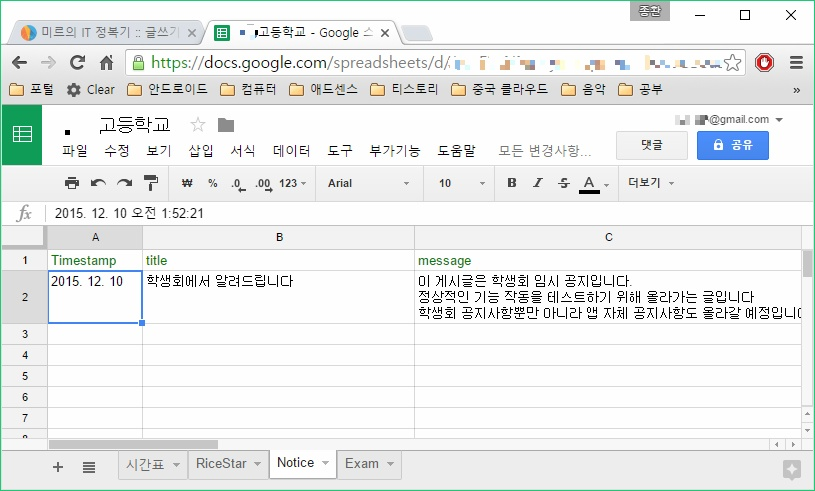

안녕하세요

기말고사가 끝나고 시간이 생겨서 학교앱 프로젝트를 지우고 처음부터 다시 구현했습니다.

이번에 안드로이드 스튜디오를 2.0 Preview 버전으로 다시 깔고 SDK도 업데이트한다음

안드로이드 머터리얼 디자인도 전보다 더 반영하려고 노력했습니다.

메인화면은 두개의 탭으로 구성했습니다.

처음 탭은 급식과 시간표가 나타나게 만들었고

두번째 탭은 나머지 기능이 나타나게 구현했습니다.

전에는 액티비티마다 ToolBar 색을 변경했는데 이번에는 그 작업이 좀 귀찮기도 해서 생략했습니다. 그래서 앱의 전체적인 통일성을 주었다고 생각합니다.

다른 부분은 이전과 같지만 이번 버전을 만들면서 한가지 기능을 추가했는데

몇시간 동안 학교에서 태블릿 가지고 구현한 별점 주기 기능입니다.

위 스샷은 급식 별점 주기 기능과 확인 기능이 동시에 찍혀있는데 이건 제가 만든 스샷이고 원래는 따로 따로 표시됩니다.

구글 스프레드 시트를 이용해서 만들었습니다.

이게 간단해 보여도 은근 복잡하더라고요

시간표는 기존 쓸데없이 자리만 차지하던 학년 반 정보를 ToolBar로 올리고 전체 레이아웃을 리스트뷰로 처리했습니다.

그리고 시간표 DB는 구글 스프레드 시트에 올려놓고 앱 사용자가 파일을 다운받아 적용할 수 있도록 만들었습니다.

학기마다 시간표를 수정해야 할 때 올려둔 파일만 수정하고 앱에서 업데이트를 하게 되면

앱을 업데이트 할 필요 없이 시간표 정보만 업데이트가 가능합니다.

시간표를 바꿀 때마다 앱을 업데이트하는 일이 번거로워서 만든 기능입니다.

학교 정보랑 일과 운영표 기능을 지워버리는 대신

학생회 공지사항 기능을 구현했습니다.

일반 학생들은 게시할 수 없고 설정에서 권한을 관리자 권한으로 바꿔야만 공지사항을 작성할 수 있습니다.

제 친구가 괜찮다고 해서 구현한 기능입니다 ㅋㅋ

그다음은 시험 시간표 기능인데요

이 기능은 원래 11월에 만들려고 생각했었는데 디자인을 바꾸고 만들고 싶어서 미루다보니

시험 시간표가 뒷북이 되었습니다 ㅋㅋㅋㅋㅋ

학년마다 이과/문과를 선택해서 시험 시간표를 띄워줍니다.

다음 시험부터 시험 시간표가 나오면 업데이트 해야죠 ㅋㅋ

이번 업데이트에서 일정 내용은 바뀌지 않았지만

바뀐점은 탭으로 표시되는 점입니다.

그리고 탭으로 표시했기 때문에 이번달 내용을 바로 표시할 수 있습니다.

유일하게 오프라인으로도 가능한 기능이군요

설정도 달라진게 많이 없습니다.

메인화면에서 급식이랑 시간표를 바로 띄워주는 간편 보기 기능을 비활성화 할 수 있게 되었고

스샷에는 없지만 맨 아래에 공지사항을 쓸 수 있는 권한을 얻을 수 있는 메뉴가 존재합니다.

이번에 노가다를 많이 했는데 가장 중요한건 구글 스프레드 시트를 이용했다는 점 같습니다.

다만.. 인터넷 의존성이 심해진게 조금 마음에 걸리네요.

아무튼 이렇게 디자인을 바꾸고 나니 확실히 마음이 가볍습니다 ㅎㅎ

이제 몇가지 기능 더 만들게 있는지 살펴보고 다른 앱을 만들기 시작해야겠어요

+ 2015-12-20

제 소스를 가지고 연구하시다 실수로라도 공지사항에 글을 게시할 수 없도록 소스를 보완했습니다.
