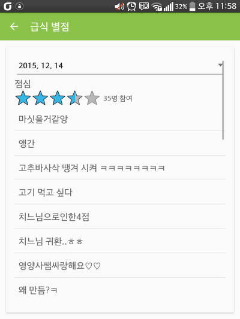

안녕하세요

저번 주말에 학교앱을 다시 한번 디자인부터 리메이크하고 몇가지 기능도 넣어서 출시하였습니다.

[[Application] - 학교앱을 새로운 디자인으로 업데이트 했습니다. (feat. 재밌는 기능 추가)](/archive/itmir/2015/596)

그중에 급식 평점기능도 새로 만들어서 넣었는데요

오늘 앱이 업데이트되고나서 1일째인 기념으로 포스팅해봅니다 ㅋㅋ

근데 제 기억으론 점심이 그렇게 맛있진 않았거든요

먹고나서 평균 별점이 3점은 못넘겠다 생각하고 있었는데 3.5가 나왔습니다. 의외의 결과..

만들면서 왜만들고 있는지 몰랐는데 사실 지금도 모르겠습니다 왜만들었는지 ㅋㅋ

결론은.. 이 결과를 학생회에게든 영양사 선생님께든 어떻게 전해야 할텐데 모르겠네요

+ 2015-12-20

제 소스를 가지고 연구하시다 실수로라도 공지사항에 글을 게시할 수 없도록 소스를 보완했습니다.