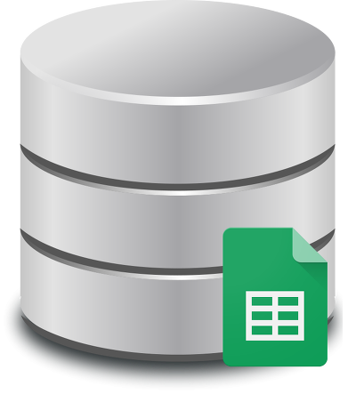

안녕하세요

저번 포스팅에서 급식 별점 기능을 공개한 바 있습니다.

[[Application] - 학교앱을 새로운 디자인으로 업데이트 했습니다. (feat. 재밌는 기능 추가)](/archive/itmir/2015/596)

[[Application] - 학교앱에 급식 평점 기능을 넣고나서](/archive/itmir/2015/597)

이번 글에서는 별점기능을 구현하기 앞서 구글 스프레드 시트를 온라인 데이터 베이스로 사용하는 방법을 알아보겠습니다.

이 글은 전에 포스팅한 티스토리 오류제보 기능 만들기와 유사합니다.

[[Tistory] - 티스토리 오류 제보하기 버튼 만들기 - 구글 스프레드 시트 사용](/archive/itmir/2015/550)

### 1. 구글 스프레드 시트에서 Html Post 요청을 받을 수 있도록 스크립트 편집하기

먼저 구글 스프레드 시트에 접속해주세요

<https://docs.google.com/spreadsheets>

시트 파일이 하나 필요합니다.

없다면 만들어주세요

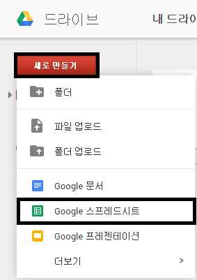

그뒤 스프레드 시트를 열어주세요

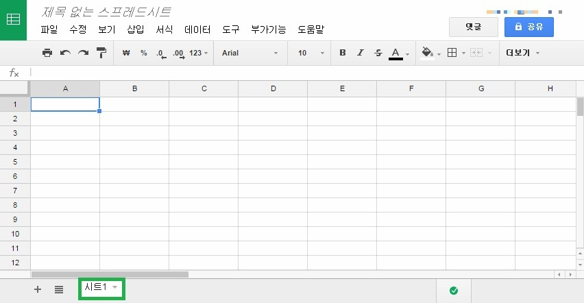

위 스샷과 같은 화면이 나타날겁니다.

파일의 이름인 "제목 없는 스프레드 시트" 부분은 알아서 바꿔주시면 됩니다.

중요한건 녹색 박스로 표시해둔 "시트1" 부분인데요

오류 제보 기능 만들 때와 달리 지금은 변경해주셔도 됩니다.

시트1 옆의 + 버튼을 눌러 시트를 몇개 추가하셔도 됩니다.

이제 스크립트를 편집해야 합니다.

도구 - 스크립트 편집기에 들어가주세요

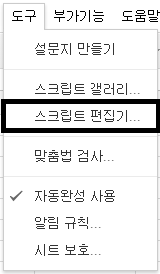

스크립트 만들기 - 빈 프로젝트를 선택해줍시다

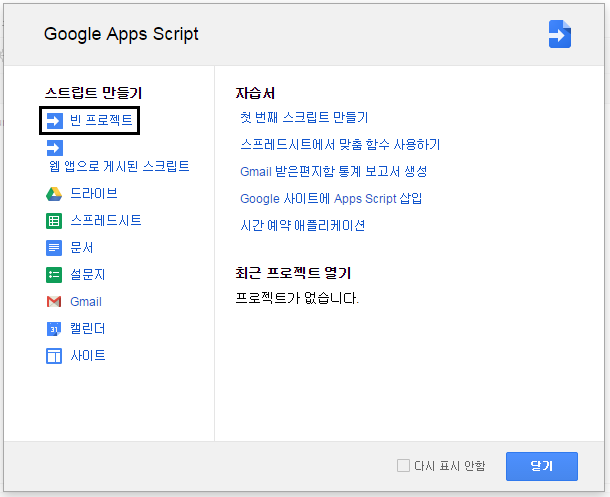

그럼 아래와 같은 스샷이 나타납니다.

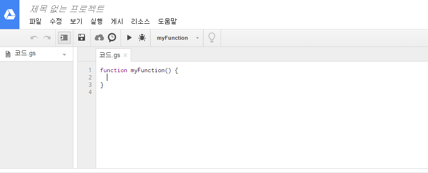

내용을 모두 지워주고 아래 박스의 스크립트를 붙혀넣기 해주세요

var SCRIPT_PROP = PropertiesService.getScriptProperties(); // new property service

// If you don't want to expose either GET or POST methods you can comment out the appropriate function

function doGet(e){

  return handleResponse(e);

}

function doPost(e){

  return handleResponse(e);

}

function handleResponse(e) {

  // shortly after my original solution Google announced the LockService[1]

  // this prevents concurrent access overwritting data

  // [1] http://googleappsdeveloper.blogspot.co.uk/2011/10/concurrency-and-google-apps-script.html

  // we want a public lock, one that locks for all invocations

  var lock = LockService.getPublicLock();

  lock.waitLock(30000);  // wait 30 seconds before conceding defeat.

  try {

    var SHEET_NAME = e.parameter["sheet_name"];

    // next set where we write the data - you could write to multiple/alternate destinations

    var doc = SpreadsheetApp.openById(SCRIPT_PROP.getProperty("key"));

    var sheet = doc.getSheetByName(SHEET_NAME);

    // we'll assume header is in row 1 but you can override with header_row in GET/POST data

    var headRow = e.parameter.header_row || 1;

    var headers = sheet.getRange(1, 1, 1, sheet.getLastColumn()).getValues()[0];

    var nextRow = sheet.getLastRow()+1; // get next row

    var row = [];

    // loop through the header columns

    for (i in headers){

      if (headers[i] == "Timestamp"){ // special case if you include a 'Timestamp' column

        row.push(new Date());

      } else { // else use header name to get data

        row.push(e.parameter[headers[i]]);

      }

    }

    // more efficient to set values as [][] array than individually

    sheet.getRange(nextRow, 1, 1, row.length).setValues([row]);

    // return json success results

    return ContentService

 .createTextOutput(JSON.stringify({"result":"success", "row": nextRow}))

 .setMimeType(ContentService.MimeType.JSON);

  } catch(e){

    // if error return this

    return ContentService

 .createTextOutput(JSON.stringify({"result":"error", "error": e}))

 .setMimeType(ContentService.MimeType.JSON);

  } finally { //release lock

    lock.releaseLock();

  }

}

function setup() {

  var doc = SpreadsheetApp.getActiveSpreadsheet();

  SCRIPT_PROP.setProperty("key", doc.getId());

}

기본적인 내용은 오류 제보와 차이가 없지만

위 박스의 코드는 시트 이름을 정의하지 않습니다.

그대신 한가지 차이점이 있다면 html post의 sheet_name을 가져옵니다.

그래서 시트를 많이 만든뒤 각각의 시트에 html post를 따로 넣고 싶다면

sheet_name만 바꿔서 post를 날려주면 됩니다.

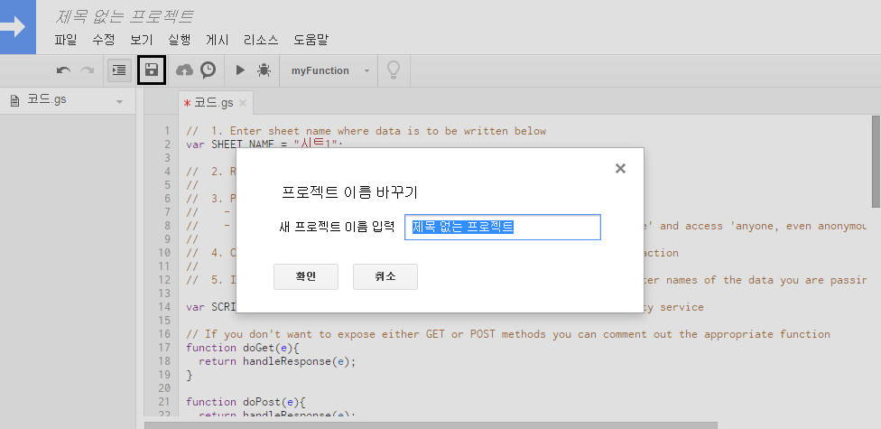

프로젝트 이름도 마음대로 수정해주시면 됩니다.

이제 실행 - setup을 눌러주세요

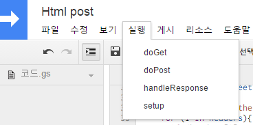

그럼 인증이 필요하다는 메시지가 나타납니다.

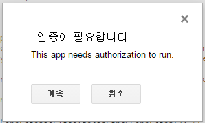

계속을 눌러 진행해봅시다.

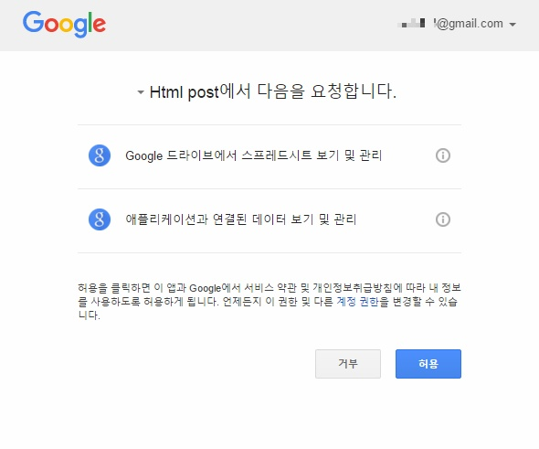

위 스샷에서도 그냥 허용 눌러주시면 됩니다.

허용하신 다음에 다시한번 실행 - setup을 눌러주세요

이제 이 프로젝트를 게시해야 합니다.

게시 - 웹 앱으로 배포..를 눌러주세요

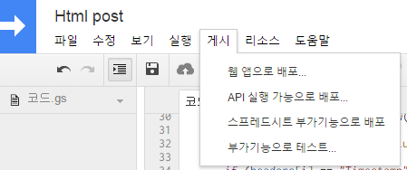

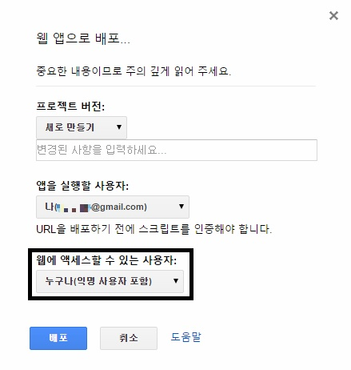

웹에 엑세스할 수 있는 사용자를 누구나(익명 사용자 포함)으로 바꿔주시고 배포합니다.

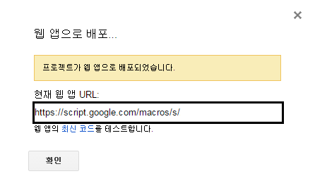

프로젝트가 웹 앱으로 배포되면 하나의 url을 얻을 수 있습니다.

이 url을 사용하여 앱에서 html post를 보낼 수 있습니다.

### 시트의 행 추가하기

HTML POST를 받을 때 시트의 맨 처음 행이 필요합니다.

SQLite로 따지자면 Column의 정보라 할까요?

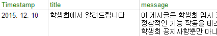

위 스샷은 공지사항 시트의 일부입니다.

Timestamp는 구글 스프레드 시트상에서 get이나 post 요청을 받을때 서버 시간을 기록하기 위한 열이고

title과 message는 post를 보낼때 데이터 구분값이라 생각하시면 됩니다

좀 말이 애매한데

Intent.putExtra("title", myTitle);

Intent.putExtra("message", myMessage);

이런 식이다 라고 생각하시면 됩니다.

post 요청을 보내기 전, 무엇 무엇이 필요한지 생각해보고 맨 처음 행을 작성하세요

참고

/archive/itmir/2015/550

+ 2015-12-20

제 학교앱 소스를 가지고 연구하시다 실수로라도 공지사항에 글을 게시할 수 없도록 소스를 보완했습니다.