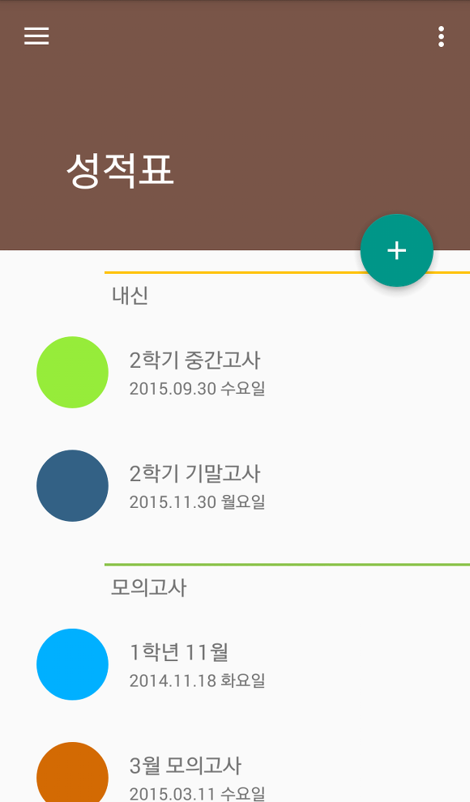
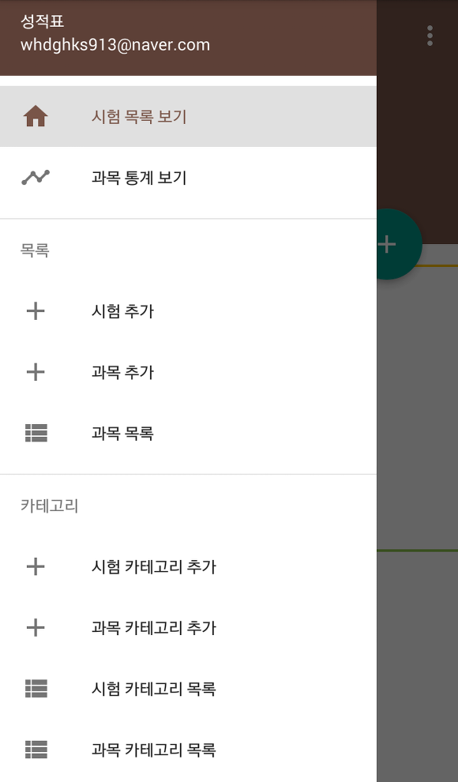
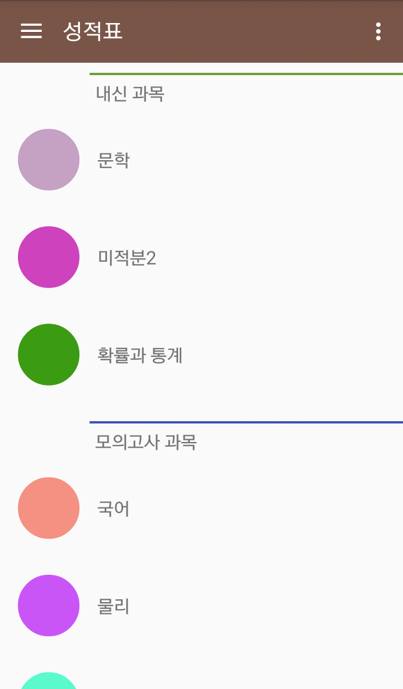
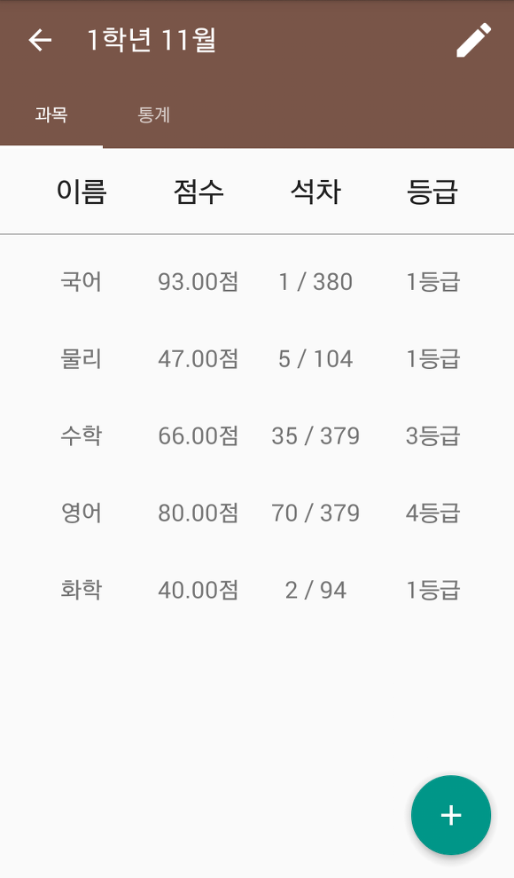
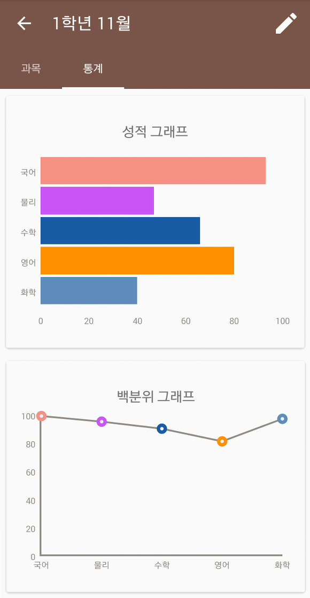
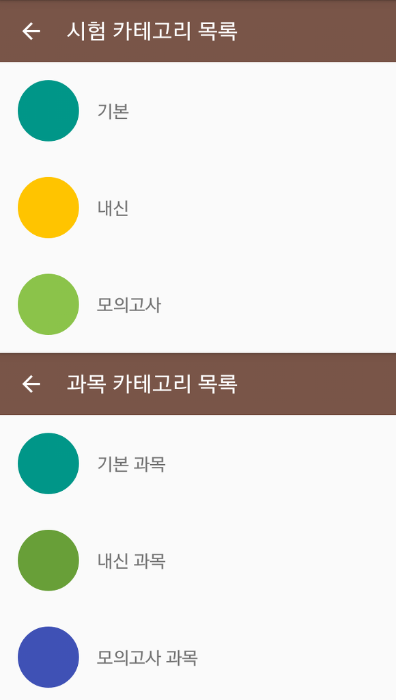
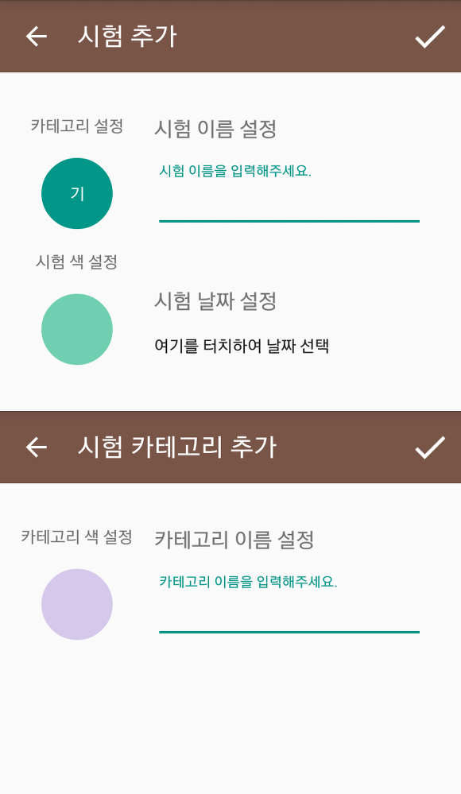
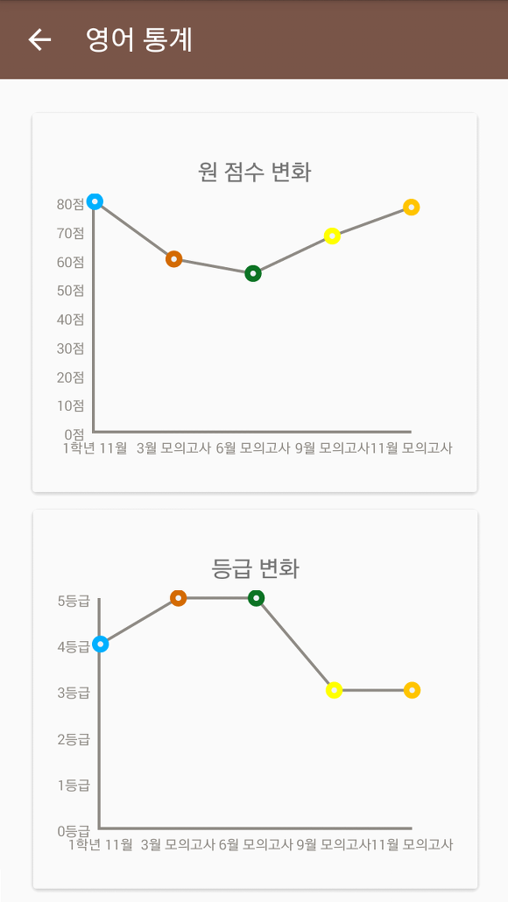
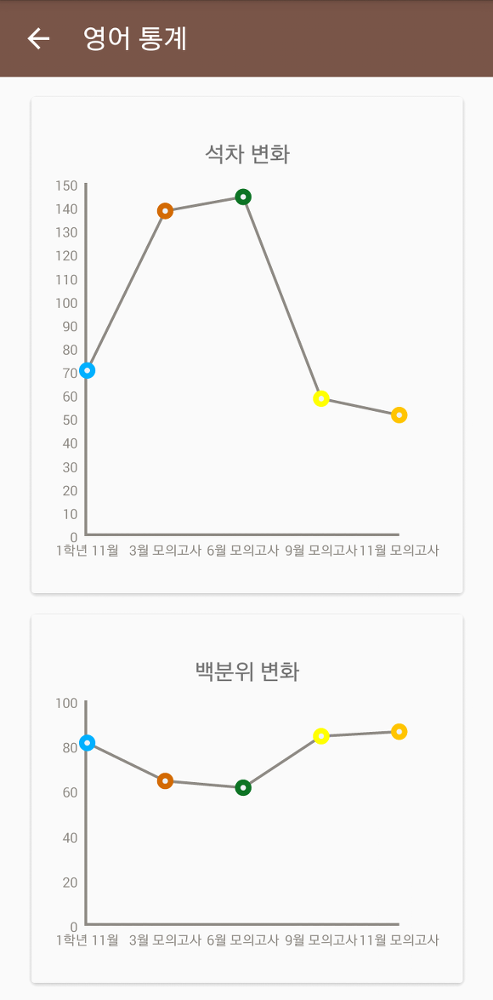

성적표 앱을 출시했습니다!

아래 글을 참고해주세요

[[Application] - 성적표 앱을 출시했습니다.](http://itmir.tistory.com/601)

안녕하세요

학교앱 프로젝트를 모두 끝낸후 전부터 생각하고 있었던 성적표앱을 만들어 보고 있습니다.

원래 조금 더 빨리 글 올릴 수 있었는데 다른 할 일도 있어서 포스팅이 늦어졌습니다..

제가 이걸 만든 이유는.. 시험 성적을 일일히 기억하기 귀찮아서입니다.

근데.. 만들다가 때려칠까 생각이 정말 많이 들었네요 ㅋㅋ

성적표앱을 만들기 시작하면서 git으로 작업내역을 기록하기 시작했는데 12월 12일에 프로젝트 생성을 시작해서 오늘까지 약 1주일하고 하루정도 걸렸습니다.

작업 커밋이 많이 있을거라 생각했는데 총 56개 커밋으로 생각보다는 작업 내역이 적군요.

오늘 대충 완성된 것 같아 글과 함께 스샷도 올립니다~

메인 화면 입니다.

카테고리를 지정하여 내신과 모의고사, 기타 시험을 분류할 수 있도록 만들어봤습니다.

이 부분 구현하느라 자바 인터페이스부터 다시 공부했습니다.. 막히더군요 ㅋㅋ

다음은 네비게이션 드로워라고 하던데 깔끔하게 메뉴가 정리될 것 같아 구현했습니다.

시험 목록 보기 아래에 있는 과목 통계 보기 메뉴를 누르면 저장된 과목이 카테고리 별로 구분되어 나타납니다.

예를 들어 과목 리스트에서 물리를 누르면 최근 10개의 시험에 입력된 물리 시험의 통계화면이 나타납니다.

통계 스샷은 아래에 있으니 아래에서 살펴보기로 하고 다음에는 시험 상세정보를 확인해보겠습니다.

맨 처음 스샷에서 시험 리스트를 눌렀을 때의 모습입니다.

시험 상세 정보는 두개의 탭이 있습니다.

과목탭에서는 시험 정보를 입력 할 수 있고, 옆에 있는 통계탭은 그래프로 표현해줍니다.

지금 구현한 그래프는

원점수를 표시해주는 그래프와 백분위 그래프 입니다.

백분위는 지금은 [100 - (과목석차/전체인원수)\*100] 공식으로 구하고 있습니다.

인터넷에 찾아봤는데 백분위 공식이 많이 있더라고요.

어떻게 구하는지 자세하게 아신다면 덧글 부탁드립니다.

그 다음 스샷은 카테고리 목록입니다.

카테고리는 자유롭게 추가/삭제가 가능하지만 기본 카테고리는 수정만 가능하고 삭제는 불가능합니다.

위 스샷은 시험/카테고리 추가 화면인데요.

시험 카테고리, 시험 색, 이름, 날짜를 입력할 수 있습니다.

과목을 추가할 때도 위 스샷과 비슷합니다.

그다음에 마지막 스샷은 위에서 말한 과목 통계부분의 스샷입니다.

샘플로 모의고사 영어 과목의 통계 사진을 들고 왔습니다.

통계는 최근 10개의 시험중에서 모의고사 카테고리의 영어 과목이 입력된 시험만 표시됩니다.

원점수 변화, 등급 변화, 석차 변화, 백분위 변화등을 그래프로 볼 수 있습니다.

날짜순으로 10개 시험이므로 모의고사와 내신 모두 2년 정도의 변화는 관찰할 수 있을겁니다. (아마?)

아마 마켓에 업로드할 날짜는 버그 확인하고, 백분위를 직접 입력할 수 있게 추가하고 해야되서 장담은 못하겠지만 올해안에 출시가 가능하겠죠...ㅎ....

가장 큰 문제는 앱 아이콘이 기본 아이콘입니다.

아이콘도 찾아봐야 하는데 마땅히 마음에 드는게 없네요..

혹시 디자인 가능하신 분들중에 심심하시다면 아이콘 몇개 던져주시면 정말 감사히 받겠습니다~

그리고 시험/과목 통계 그래프도 추가할 그래프나 보완점 있으시면 댓글로 알려주세요~

추가할 그래프는 x축, y축에 무엇이 들어가야 하는지 알려주셔야 합니다.

읽어주셔서 감사합니다.
