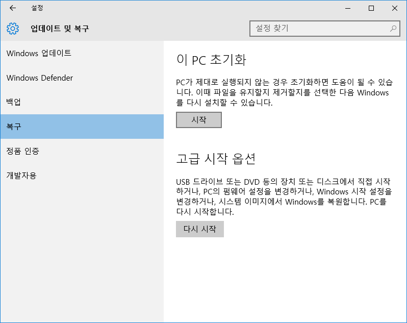
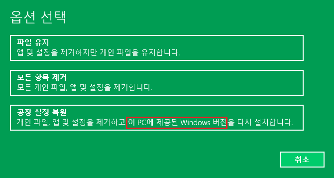
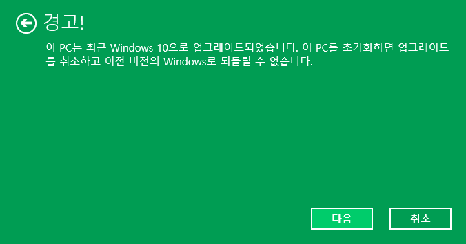

어제 26일 저녁 8시부터 태블릿의 윈도우 8.1을 포멧하고 윈도우 10을 깔고 있었습니다.

데이터 백업하고 윈도우를 한번 포멧해서 C드라이브 용량을 확보한 다음,

윈도우 10으로 설치하느라 시간이 오래 걸렸는데요.

10으로 업데이트 하고나서 8.1의 흔적을 지우기 위해 포멧을 하는데 이상한 옵션을 발견하였습니다.

참고로 필자는 주연테크 제이탭2를 사용 중입니다.

설정 - 업데이트 및 복구 - 복구 - 이 PC 초기화

일반적인 윈10의 초기화 과정으로 진행하였습니다.

이 PC 초기화 메뉴의 시작을 누르면 초기화 옵션이 나타나게 됩니다.

그런데 한가지 이상한 문구를 발견했습니다.

"이 PC에 제공된 Windows 버전"

처음에 이 문구를 그냥 간과하고 3번째 옵션을 선택해서 초기화했습니다.

원래 윈10으로 업뎃하면, Windows.old 폴더가 존재하고, 윈8으로 돌아갈 수 있는 메뉴를 한 달간 제공합니다.

그리고 복구 파일이 존재할 때 초기화를 하려 하면 아래와 같은 경고가 뜹니다.

그런데 저 세번째 옵션으로 초기화를 할 때 Windows.old 폴더를 날려버려서 복구 할 수 없을텐데,

초기화를 진행해보니 Windows 8.1으로 다시 돌아오게 되었습니다.

ㅋㅋㅋㅋ

시간을 매우 낭비하게 되었습니다.

다시 윈10을 설치하고 이전 윈도우 복구 폴더까지 디스크 정리로 지운 뒤 초기화 옵션을 살펴보았지만 같은 문구가 있는것을 알 수 있었습니다.

결론은, 저 세 번째 옵션은 내장된 복구 파티션을 이용해서 초기화를 하는 원리로 생각됩니다.

이럴 줄 알았다면 윈8에서 복구 디스크 만들려고 난리치지 않아도 됐었는데 말이죠...

복구 파티션을 지워버리면 안 뜰까요? ㅋㅋㅋ
