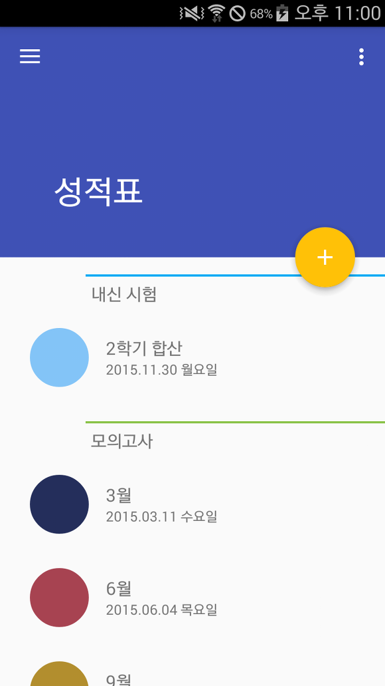
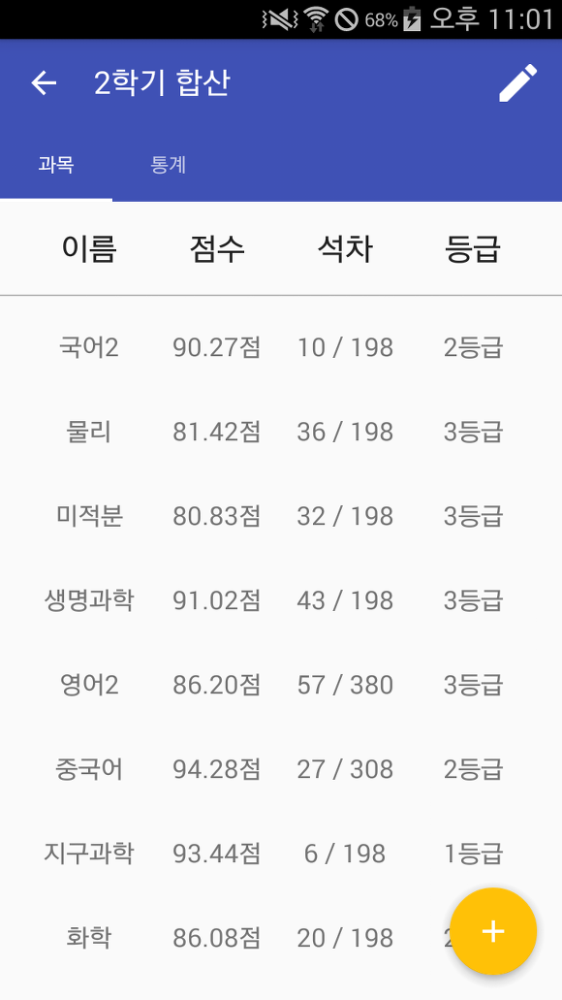
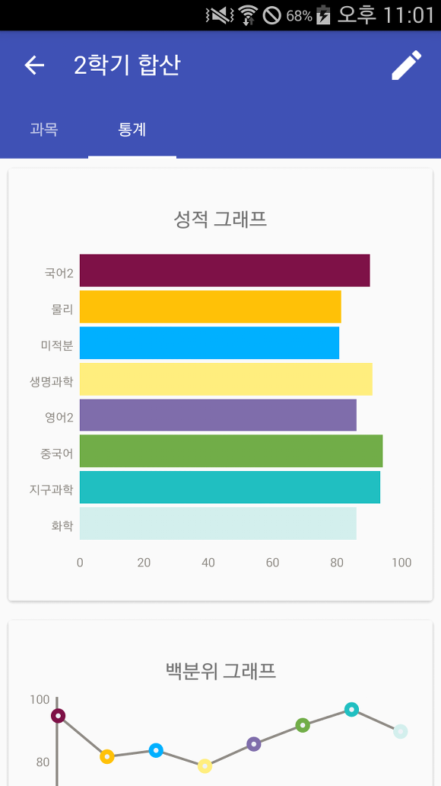
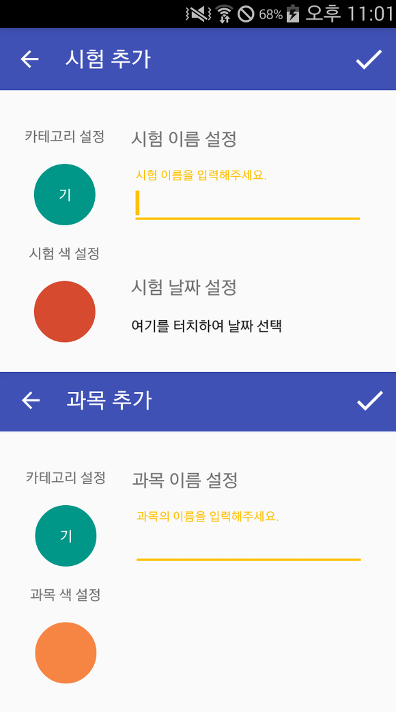
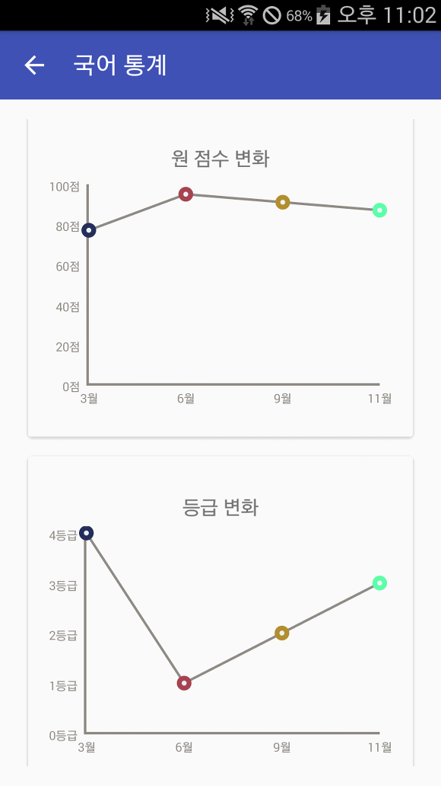

안녕하세요~

12월 중반부터 프로젝트를 만들기 시작해서 저번 20일날 잠깐 포스팅으로 스샷을 공개했었는데요

이번에 좀 더 다듬어서 마켓에 출시하게 되었습니다!

여기서 저번 글이 궁금하시다면 : [[Application] - 성적표앱을 만들어보고 있습니다.](http://itmir.tistory.com/599)

저번 글이랑 달라진 점은 크게 겉으로 드러나는 부분은 색이 바뀌었고 나머지는 전부 버그와 기능 보완에 중점을 두었습니다.

완성도가 높아졌다고 생각하여 지금 마켓에 출시하고 바로 포스팅 하고 있네요 ㅋㅋ

앱의 메인화면 입니다.

메인 화면에는 시험 리스트가 표시되고, 저 리스트를 터치하면 상세 정보를 확인할 수 있습니다.

과목 성적을 추가해보았습니다.

과목은 가나다 순으로 정렬되며 점수, 석차, 등급이 리스트로 표시됩니다.

오른쪽으로 스와이프 하게된다면 시험에 대한 그래프가 표시됩니다.

달라진 부분이 있다면

성적 그래프의 최댓값은 입력된 시험 점수에 따라 달라지게 됩니다.

지금은 90점대가 있어서 그래프의 최고점이 100으로 뜨고, 그 이상 점수를 입력하면 점수에 맞게 최고점이 다시 계산됩니다.

시험과 과목을 추가하는 부분입니다.

이름을 입력하고 키보드의 확인을 누르면 바로 저장이 가능하도록 설정했습니다.

과목 통계 부분도 겉으로는 달리진 부분이 없지만 버그 수정과 그래프 측정 알고리즘을 일부 수정하였습니다.

성적표앱은 마켓에서 다운로드 하실 수 있습니다.

[바로가기](https://play.google.com/store/apps/details?id=com.tistory.itmir.whdghks913.reportcard)

ps. 맨 위의 앱 아이콘은 가운데 이미지를 찾은뒤 인터넷 포토샵이라고도 불리는 <https://pixlr.com/editor/> 사이트에서 만들었습니다 ㅋㅋ
