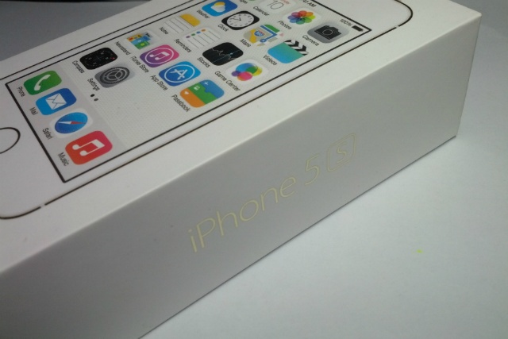
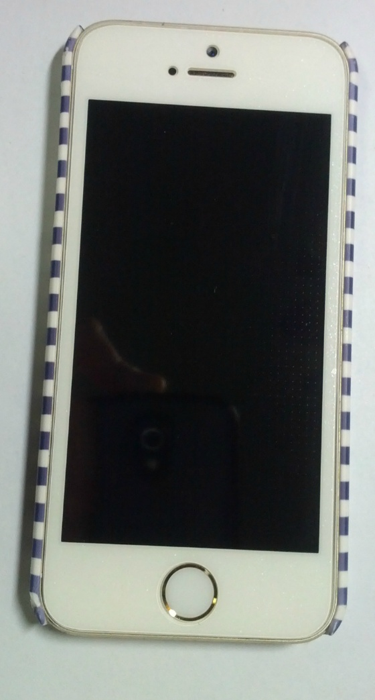
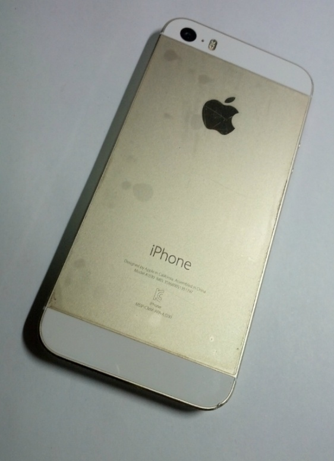
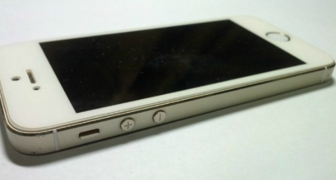
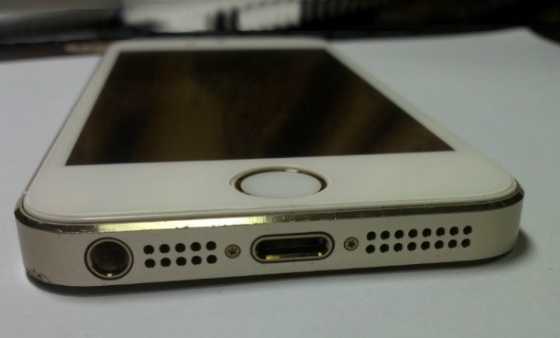
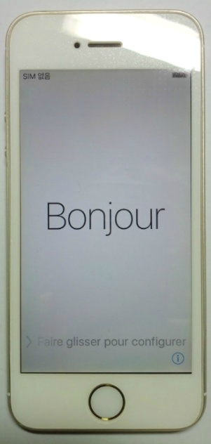

아이폰 5s 골드 32gb를 중고로 샀습니다~

아주 오래전에 받은 애드센스와 저번주에 삼촌들께 받은 용돈 +a

아이폰 5와 5s중에서 고민했었는데 지문인식이 제일 끌려서 5s로 결정했습니다.

오늘 6시 45분쯤에 당산역에서 판매자분과 직거래로 만나 거래했습니다.

판매자 분께서 쓰던 케이스 몇 개 주셨는데 한번 끼우고나니 다시 빼기가 귀찮더라고요 ㅋㅋ

전엔 5s살 계획이 없었는데 어쩌다보니 집에 아이폰 5용 필름(하얀 테두리가 있는 필름인데 이름을 모르겠네요..)이랑

아이폰 5(5s호환) 케이스도 하나 있네요 ㅋㅋ

기존 필름 떼버리고 새걸로 바로 붙혔습니다.

뒷면은 사진상으론 깨끗하지 않지만 저 필름 벗기면 깨끗합니다 ㅎㅎ

필름 안떼고 사용하셨다고 하시더라고요

저도 나중에 없앨 생각입니다.

아래 사진들은 옆면이랑 아랫면 한번 찍어본 사진입니다.

테두리에 찍힘이 하나 있지만 케이스 끼니 가려져서 안보이네요 ㅋㅋ

제가 원했던 아이폰 거래 조건은

- 무조건 직거래일 것 + 물건 확인후 바로 계좌 이체

- 만나는 위치는 버스 + 지하철으로 1~2시간일 것 (서울 지역과 그 주변이 포함됩니다.)

- 골드 색상 + 32GB 아이폰 (16GB는 친구들이 절대 사지 말라고 하더라고요.)

- 박스 유무는 상관 없으나 충전기는 필수, 이어팟은 있으면 더 좋다.

- 녹테가 없는 아이폰

- 30만원 이내의 가격

중고 거래치고 까다롭게 기준을 잡아서 중고 나라에서 찾는 것도 어렵더라고요..

정말 운좋게 저 조건이 99% 맞는 중고 거래글을 찾았습니다 ㅋㅋ

1. 직거래 + 계좌 이체 흔쾌히 허락해 주셨습니다.

2. 집 앞 정류장에서 흔하게 보이는 버스를 타면 약속 장소인 역까지 한번에 갈 수 있다.

3. 아이폰 5S 골드 32GB

4. 박스 + 설명서 + 사과 스티커 + 충전기 + 라이트닝 케이블 + 이어팟 + 사용하시던 여분의 케이스 2개 + 안쓰시다고 주신 iRing

5. 화면 켜서 옆쪽으로 테두리 보았을 때 인터넷에서 말하는 녹색 테두리 현상은 없는 것으로 보이지만 자세히는 아래 마지막 사진을 참고해주세요

6. 정확히 30만원

한가지 아쉬운 점이 있다면.. 매우 아쉬운데요

화면의 테두리가 완전 하얀색이 아니라 약간 바랜 느낌?

유심이 없어 초기 화면에서 진행하지 못해 하얀 화면만 봐서 심하게 거슬릴지는 모르겠습니다만

하얀 배경에서는 무척 신경쓰입니다.

다행히 첫 중고 거래(중고나라 첫 이용) + 첫 직거래에서 사기당하진 않았습니다 ㅋㅋ

이제 내일 대리점 가서 유심 사고 작동해보고 싶네요 ㅎ
