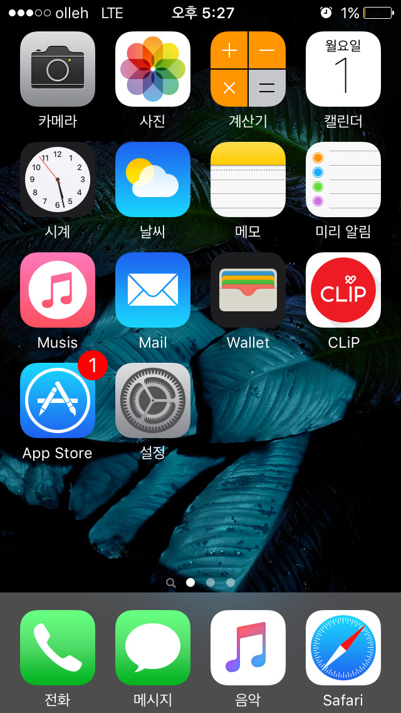
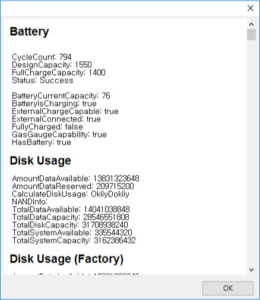

​아이폰 5s로 바꾼지 약 한달 정도 된 것 같습니다.  
안드로이드 폰만 쓰다가 IOS로 넘어와서 처음엔 적응이 잘 안되더라고요.  
예를 들면 아이튠즈라던가......  
  
2주 정도 지나서 완전히 적응하고 나니 확실히 편합니다, 아이폰이.  
  
​

5s부터 적용된 Touch ID 설정하고 나서 비밀번호나 핀번호를 입력할 때는 아이폰을 재부팅하고 나서말곤 없었습니다.  
  
처음에 이게 지문인식이 잘 안되더라고요.  
홈버튼 표면에 지문도 잘 묻고..  
그래서 어떻게 하면 인식을 잘 할 수 있게 만들까? 생각하다가  
스카치 테이프를 홈버튼에 붙혔습니다. ㅋㅋ  
  
원형 금속 테두리 안에 테이프를 정교하게 붙히니 그 다음부턴 지문 인식이 바로 바로 되더라고요. 신기하게.  
  
좀 된 것 같은데 아직도 무리없이 잘 됩니다.  
테이프 제거할 때가 조금 힘들긴 한데 아직까진 멀쩡하더라고요.  
자세히 들여다보지 않으면 자국도 없고. (아이폰을 본 그 누구도 알아채지 못했습니다)  
  
​

문제가 있다면 중고제품이라 그런지 배터리 용량이 줄어든 것 같은 느낌이 들더라고요.  
  
​

한번 확인해 봤는데 사이클이 생각보다 많아서 언제 배터리 교체를 하던가 아니면 중고로 다시 팔고 딴 아이폰 사야 겠습니다.
