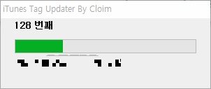

> 아이튠즈 최신 버전 업데이트 이후 프로그램이 작동하지 않습니다.
>
> 다른 방법을 아무리 찾아도 아이튠즈 태그를 업데이트 하는 정확한 방법은 이제 없습니다.

안녕하세요.

아이폰에 음악을 넣으려고 아이튠즈를 쓰고 있었습니다.

일단 아이폰에 음악을 넣은 뒤에 태그를 한번에 정리하려고 생각을 해서 보관함에 음악을 집어넣고 일단 동기화 했습니다.

그다음 mp3tag를 이용해서 태그를 수정하고 자막을 넣고.. 한시간 정도 작업한뒤 다시 아이튠즈 동기화를 했습니다.

그런데 아이폰에서 음악을 확인해 봐도 수정한 태그가 반영되지 않더라고요.

물론 보관함의 음악을 삭제하고 다시 추가하면 수정한 태그가 나타나긴 했습니다만 그럼 별점이나 플레이 횟수같은 정보가 날라가고...

한 음악 mp3파일의 태그를 수정한 뒤 반영하려면 보관함 속의 많은 음악 목록에서 수정한 음악을 지우고 다시 넣어야 하고.. 불편하더라고요.

그래서 구글에 관련 키워드로 검색을 해보니, 저와 같은 문제를 해결하신 분이 계셨습니다.

관련 글은 <http://cloim.tistory.com/8> 입니다.

위에 있는 링크로 진입하신다음 프로그램 다운받으셔서 실행하면 아이튠즈의 태그가 업데이트 됩니다.

원 게시글을 보면

> Apple에서 Windows를 위해 COM SDK를 공개해놓고 있었던 것.
>
> 부랴부랴 Autolt으로 라이브러리 중에 음악에 한해서 정보(태그)를 업데이트 하는 스크립트를 짰다.

이라며 프로그램의 원리가 설명되어 있습니다.

일단 아이튠즈를 끕니다.

프로그램 다운받고 **마우스 오른쪽 클릭으로 관리자 권한**으로 실행해보면 실행이 안 됩니다.

.jpg)

저 창에서 추가정보를 눌러주면 실행 버튼이 나타납니다.

.jpg)

실행 버튼을 누른다음 몇 초 기다려보면 아이튠즈가 실행됩니다.

그다음 아래 창이 뜨면서 태그가 업데이트 됩니다.

ps. 트랙백좀 넣으려 하는데 왜 자꾸 실패했다고 나오는지 모르겠네요. ㄷ;
