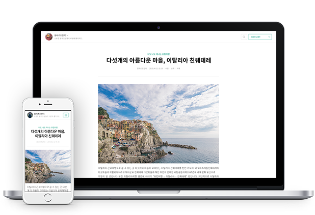
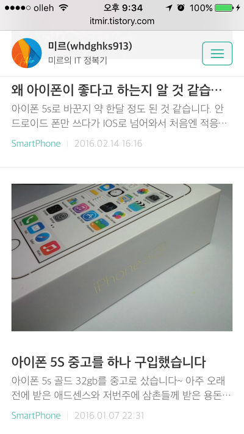

### 서론

안녕하세요.

어제까지 쓰던 Fastboot 반응형 스킨에서 벗어나 오늘 블로그의 스킨을 변경하였습니다.

이번에 바꾼 스킨은 티스토리에서 자체적으로 만든 반응형 스킨인 #1 입니다.

뭐하라님의 Material Mark 스킨과 고민하다 좀 더 심플하고, 군더더기가 없는 #1으로 적용하였습니다.

Material 스킨도 훌륭한 스킨이므로 혹시 관심있는 분께서는 아래 링크 방문해 주세요.

<http://nubiz.tistory.com/>

### 티스토리 #1 스킨

스킨을 적용하고 이전 스킨에서 변경한 부분을 다시 가져와야 하고

소스 코드 보기 플러그인 (참고 : [[Tistory] - 티스토리 좋은 소스코드 표현방법](/archive/itmir/2013/324)) 까지 적용하는데 시간이 걸렸습니다.

이 스킨은 다른 점은 마음에 드는데 몇가지 문제점이 있다면

첫번째는 블로그 설명이 보이지 않습니다.

사이드바에 블로그 설명 부분이 아에 없는걸로 보아 스킨 만드실때 제거한 기능으로 보입니다.

블로그 설명이 없는 게 마음에 걸려서 Material 스킨으로 하려고 했지만 그냥 블로그 설명을 포기하니 편하더라고요..

두번째는 세세한 여백이 너무 많다는 점 입니다.

게시글 화면에서 본문 제목 부분의 여백이 크기 때문에 눈에 거슬리더라고요

이 부분은 css 건들면서 수정을 해보았습니다.

그 다음은 오류 제보 기능도 포기했습니다.

사실 사용하시는 분들이 없으시더라고요;

네번째는 덧글의 이미지가 변하지 않는다는 점입니다.

비 로그인 방문자가 덧글을 작성하면 일반 아이콘이, 블로그 지기나 다른 티스토리 사용자가 덧글을 작성하면 아이콘이 나타나야 하는데

이 스킨은 아이콘은 옆에 조그맣게 나타나고 나머진 일정한 아이콘이더라고요

이 문제는 아래 블로그에서 해결하였습니다.

<http://hg4004.tistory.com/126>

스트레스 받았는데 바로 해결하게 되어 기쁘네요 ㅎㅎ

마지막은 메인 화면입니다.

티스토리에서 "제목만"으로 설정해도 안됩니다.

<http://hg4004.tistory.com/125> 글에 따르면

> 내용이 뜨는 것이 싫어서 관리에서 화면출력 부분을 수정해도 딱히 제목만 출력되지 않고, 오히려 스킨이 틀어진다든지 하는 오류가 생깁니다.
>
> 스킨 자체에서 내용이 표시되도록 설정되어 있는 스킨이기때문에 그에 맞게 html/css에서 수정을 해줘야만 하죠.

그래서 차라리 게시글 목록에 썸네일을 넣어 버리는건 어떻까 생각해서 사진을 넣어 봤습니다.

PC와 같은 대 화면에서는 사진 크기는 가로 400px (세로는 비율에 맞게 축소됨)으로, 아이폰과 같은 소 화면에서는 화면 크기에 맞게 썸네일을 표시하도록 만들어 봤습니다.

PC에도 모바일에도 썸네일이 잘 뜨는 것을 확인하였습니다.

이렇게 작업하고 나니 시간이 9시 30분 정도 되더라고요. 시간 꽤 많이 잡아먹었습니다.

### 티스토리의 쓸만한 플러그인들

스킨을 바꾸게 되면 애널리틱스 코드들, 애드센스 코드등 추가했던 html 소스를 다시 넣어줘야 하는데요

티스토리에 네이버, 구글 애널리틱스 플러그인이 생겨 앞으로는 스킨 변경시 수정해야 하는 부분이 줄어들게 되었습니다.

방문자 분들께서도 스킨을 바꾸실 때 편의를 위해 애드센스, 애널리틱스는 티스토리가 제공하는 플러그인을 사용해보세요.

저는 사이드바의 사용자 모듈에 구글 번역기 소스까지 넣어서 사용중입니다.

### 결론

티스토리 스킨 바꾸는게 예전에는 애드센스 소스 넣기와 같은 작업 때문에 귀찮았다면

요즘은 플러그인이 만들어져서 스킨을 적용하고, 세세한 부분만 손봐주면 되니까 확실히 편해졌습니다.

이 스킨의 몇가지 문제점도 보이긴 하지만 그래도 지금부터는 이 스킨 써야겠군요 ㅋㅋ