### iOS 9.3 Public Beta 공개

iOS 9.3 공개 베타버전이 나왔다고 합니다.

원래는 정식 버전까지 기다리려고 했지만 안드로이드에서는 최신 OS를 바로바로 쓸 수 없었던 아픈(?) 기억이 있어서..

올려봤습니다.

### Install iOS 9.3 Beta Profile

바로 iOS 9.3을 설치할 수 있는 건 아니더라고요.

프로파일 설치를 해야 가능합니다.

Free My Apps를 아이폰에서 해보신 분께서는 한번쯤 보셨을겁니다.

<https://beta.apple.com/sp/ko/betaprogram/>

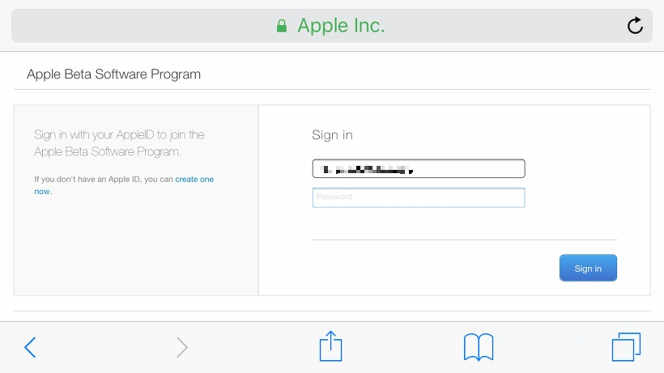

Apple Beta Software Program에 참여하려면 애플 아이디를 입력하라고 합니다.

로그인해주세요.

그러면 잘 찾아보시면 프로파일을 설치해야 한다는 내용이 있습니다.

프로파일 설치해봅시다.

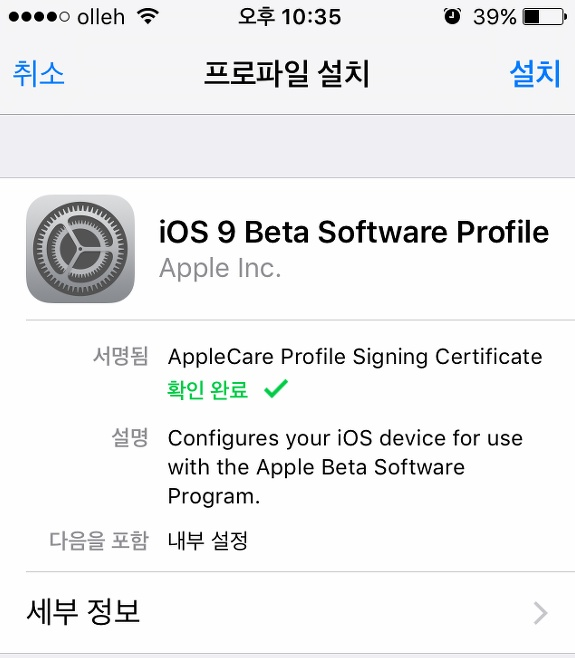

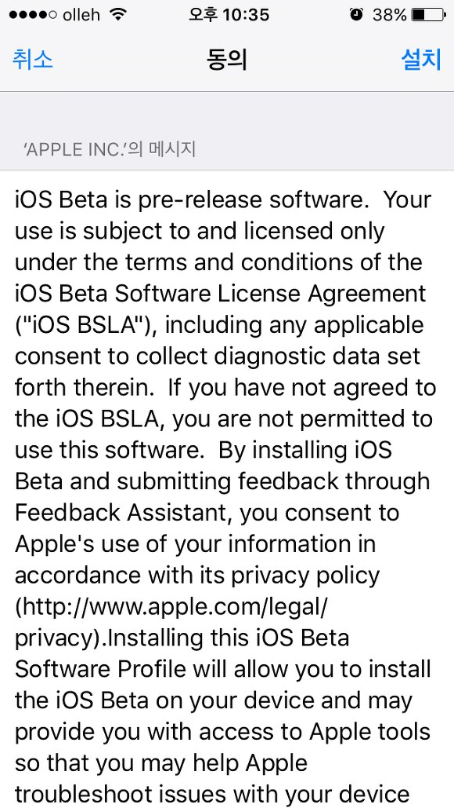

아이폰 암호를 입력하신후 프로파일을 설치하시면 재시동을 해야 한다고 알려줍니다.

재부팅을 합니다.

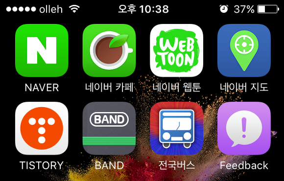

그럼 위 스샷처럼 Feedback이라는게 생기게 되는데요

저걸로 오류 제보를 하나봅니다.

iOS 9.3을 올리기 전에 백업을 필수로 해야 합니다.

저는 아이튠즈의 내 컴퓨터로 백업에 체크한다음 백업해주고, 다시 iCloud로 백업을 했습니다.

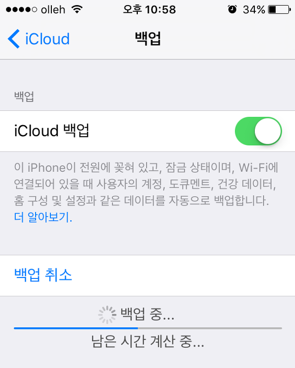

이제 설정, 일반, 소프트웨어 업데이트에 들어가시면 iOS 9.3 Public Beta가 나타납니다.

용량은 1.4GB입니다.

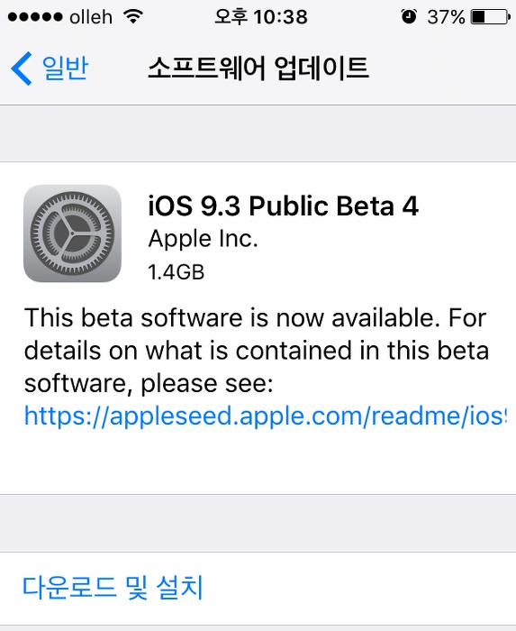

다운받고 약관에 동의하면 재부팅되며 설치됩니다.

배터리 50%이상, 또는 전원에 연결되어 있어야 설치가 가능합니다.

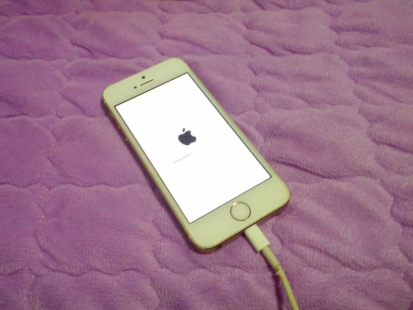

설치중...

### iOS 9.3 설치 완료

설치가 완료되면 자동으로 아이폰이 켜지고, iOS 9.3 설치가 완료됩니다.

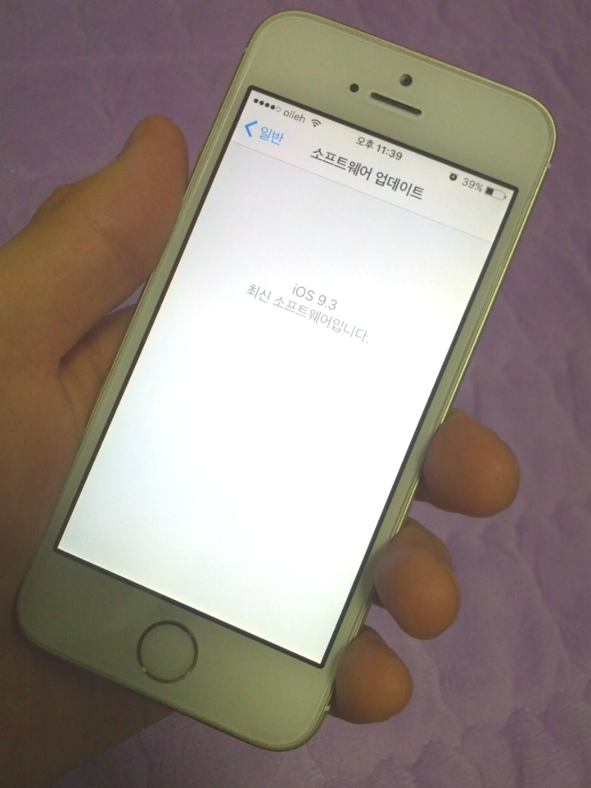

새로운 기능이라고 하는 Night Shift와 메모의 Touch Id를 스샷 찍어봤습니다.

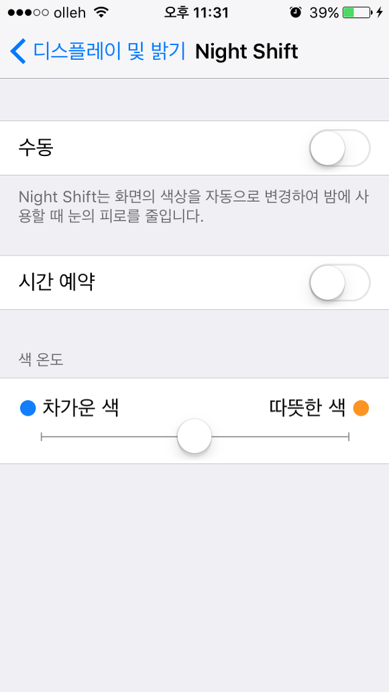

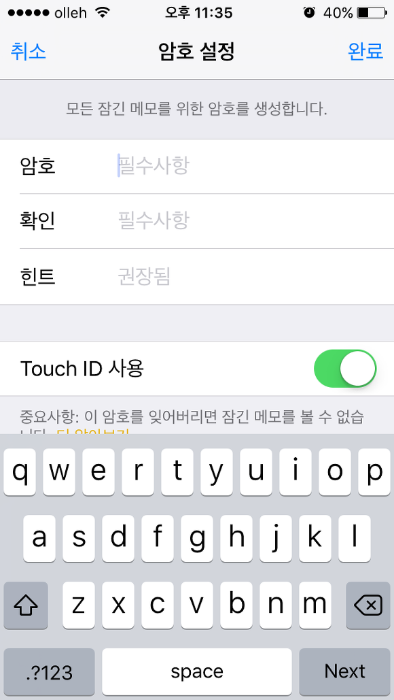

이 두개 기능 말고는 9.3에서 달라진게 뭔지 기억이 안나네요.;;

아래 링크는 애플 iOS 9.3 프리뷰 사이트입니다.

사이트 주소로 볼 때, 재활용(?)하나보군요 ㅋㅋ

미래에는 아래 링크는 9.3이 아닌 다른 버전의 프리뷰가 나올 가능성이 매우 클 것 같습니다.

<http://www.apple.com/kr/ios/preview/>

[http://www.apple.com/](http://www.apple.com/ios/preview/)[ios/preview/](http://www.apple.com/ios/preview/)

참고로 아래 영문버전 사이트로 들어가시면 한국에서 지원되지 않는 기능(News, CarPlay 등)의 새로운 내용도 확인이 가능합니다.

이렇게 보면 아이폰이 편하긴 하네요 ㅋㅋ

최신 버전 iOS를 (베타버전이긴 하지만) 바로 적용해볼 수 있다는 게 매우 좋습니다.

### null app이 사라짐

언제부턴가 null 앱이 생겼습니다.

무슨 앱을 깔다 null 앱이 생긴건지 몰라서 그냥 뒀는데요.

iOS 9.3을 올리면서 확인해보니 사라졌습니다.

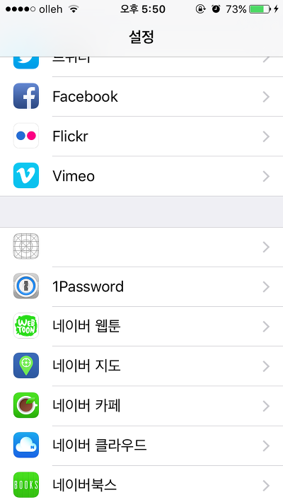

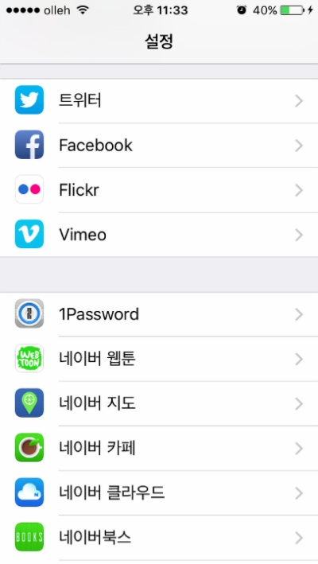

왜 사라졌는지 자세한 이유는 모르겠지만 iOS 설치중에 찌꺼기가 사라진 듯 합니다.

### + 2016-02-27 pm 10:23

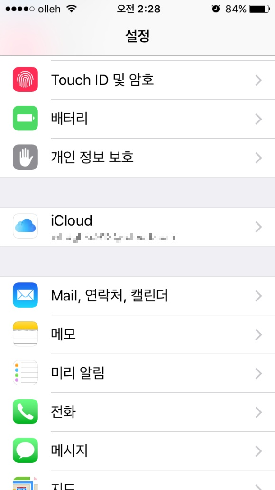

앱스토어 설정이 사라졌습니다..;

그리고 오늘 오후 1시쯤에 갑자기 서버 설정이 어쩌구 하면서 메일앱이 터지네요 ㅋㅋ;

다시 9.2.1으로 내려왔습니다.
