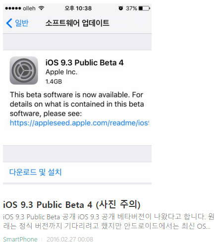
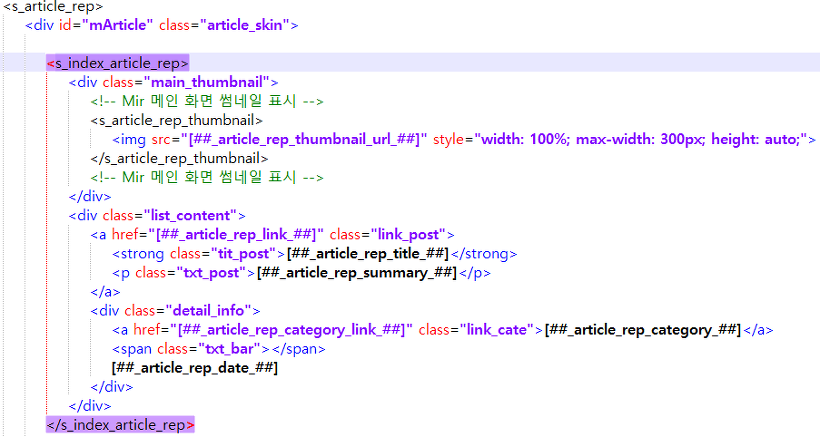

### 현재 블로그에 적용된 #1 스킨에 게시글 이미지가 표시된 모습

아래 스크린샷을 보시면 [제 블로그의 메인화면](http://itmir.tistory.com)에서 게시글 썸네일이 표시되는 모습을 볼 수 있습니다.

원래 #1 스킨은 제목+내용만 표시되는데요.

티스토리 블로그 관리자 페이지에서 제목만으로 설정해도 반영이 안되는 듯 합니다.

참고 : [[Note] - 블로그 스킨을 티스토리 #1로 변경하였습니다.](/archive/itmir/2016/609)



그래서 저는 썸네일을 가져오는 티스토리 치환자를 찾아 블로그에 적용하였고, 그냥 적용하면 가로, 세로가 원본 크기대로 나와서 그 부분도 수정해보았습니다.

어떻게 수정하였는지 알려드리겠습니다.

### html 찾기 / 수정

먼저 <s_index_article_rep> 태그를 찾아주세요.

이 태그는 #1 스킨에서 3개 존재합니다.

찾기 쉽게 유일한 것을 알려드리고 싶었지만 없는 것 같더라고요;

그래서 스샷도 준비했습니다.



```html
<s_article_rep>

    <div id="mArticle" class="article_skin">

        <s_index_article_rep>

            <!-- 이 부분 입니다. -->

        </s_index_article_rep>

...

이하 생략
```

썸네일을 추가하기 위한 코드는 아래와 같으며, 순서대로 위가 html, 아래는 css 코드입니다.

```html
<div class="main_thumbnail">

    <!-- 메인 화면 썸네일 표시 -->

<s_article_rep_thumbnail>

   

</s_article_rep_thumbnail>

<!-- 메인 화면 썸네일 표시 -->

</div>
```

```css
/* 메인화면 썸네일 표시 */

.main_thumbnail {padding:21px 15px 0}

/* 메인화면 썸네일 표시 */
```

css는 맨 아래쯤 넣어주시면 되고, html은 위 스샷처럼 위치 잡아주시면 됩니다.

### 최대 너비(가로) 크기 수정

위의 html 소스에서 `` 태그를 보시면

```html

```

이렇게 style값을 정해두었습니다.

max-width의 300px 부분이 최대 가로 크기입니다.

이걸 원하시는 크기로 설정하시면 됩니다.

height는 auto로 설정되어 있어 가로 크기가 줄어들면 같은 비율로 줄어들어 표시됩니다.

### 이미지에 링크걸기

이미지에 하이퍼링크를 걸어봅시다.

```html
<a href="[##_article_rep_link_##]" class="link_post"></a>
```

기존 ``태그를 `<a>`태그로 감싸면 됩니다.