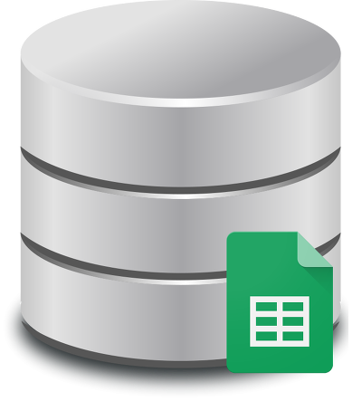
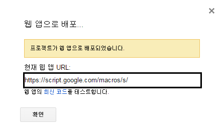
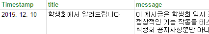

안녕하세요.

저번 편에서 구글 스프레드 시트를 데이터베이스로 이용하는 방법의 첫번째로 스크립트를 작성하였습니다.

스크립트를 작성한 이유는 앱에서 정보를 입력한 뒤 구글 서버로 보내주면 마지막 줄에 정보를 추가해주기위해서 입니다.

### 안내

참고 java파일 : .activity.bap.star.BapStarActivity.java, class HttpTask

선행된 작업 : [[Development/App] - 구글 스프레드 시트를 데이터베이스로 사용하기 - 스크립트편](/archive/itmir/2015/598)

전 강좌의 작업을 모두 완료하신다음 얻어지는 url 경로를 저장하세요.



위 스샷의 검은 박스 부분의 URL이 필요합니다.

### 앱에서 HTTP POST를 보내는 소스

바로 결론부터 말씀드리면 http post를 보내는 소스는 BapStarActivity.java파일의 class HttpTask의 doInBackground 메소드안에 들어있는 코드들 입니다.

```java
HttpPost postRequest = new HttpPost("URL");

//전달할 값들
Vector<NameValuePair> nameValue = new Vector<>();
nameValue.add(new BasicNameValuePair("sheet_name", "시트1"));
nameValue.add(new BasicNameValuePair("type", params[0]));
nameValue.add(new BasicNameValuePair("rate", params[1]));
nameValue.add(new BasicNameValuePair("memo", params[2]));

//웹 접속 - UTF-8으로
HttpEntity Entity = new UrlEncodedFormEntity(nameValue, "UTF-8");
postRequest.setEntity(Entity);

HttpClient mClient = new DefaultHttpClient();
mClient.execute(postRequest);
```

위 코드가 http post를 전송해 줍니다.

물론 당연히 인터넷 권한이 필요합니다.

1번째 줄의 URL을 전 글에서 얻으신 url으로 바꿔주시면 되고, 값을 넣어주는 코드는 아래와 같습니다.

nameValue.add(new BasicNameValuePair("NAME", VALUE));

NAME 부분은 전 강좌에서 말씀드렸던 것 처럼 시트의 맨 첫번째 라인을 말합니다.

VALUE 부분은 입력될 값들 입니다.

예를 들어 보충 설명하겠습니다.



이렇게 시트를 작성하셨고,

Vector<NameValuePair> nameValue = new Vector<>();

nameValue.add(new BasicNameValuePair("Timestamp", "2016-03-13"));

nameValue.add(new BasicNameValuePair("title", "안녕하세요!"));

nameValue.add(new BasicNameValuePair("message", "강좌가 늦어서 죄송합니다!"));

이렇게 작성하시면

|  |  |  |
| --- | --- | --- |
| Timestamp | title | message |
| 2016-03-13 | 안녕하세요! | 강좌가 늦어서 죄송합니다! |

이렇게 시트에 저장됩니다.

한번 더 박스의 코드를 실행하면 아래 표처럼 저장되겠죠?

|  |  |  |
| --- | --- | --- |
| Timestamp | title | message |
| 2016-03-13 | 안녕하세요! | 강좌가 늦어서 죄송합니다! |
| 2016-03-13 | 안녕하세요! | 강좌가 늦어서 죄송합니다! |

### 주의점

nameValue.add(new BasicNameValuePair("sheet\_name", "시트1"));

시트1과 관련된 내용입니다.

전 강좌를 그대로 따라오셨다면 아래와 같은 문구를 기억하실 수 있으실 겁니다.

> 기본적인 내용은 오류 제보와 차이가 없지만
>
> 위 박스의 코드는 시트 이름을 정의하지 않습니다.
>
> 그대신 한가지 차이점이 있다면 html post의 sheet\_name을 가져옵니다.
>
> 그래서 시트를 많이 만든뒤 각각의 시트에 html post를 따로 넣고 싶다면
>
> sheet\_name만 바꿔서 post를 날려주면 됩니다.

이게 처음에 뭔말인지 궁긍하셨을겁니다.

구글 스프레드 시트의 첫 발생은 뭐하라님께서 알려주신 티스토리 오류 제보였습니다.

[[Tistory] - 티스토리 오류 제보하기 버튼 만들기 - 구글 스프레드 시트 사용](/archive/itmir/2015/550)

이 오류 제보 기능은 시트를 하나만 사용했습니다. (2개 이상의 시트를 쓸 이유가 없죠)

그런데 저는 공지사항과 급식 별점처럼 2개 이상의 시트를 이용해야 하기 때문에 시트이름까지 앱에서 넣어주는 방식을 사용했습니다.

그냥 파일을 두개로 찢으면 안되나? 하실 수도 있는데요.

저는 유지보수를 중요시하기 때문에 한 파일과 한 스크립트로 처리하기 위해 이런 방법을 사용했습니다.

그래서 시트 이름을 넣어줘야 합니다.

Vector<NameValuePair> nameValue = new Vector<>();

nameValue.add(new BasicNameValuePair("sheet\_name", "시트1"));

이런식으로 말이죠.

> var SHEET\_NAME = e.parameter["sheet\_name"];
>
> ...
>
> 그대신 한가지 차이점이 있다면 html post의 sheet\_name을 가져옵니다.
>
> 그래서 시트를 많이 만든뒤 각각의 시트에 html post를 따로 넣고 싶다면
>
> sheet\_name만 바꿔서 post를 날려주면 됩니다.

오류제보와 이 스크립트가 다른점은 스크립트에서 시트 이름이 정의되지 않고 HTTP POST로 넣어줄 시트 이름을 받아온다는 점입니다.

### 앱에서 구현 방법

이제 앱에서 어떻게 구현해야 하는지 알아봅시다.

사람들마다 소스 구조가 다르니까 응용하기 쉽게 뼈대를 알려드리겠습니다.

```java
public void postStar(View v) {
    // 0 : Lunch, 1 : Dinner
    int position = mGiveStarType.getSelectedItemPosition();

    if (BapTool.canPostStar(getApplicationContext(), position)) {
        float rate = mPostRatingBar.getRating();
        (new HttpTask()).execute(String.valueOf(position), String.valueOf(rate), null);
    } else {
        AlertDialog.Builder builder = new AlertDialog.Builder(this, R.style.AppCompatErrorAlertDialogStyle);
        builder.setTitle(R.string.bap_star_once_title);
        builder.setMessage(R.string.bap_star_once_message);
        builder.setPositiveButton(android.R.string.ok, null);
        builder.show();
    }
}
```

위 메소드는 전송! 버튼을 누르면 호출되는 메소드입니다.

3번째 줄에서 가져오는 int값은 Spinner에서 가져오는데요.

첫번째 Spinner는 점심, 두번재는 저녁으로 설정되어 있습니다.

5번째 줄이 존재하는 이유는 하루당 점심, 저녁 한번만 전송할 수 있도록 막아둔 코드입니다.

BapTool.canPostStar(getApplicationContext(), position)

```java
public static boolean canPostStar(Context mContext, int type) {
    Calendar mCalendar = Calendar.getInstance();
    int year = mCalendar.get(Calendar.YEAR);
    int month = mCalendar.get(Calendar.MONTH);
    int day = mCalendar.get(Calendar.DAY_OF_MONTH);

    Preference mPref = new Preference(mContext, "RateStarInfo");
    String lunchKey = "LunchStar_" + year + month + day;
    String dinnerKey = "DinnerStar_" + year + month + day;

    return ((type == 0) && mPref.getBoolean(lunchKey, true)) || ((type == 1) && mPref.getBoolean(dinnerKey, true));
}
```

소스 코드는 위와 같습니다.

다시 postStar(View v)메소드로 돌아와서,

6-7번째 줄에서 AsyncTask를 실행하는 모습입니다.

else 이하는 말 안해도 아실꺼라 믿습니다.

7번째 줄의

(new HttpTask()).execute(String.valueOf(position), String.valueOf(rate), null);

이부분은 position값과 rate값을 String으로 형 변환하여 execute메소드에 넣어주고 있는데요.

AsyncTask를 아신다면 바로 이해가 가능하고, 모르신다고 해도 값을 넣어준다 정도로 이해하시면 됩니다.

자세히 궁금하신 분께서는 AsyncTask의 작동원리를 찾아보시길 바랍니다.

이제 HttpTask class를 분석해봅시다.

```java
private class HttpTask extends AsyncTask<String, Void, Integer> {

    @Override
    protected void onPreExecute() {
        super.onPreExecute();

        mDialog = new ProgressDialog(BapStarActivity.this);
        mDialog.setIndeterminate(true);
        mDialog.setMessage(getString(R.string.post_bap_star_posting));
        mDialog.setCanceledOnTouchOutside(false);
        mDialog.show();
    }

    @Override
    protected Integer doInBackground(String... params) {
        try {
            HttpPost postRequest = new HttpPost("URL");

            //전달할 값들
            Vector<NameValuePair> nameValue = new Vector<>();
            nameValue.add(new BasicNameValuePair("sheet_name", "시트1"));
            nameValue.add(new BasicNameValuePair("type", params[0]));
            nameValue.add(new BasicNameValuePair("rate", params[1]));
            nameValue.add(new BasicNameValuePair("memo", params[2]));

            //웹 접속 - UTF-8으로
            HttpEntity Entity = new UrlEncodedFormEntity(nameValue, "UTF-8");
            postRequest.setEntity(Entity);

            HttpClient mClient = new DefaultHttpClient();
            mClient.execute(postRequest);

            return Integer.parseInt(params[0]);
        } catch (Exception e) {
            e.printStackTrace();
        }

        return -1;
    }

    protected void onPostExecute(Integer value) {
        super.onPostExecute(value);

        if (mDialog != null) {
            mDialog.dismiss();
            mDialog = null;
        }

        if (value == -1) {
            AlertDialog.Builder builder = new AlertDialog.Builder(BapStarActivity.this, R.style.AppCompatErrorAlertDialogStyle);
            builder.setTitle(R.string.post_bap_star_title);
            builder.setMessage(R.string.post_bap_star_failed);
            builder.setPositiveButton(android.R.string.ok, null);
            builder.show();

        } else {
            AlertDialog.Builder builder = new AlertDialog.Builder(BapStarActivity.this, R.style.AppCompatAlertDialogStyle);
            builder.setTitle(R.string.post_bap_star_title);
            builder.setMessage(R.string.post_bap_star_success);
            builder.setPositiveButton(android.R.string.ok, null);
            builder.show();

            BapTool.todayPostStar(getApplicationContext(), value);
        }
    }
}
```

AsyncTask의 구조를 아신다면 쉽지만 모르시는 분들을 위해 설명드리면

onPreExecute(), doInBackground(), onPostExecute()순으로 메소드가 실행됩니다.

onPreExecute() 메소드에서는 전송중 알림을 띄워주는거니 패스, 마지막 onPostExecute() 메소드도 성공 실패 여부에 따라 알림을 띄워주는거니 맨 마지막 코드를 제외하면 전부 아실겁니다.

doInBackground() 메소드도 try-catch로 묶여있는 부분은 전부 위에서 반복된 내용입니다.

그러니 63번째 줄만 설명하겠습니다. (태블릿 배터리가 없어서요)

BapTool.todayPostStar(getApplicationContext(), value);

이 것도 간단합니다.

전송이 완료되면 Preference에 값을 저장하는거죠.

BapTool.canPostStar()와 연동됩니다.

```java
public static void todayPostStar(Context mContext, int type) {
    Calendar mCalendar = Calendar.getInstance();
    int year = mCalendar.get(Calendar.YEAR);
    int month = mCalendar.get(Calendar.MONTH);
    int day = mCalendar.get(Calendar.DAY_OF_MONTH);

    Preference mPref = new Preference(mContext, "RateStarInfo");
    String lunchKey = "LunchStar_" + year + month + day;
    String dinnerKey = "DinnerStar_" + year + month + day;

    if (type == 0) {
        mPref.putBoolean(lunchKey, false);
    } else {
        mPref.putBoolean(dinnerKey, false);
    }
}
```

간단한 원리입니다.

### 끝나며

이렇게 해서 앱에서 구글 스프레드 시트로 데이터를 전송하는 기능을 알아보았습니다.

이 기능은 급식 별점뿐만 아니라 앱의 버그 리포트를 받거나, 문의사항을 받을 때 유용하게 사용 가능합니다.

서버를 만들 필요도 없고, 이메일 주소를 포함하는 것도 아닌 그냥 전송 버튼만 누르면 스프레드 시트에 저장되니까요.

마지막이 될 강좌(=파싱)는 소스가 더럽습니다.

"구글 스프레드 시트를 데이터베이스로 사용하기" 글이 늦게 나온 원인이기도 합니다.

(좀 더 간단하게 시트의 내용을 가져올 수 있는 방법을 찾다가 안나와서 그냥 포기한 케이스)

구글 스프레드 시트를 파싱하기 위해 자체 class를 만들고 (itmir.tistory.com.spreadsheets.GoogleSheetTask) 이를 또 상속받아 (extends GoogleSheetTask) 만든 class가 바로 BapStarActivity.java파일의 class getStarRateDownloadTask 입니다.

간단히 다음 강좌의 요약을 해드리면

첫번째로 구글 스프레드 시트를 파싱해서 데이터 베이스로 저장합니다.

맨 첫번째 라인(Timestamp, title, message같은거)이 Column이 됩니다.

그다음 db에 저장된 내용을 다시 가져오는 부분이 두번째 입니다.

머리가 심하게 아프고 복잡한 내용이므로 SQLite를 좀 알아두시길 추천드립니다.