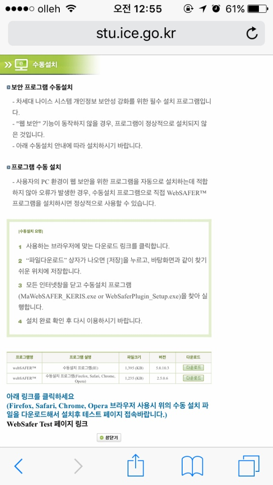
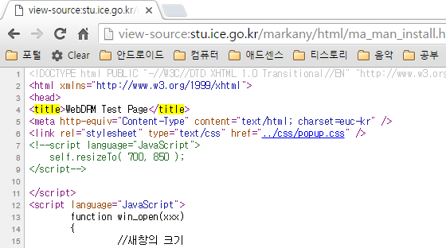

### 2016-03-18 PM 7:27 추가

나이스 홈페이지를 학교 홈페이지로 대체하기 위해 소스를 살펴보던 중 다시 나이스 급식 파싱이 작동되는 것을 확인했습니다.

원인을 찾아보니 나이스 주간 급식의 주소가 하나는 아래에 있는 변경된 주소, 나머지는 이전 급식 파싱에 사용된 주소로 2개를 확인했습니다.

예를 들어, 인천 나이스의 예전 주소는 아래와 같으며,

<http://stu.ice.go.kr/sts_sci_md01_001.do>

나이스 메인페이지에서 식단표를 클릭할경우 리다이렉트되는 링크는 아래입니다.

<http://stu.ice.go.kr/edusys.jsp?page=sts_m42310>

예전 주소가 지금처럼 진입이 가능하면 상관이 없지만, 주소를 삭제하거나, 보안 프로그램을 깔아야 할경우 답이 없어집니다.

일단 지금은 작동되는군요.

안녕하세요.

이번 포스팅 내용은 정말 어이가 없는 내용입니다.

오늘 인공지능 투자 뉴스에 이어 두번째로 황당한 일이네요;

### 처음

[이전글](http://itmir.tistory.com/613)에 "Alpha"님께서 덧글로 나이스 홈페이지가 달려져서 급식 파싱이 정상적으로 이루어지지 않는다는 소식을 알려주셨습니다.

확인해본결과 급식 파싱이 정상적으로 이루어지지 않는 모습을 확인했고, 나이스 홈페이지에 접속하였습니다.

### WebDRM Test Page

식단표 링크를 클릭할 때 보안프로그램을 깔아야 한다고 설명하는 페이지로 리다이렉트되며 그 페이지 링크는 아래와 같습니다.

<http://stu.ice.go.kr/markany/html/ma_man_install.html>

한번 사이트 모습을 확인해보도록 하겠습니다.

.jpg)

다음은 해당 페이지에 존재하는 문구입니다.

> 차세대 나이스 시스템 개인정보 보안성 강화를 위한 필수 설치 프로그램입니다.
>
> "웹 보안" 기능이 동작하지 않을 경우, 프로그램이 정상적으로 설치되지 않은 것입니다.
>
> 아래 수동설치 안내에 따라 설치하시기 바랍니다.

심지어 모바일 환경에서도 저 페이지로 리다이렉트됩니다.

Chrome과 같은 브라우저에서는 따로 프로그램을 설치해야 한다고 뜨며, IE에서는 액티브X로 동작하는 듯 합니다.

(일주일 전에 나이스 홈페이지에서 학생용 공인인증서를 발급받는다고 몇몇 프로그램을 깔았더니 추가 설치 없이 프로그램을 실행하니 창이 열립니다.)

### 도저히 이해할 수 없는 사이트

왜 나이스 홈페이지에 접속하려면 보안 프로그램을 깔아야 하는지 도무지 이해할 수 없습니다.

제가 기피하는 사이트가 공공기관 사이트와 은행 사이트가 있는데, 원래도 나이스 싫어했지만 이 모습을 보고나니 더 싫어졌습니다.

게다가 웃긴건 설치 프로그램 안내 사이트의 타이틀이 WebDRM TestPage라는 점입니다.

Test Page라는 타이틀에서 조금의 희망을 볼 수 있을까요? 아마 안될꺼야..

### 급식 파싱 라이브러리 관련

결론적으로 나이스 홈페이지가 보안 프로그램을 깔아야만 사이트 접근이 가능하다면 파싱이 불가능해집니다.

나이스에서 공공 데이터로 급식 정보를 받아올 수 있는 API를 제공하지 않는 이상 불가능하다고 생각합니다.

저는 프로그램 설치 필요 없는 사이트만 이용하고 싶습니다.
