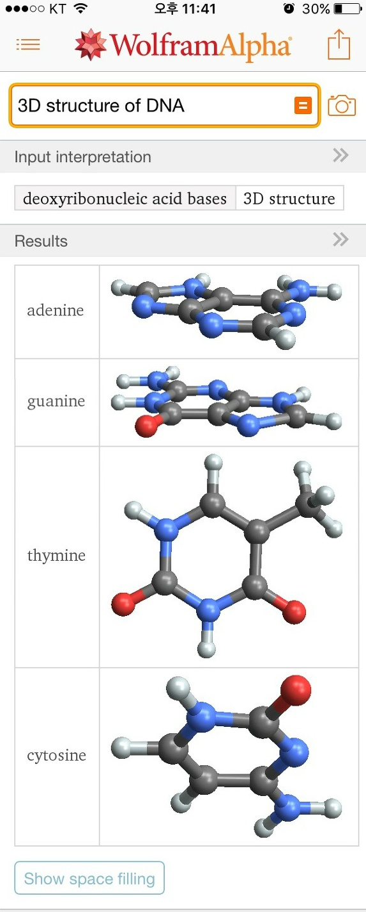
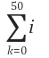
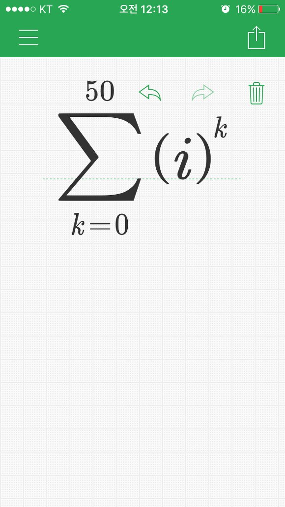
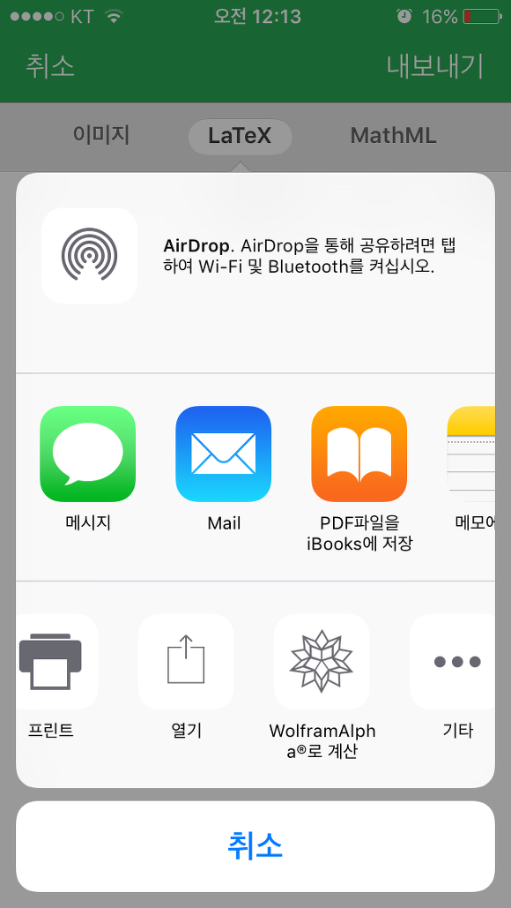
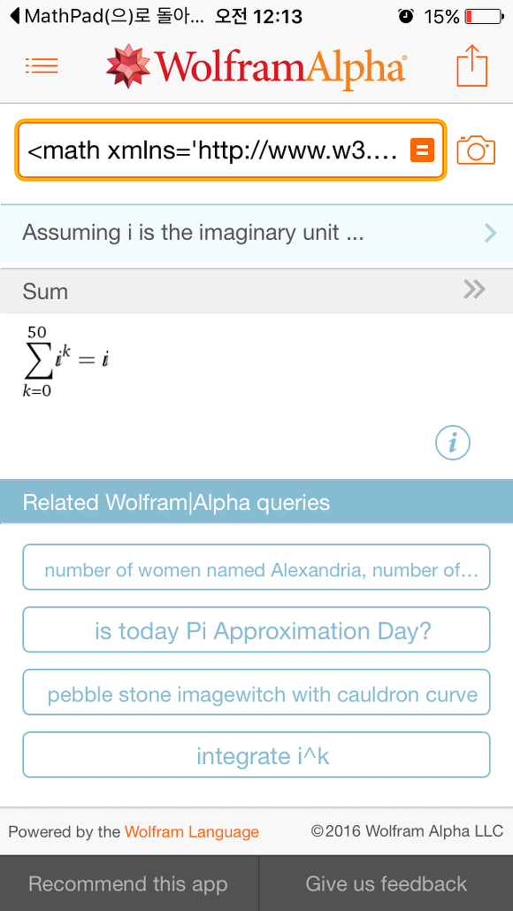

안녕하세요.

정말 오랜만에 블로그에 포스팅하는 것 같습니다.

제가 아이폰으로 바꾸면서 무료로 풀리는 유료앱도 많이 써봤고 유료가 아니더라도 완성도 높은 앱을 자주 보았는데요.

이번 글에선 제 친구와 제가 알아낸 방법인데..

아이폰에서 적분을 할 수 있습니다... !!

(적분뿐만 아니라 수학의 대부분을 할 수 있고요(미분, 편미분, 적분, 극한, 시그마등...), 물리 관련 수식도 있고 기본적인 날씨부터, 생일을 입력하면 그날 일몰과 일출, 낮의 길이, 그날 달의 위상등 진짜 공대생에게 대박인 앱입니다.

참고로 WolframAlpha는 웹사이트에서도 사용할 수 있으며, 아래 스샷의 앱은 유료(3달러)입니다.

웹사이트 이용하시기 귀찮으시거나 Mathpad와 함께 수식 입력을 매우 간단하게 사용하시려면 결제하셔야 합니다.

또한 Mathpad도 앱 자체는 무료지만 WolframAlpha와 연동해서 쓰려면 인앱결제(역시 3달러)가 필요합니다.

저는 전부 결제했습니다 ㅋㅋ

아래 스샷은 WolframAlpha에게 DNA의 구조를 검색해본 스샷입니다.

슈퍼컴퓨터와 연동되어 있어서 인터넷 연결이 꼭 필요하지만 다양한 정보를 얻을 수 있어요.

그러면 Mathpad와 연동해서 쓰는 스샷을 보여드리겠습니다.

아래 수식은 수2에 나오는 1부터 i의 50제곱까지 덧셈을 하는 식입니다.

수식을 입력하셨으면 오른쪽 위에 있는 내보내기 버튼을 누르시면 됩니다.

이미지, LaTeX, MathML으로 내보내기가 가능하며 WolframAlpha로 계산하시려면 위에서 설명한대로 3달러의 인앱 결제가 필요합니다.

계산을 해보겠습니다.

덧셈 결과는 "i" 라고 합니다.

미처 스샷을 찍지는 못했지만 적분, 시그마, 극한과 같은 수식들을 MathPad에 쓴다음 Alpha에게 계산시킬수 있습니다.

수학 뿐만 아니라 물리에서는 일, 뉴턴의 3법칙, 빛의 속력 등을 계산할 수 있고,

달력은 어느 해의 공유일 정보, 과거 날짜의 날씨, 시간 계산, 몇 백년후 대륙의 모습 예상,

음악에서는 스케일, 화음, D키 정보등

지진 타임라인, 세계 지진 정보등..

정말 놀랍습니다!
