저번 포스팅에서 MathPad의 추가기능 활성화하여 Wolfram Alpha를 통해 수식을 계산하는 모습을 살펴보았습니다.

[[Application] - 아이폰앱 Wolfram Alpha와 Mathpad를 이용해서 적분하기](http://itmir.tistory.com/615)

그런데, Wolfram Alpha에는 수식 계산 말고도 더 많은 사용방법이 있습니다.

어떤 검색 결과를 보여줄지 대표적으로 몇 개를 살펴보겠습니다.

### Wolfram Alpha는 사이트에서도 사용이 가능합니다.

기본적으로 울프럼 알파는 홈페이지에서도 사용이 가능합니다.

<https://www.wolframalpha.com/>

그러나 이 포스팅에서는 아이폰에서 유료(약 3달러)로 구매할 수 있는 울프럼 알파 앱을 통해 검색해본 스샷을 준비했습니다.

### Wolfram Alpha는?

인터넷 연결만 된다면 다차연립방정식, 미적분, 극한, 점화식 찾기, 그래프 그리기 등 웬만한 수학을 모두 풀 수 있습니다.

80자리 수의 소인수분해도 된다고 합니다.

MS와 제휴한 뒤 bing에서 울프럼 알파 엔진을 사용할 수 있고, Siri의 수식 계산에도 울프럼 알파의 엔진이 사용된다고 합니다.

### Wolfram Alpha 사용 예

울프럼 알파 앱의 다양한 예시를 가지고 검색해보았습니다.

1. 수학

파이부터 2파이까지 |sinx|그래프를 적분해보았습니다.

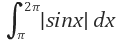

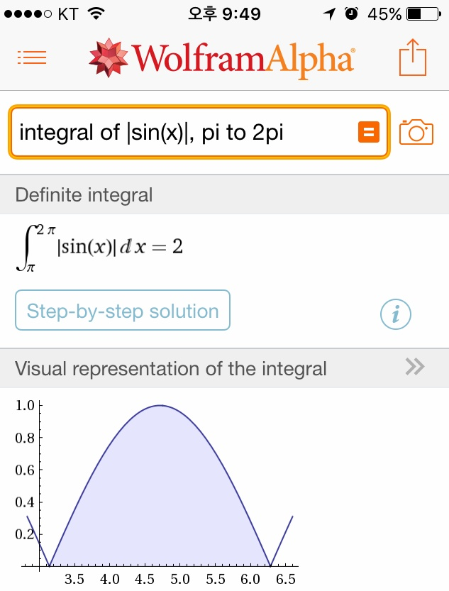

그래프까지 보여주며 적분하는 모습을 볼 수 있습니다.

두번째로는 그래프를 보여주는 스샷입니다.

수식은 sin(t) + cos((루트3)t) 입니다.

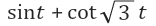

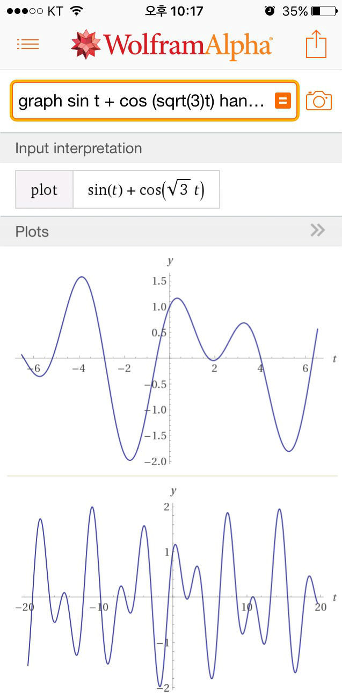

그래프로 보여줍니다.

2. 영어 단어 빈칸 추론(?)

영어 단어의 빈칸을 추론해줍니다.

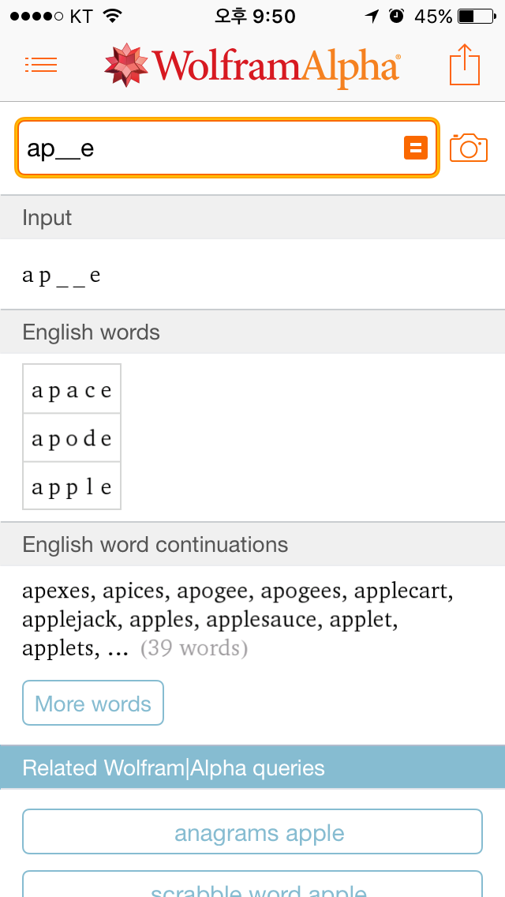

3. 단위 계산

단위가 다른 두개의 길이를 더할 수 있습니다.

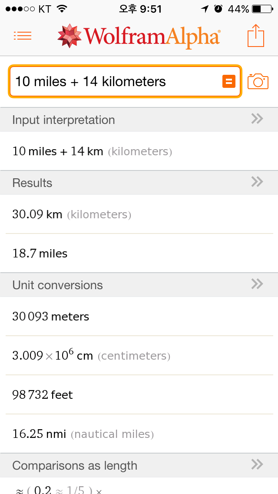

4. 세계 시간 확인

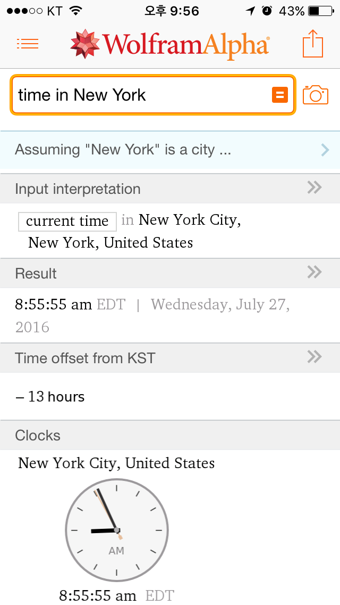

5. 특정 해의 어느 분야 노벨상 수상자 목록

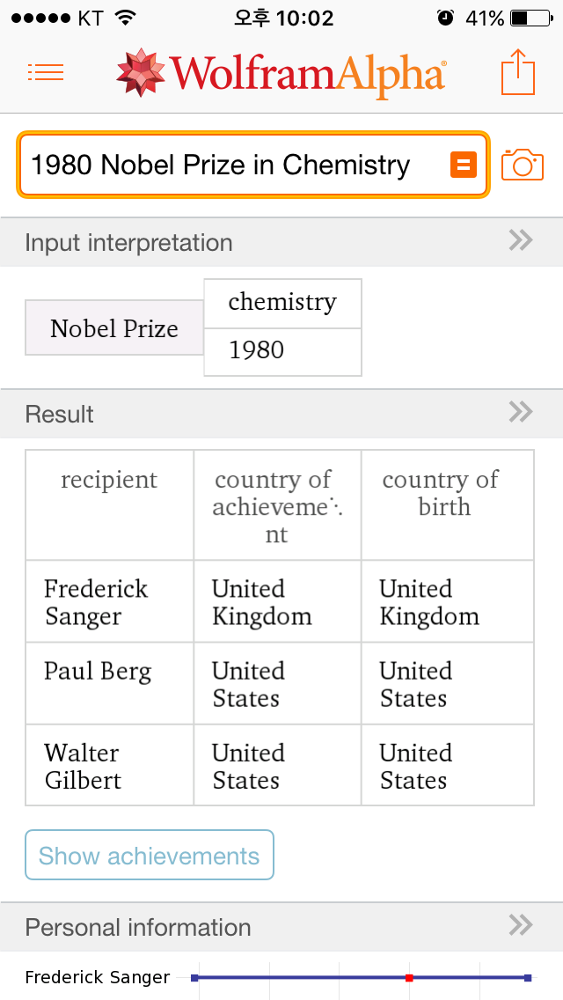

6. 특정 날짜의 행성(또는 항성) 정보

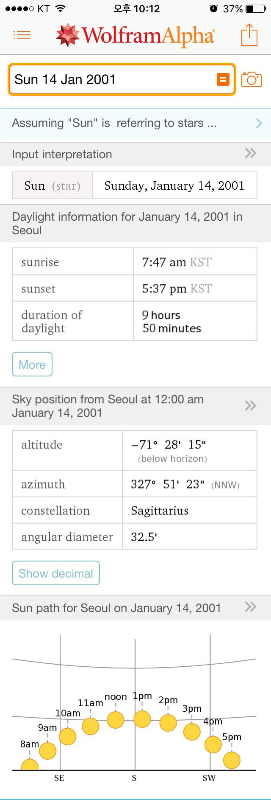

 7. 세계 지진 정보

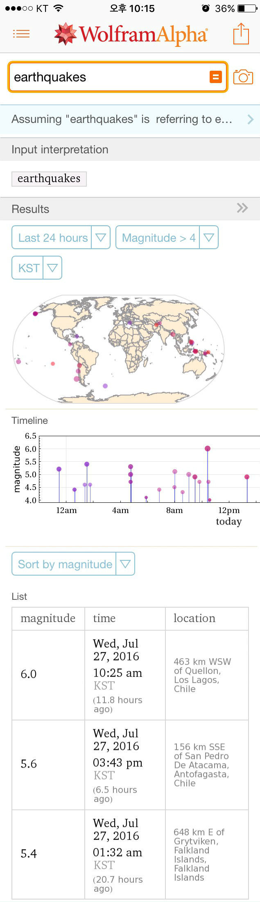

이외 어제 올린 게시글의 DNA를 이루는 염기의 분자 구조부터 다양한 정보를 검색 할 수 있습니다.

### 이 외에도 많은 예시가 있어요

<http://www.wolframalpha.com/examples/>

위 사이트에 접속하시면 Wolfram Alpha의 다양한 예시가 있습니다.

제가 영어를 공부해야 하는 이유가 하나 더 늘었군요.

### 구매 인증

아이튠즈의 구입내역 스샷입니다.

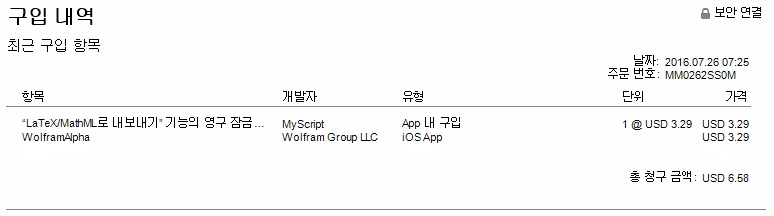

참고

Wolfram Alpha 나무위키 : [https://namu.wiki/w/Wolfram](https://namu.wiki/w/Wolfram%20Alpha)[Alpha](https://namu.wiki/w/Wolfram Alpha)
