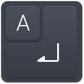
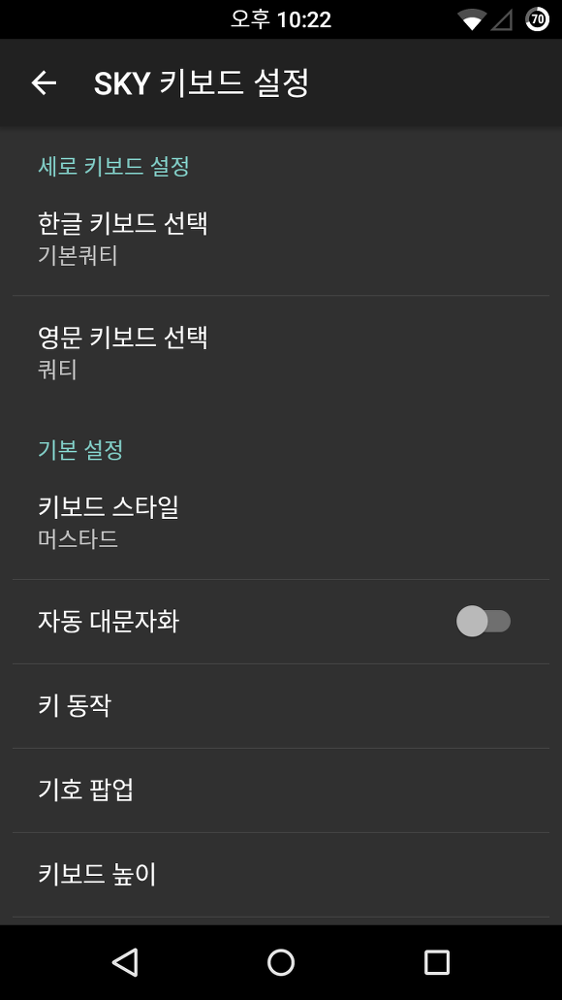
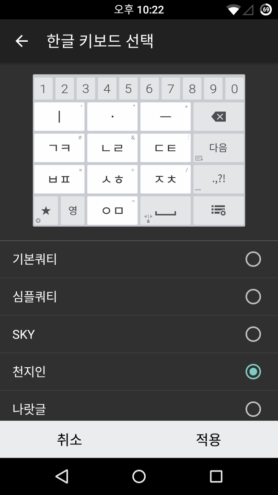
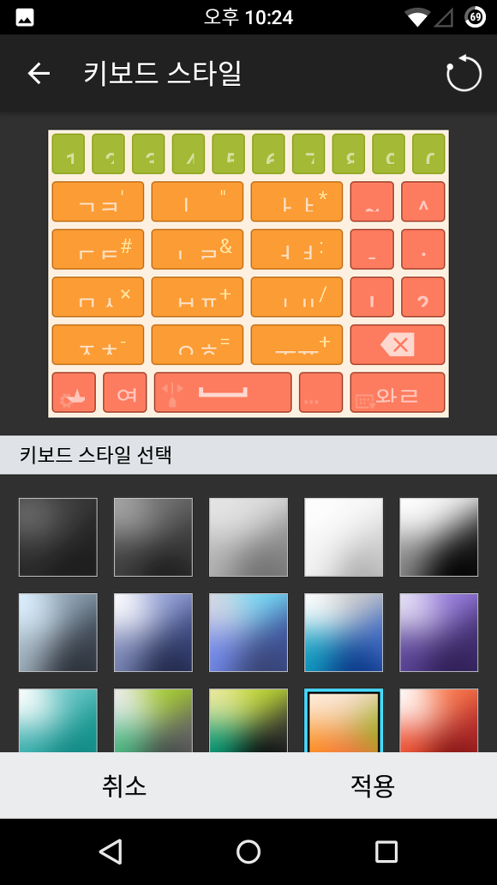
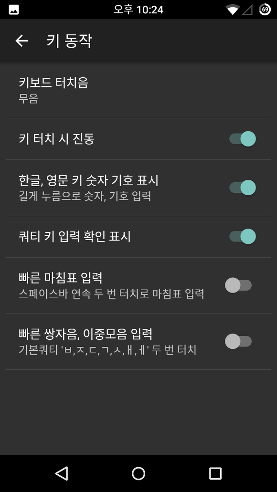
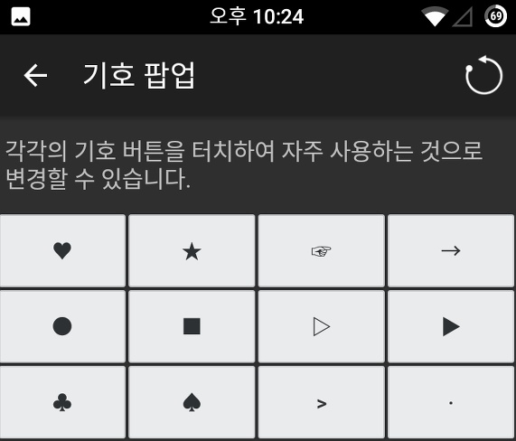
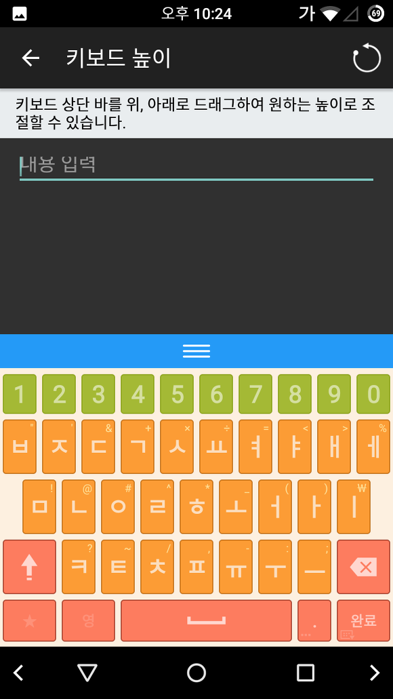
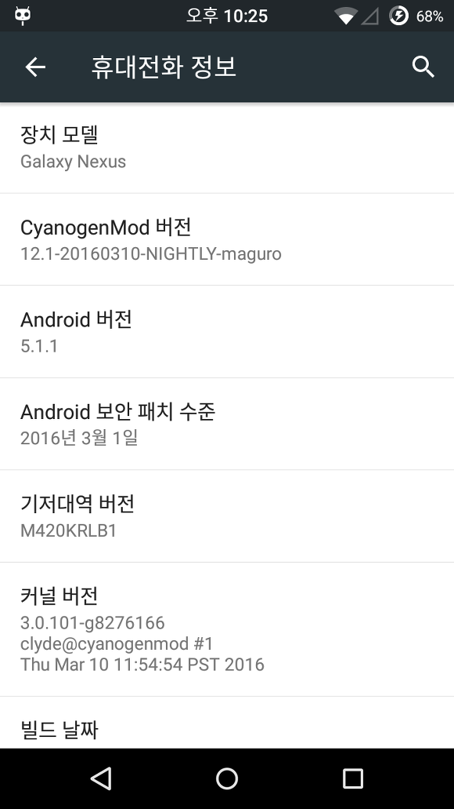
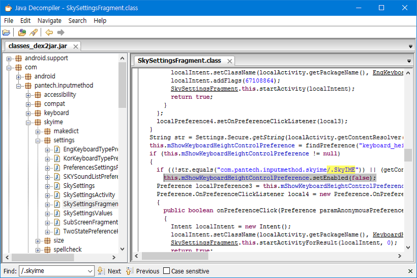
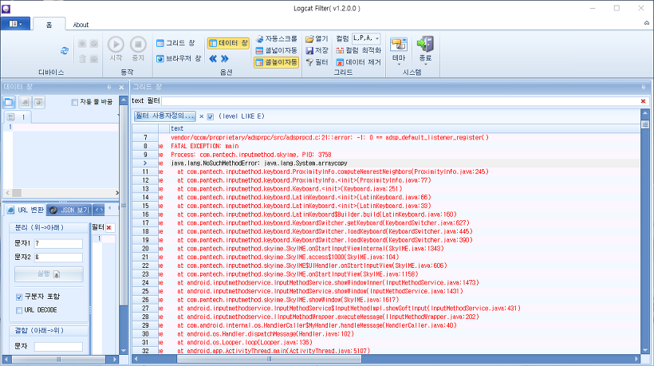

안녕하세요.

베가 시크릿 업 키보드부터 베가 아이언2 키보드 포스팅에 이어 아임백 키보드도 설치해보았습니다.

개인적인 평은 베가 아이언2 키보드때 너무 큰 충격(?)을 받아서인지 큰 감흥은 없더라고요.

기능면에서나 디자인면에서나 큰 발전은 없다는 느낌이 들었습니다.

그러므로 만약 이 앱이 작동하지 않으신다면 아래 링크로 들어가셔서 베가 아이언2 키보드 등을 설치해주세요.

[[Application] - 20140522 - 베가 아이언2 (Vega Iron2) 키보드 (VEGAIME.apk)](/archive/itmir/2014/499)

[[Application] - [APK] 베가 아이언2 (Vega Iron2) 키보드 (VEGAIME.apk)](/archive/itmir/2014/498)

[[Application] - [KitKat] Vega Secret UP (베가 시크릿 업) 키보드 킷캣 업데이트](/archive/itmir/2014/493)

[[Application] - [APP] Vega Secret UP (베가 시크릿 업) 키보드](/archive/itmir/2014/425)

참고로 제가 가진 안드로이드 기기중 가장 최신 OS버전이 갤넥의 CM12.1, Android 5.1.1입니다.

키보드 설정 화면의 디자인은 기기마다 다를 수 있습니다.

그러고보니 팬택의 키보드로 포스팅하는건 2년만이네요. ㅋㅋ

키보드 설정 메인화면입니다.

런처에 키보드 설정으로 바로 진입 가능한 바로가기를 생성해두었습니다.

베가 아이언2 키보드의 종류와 차이 없습니다.

이 부분도 베가 아이언2 키보드와 마찬가지로 같은 키보드 테마를 가지고 있으며

달라진 점이 있다면 키보드 내부적으로 코드의 변화가 조금 생겨 com.pantech.res.apk를 참고합니다.

따라서 이 com.pantech.res.apk를 설치하지 않을 경우 패키지를 찾을 수 없다며 강제종료가 발생합니다.

키 동작도 별다른게 없습니다.

위 스샷의 키보드 소리와 진동은 전 기기의 키보드와 마찬가지로 동작하지 않습니다.

그 이유는 팬택이 위 스샷의 설정 + SKYSettings에서 값을 불러오게 코드를 만들었기 때문에

이를 해결하지 않으면 영영 불가능합니다.

개인적으로 진동이 매우 필요해서 한시간 정도를 투자했는데도 별다른 진척이 없네요...

마찬가지 기호 팝업입니다.

키보드 높이 스샷입니다.

바로 위 스샷은 작동을 테스트한 갤넥의 기기 정보입니다.

참고로 베가 아임백 키보드는 인생을 루팅한 고1님께서 먼저 설치에 성공하셨습니다

(관련 게시글 : <http://cafe.naver.com/develoid/646537>)

키보드 높이가 설정되지 않는 이유를 알아보기 위해 smali를 java로 변환해서 확인하였습니다.

드래그한 부분이 키보드 설정을 비활성화 하는 코드입니다.

저는 바로 위 if문과 setEnabled()를 제거해서 언제나 키보드 설정이 활성화 되도록 수정했습니다.

따라서 상황에 따라 키보드 높이 설정 진입시 강제종료가 될 수 있으며, 시간도 보낼겸 만들어 본거라 앞으로 완벽한 해결 계획은 없습니다.

최소 안드로이드 동작 API를 21(Android 5.0이상)로 만들었습니다.

따라서 롤리팝 이상 기기에서 설치는 가능합니다.

그러나 이 앱이 API 23(마시멜로)을 타겟으로 만들었기 때문에

마시멜로 이하 기기에서 발생하는 오류는 해결하기 힘듭니다.

아래는 제 뷰3(킷켓)에서 발생한 오류의 로그입니다.

java.lang.NoSuchMethodError: java.lang.System.arraycopy

네... 해결방법이 안보여서 최소 API를 더 내리진 못했습니다.

따라서 마시멜로 이하에서 작동을 보증할 수 없습니다.

[com.pantech.res.apk](https://github.com/itmir913/archive/releases/download/itmir-attachments/com.pantech.res.apk)

[VEGAIME\_by\_Mir.apk](https://github.com/itmir913/archive/releases/download/itmir-attachments/VEGAIME_by_Mir.apk)

저에겐 최신의 안드로이드를 탑재한 기기가 없습니다.... 갤넥 CM12에서만 작동을 확인했기 때문에

그래서 이 키보드는 베가 아이언2떄처럼 작동을 확신할 수 없네요..

베가 아임백 키보드와 베가 아이언2 키보드는 1%의 차이가 존재하고 대부분 같으므로

이 앱이 문제가 발생하신다면 베가 아이언2 키보드를 사용해 보시는 것도 추천드립니다!

위에서 설명한 대로 com.pantech.res.apk를 설치하지 않으시면 패키지를 찾을 수 없는 오류가 발생하여 강제종료가 발생합니다.

기본 apk는 kimcloud.kr에서 받아서 수정했습니다.

<http://www.kimcloud.kr/pantech/IM-100S/> 의 IM-100S\_DEODEXED.zip

긴 글 읽어주셔서 감사합니다.

---

## 첨부파일

- [com.pantech.res.apk](https://github.com/itmir913/archive/releases/download/itmir-attachments/com.pantech.res.apk) `1.2 MB`
- [VEGAIME_by_Mir.apk](https://github.com/itmir913/archive/releases/download/itmir-attachments/VEGAIME_by_Mir.apk) `3.7 MB`